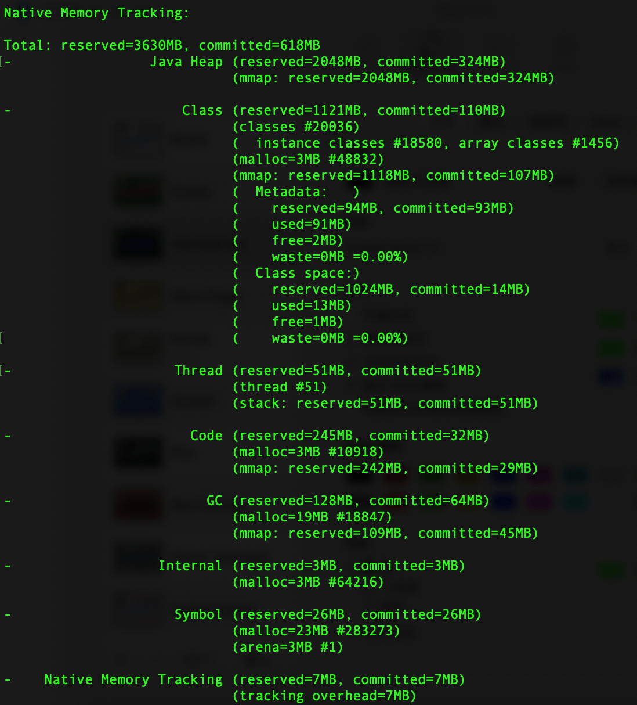
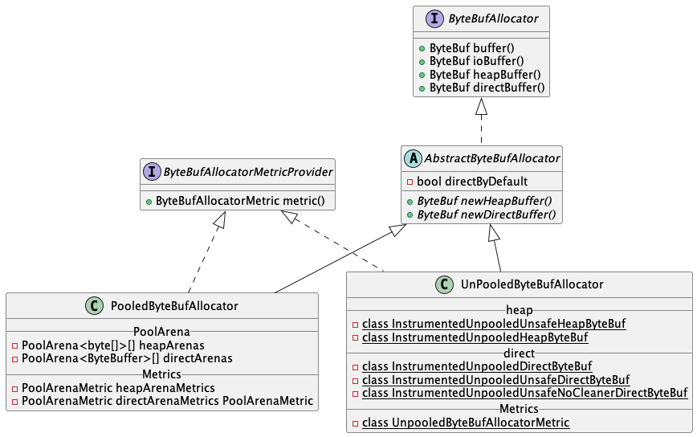
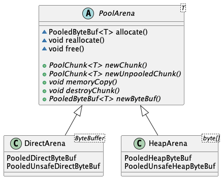
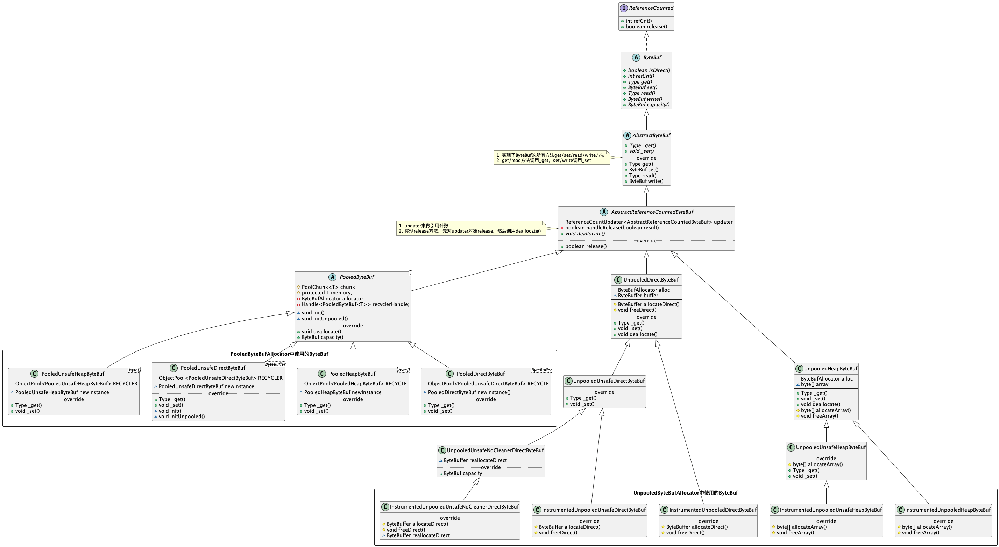
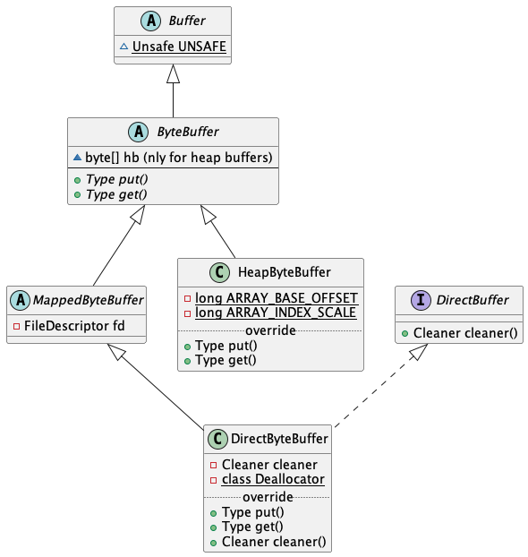
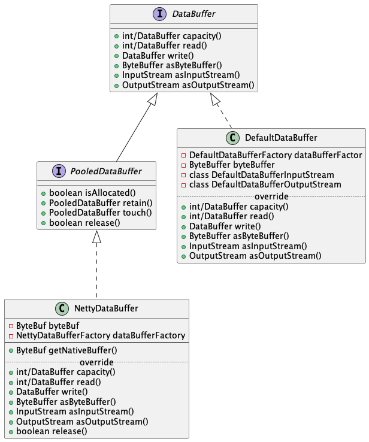
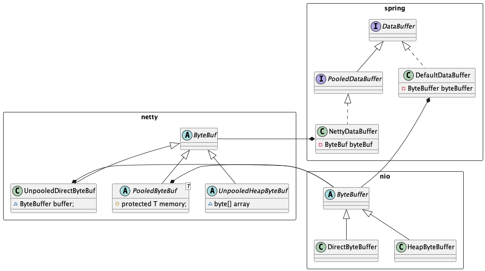

通过一次内存溢出的事故，看了一下netty相关的源码，分享一下自己的收获。

## 排查内存溢出的办法

可以使用 jcmd 命令 查看Naive Memory，例如

```bash
jcmd {pid} VM.native_memory summary scale=MB
```




## Netty 源码分析

### Netty Allocator

Netty的分配器分为两种，**pooled**和**unpooled**，可以通过 VM option 中的 io.netty.allocator.type 修改，默认是pooled。不论是pooled还是unpooled都可以选择是走heap和direct，分别指堆内和堆外模式。

Netty Allocator 中实现pooled和unpooled的具体方法是**PooledByteBufAllocator** 和 **UnpooledByteBufAllocator**，具体的实现继承关系如下图：

#### AbstractByteBufAllocator

AbstractByteBufAllocator主要做了2件事：

1.  判断使用heap还是是用direct，默认是走direct即堆外内存。可以通过VM参数*io.netty.noUnsafe*和*io.netty.noPreferDirect*来设置堆内或是堆外。
1.  监控是否发生内存泄露。在每次新建ByteBuf后，都会调用toLeakAwareBuffer()方法，此方法会trace对应的ByteBuf，用来判断有没有内存泄露的风险。

#### PooledByteBufAllocator

PooledByteBufAllocator是池化模式下的分配器，其中定义了许多相关参数，如池中的chunkSize、pageSize、smallCacheSize、normalCacheSize等等，这里就不展开来细节了。

池化模式中具体的内存分配使用的是 PoolArena 类，我们首先看一下和它相关类的UML图：




首先需要注意的点是

-   **内存的分配**是PooledByteBufAllocator通过调用PoolArena的 allocate() 方法完成的，同时返回了netty中定义的PooledByteBuf类。
-   **内存的释放**是PooledByteBuf类通过调用PoolArena的 reallocate() 或者 free() 方法实现的。
-   PoolArena给allocator返回的是PooledByteBuf类，但是在实际的newChunk中操作的是一个泛型。这个泛型对direct堆外模式来说是一个nio中的ByteBuffer，对heap堆内模式来说时一个byte[]数组。

由此我们可知，allocate在分配内存的时候会创建一个PooledByteBuf，并在其中管理nio中的ByteBuffer或者byte[]数组来实现对内存的实际操作。内存的释放则是通过创建的PooledByteBuf对象来控制。下面具体展开说明分配和释放：

**direct 堆外内存**
管理direct堆外内存的PooledByteBuf根据是否safe分为两类：
- safe情况下，使用PooledDirectByteBuf对象管理
- unsafe情况下，使用PooledUnsafeDirectByteBuf对象管理

根据上面我们已经清楚，direct堆外内存的PooledByteBuf中，实际去分配或占用内存的是nio中的ByteBuffer。ByteBuffer的分配和释放，则是根据nocleaner分为两种实现方式：
- nocleaner模式下的内存分配，是通过reflect反射中的Constructor构造器来创建ByteBuffer对象；
- nocleaner模式下的内存释放，是直接通过UNSAFE中的native方法freeMemory0(long address)释放；
- cleaner模式下的内存分配，直接使用new DirectByteBuffer的方式创建；
- cleaner模式下的内存释放，是通过reflect反射调用nio中DirectByteBuffer的cleaner去完成内存释放。

```java
static final class DirectArena extends PoolArena<ByteBuffer> {

    @Override
    protected PoolChunk<ByteBuffer> newChunk(int pageSize, int maxPageIdx,
        int pageShifts, int chunkSize) {
        if (directMemoryCacheAlignment == 0) {
            ByteBuffer memory = allocateDirect(chunkSize);
            return new PoolChunk<ByteBuffer>(this, memory, memory, pageSize, pageShifts,
                    chunkSize, maxPageIdx);
        }
        final ByteBuffer base = allocateDirect(chunkSize + directMemoryCacheAlignment);
        final ByteBuffer memory = PlatformDependent.alignDirectBuffer(base, directMemoryCacheAlignment);
        return new PoolChunk<ByteBuffer>(this, base, memory, pageSize,
                pageShifts, chunkSize, maxPageIdx);
    }

    private static ByteBuffer allocateDirect(int capacity) {
        return PlatformDependent.useDirectBufferNoCleaner() ?
            PlatformDependent.allocateDirectNoCleaner(capacity) : ByteBuffer.allocateDirect(capacity);
    }

    @Override
    protected void destroyChunk(PoolChunk<ByteBuffer> chunk) {
        if (PlatformDependent.useDirectBufferNoCleaner()) {
            PlatformDependent.freeDirectNoCleaner((ByteBuffer) chunk.base);
        } else {
            PlatformDependent.freeDirectBuffer((ByteBuffer) chunk.base);
        }
    }

    @Override
    protected PooledByteBuf<ByteBuffer> newByteBuf(int maxCapacity) {
        if (HAS_UNSAFE) {
            return PooledUnsafeDirectByteBuf.newInstance(maxCapacity);
        } else {
            return PooledDirectByteBuf.newInstance(maxCapacity);
        }
    }
}
```

**heap 堆内内存**

管理heap堆内内存的PooledByteBuf也根据是否safe分为两类：
- safe情况下，使用PooledHeapByteBuf对象管理
- unsafe情况下，使用PooledUnsafeHeapByteBuf对象管理

同样根据上面得知，heap堆内内存是通过维护一个byte[]数组去实现的。这其中比较重要的一个参数是
*io.netty.uninitializedArrayAllocationThreshold* ，用来设置未初始化的byte数组的阈值，默认是1024。

具体的分配与释放如下：
- 内存的分配方面，如果需要分配的byte数组大小不超过阈值，则直接使用new byte[]创建；如果超过了阈值，则使用reflect反射创建byte数组
- 内存的释放方面，直接依赖GC

```java
static final class HeapArena extends PoolArena<byte[]> {

    private static byte[] newByteArray(int size) {
        return PlatformDependent.allocateUninitializedArray(size);
    }

    @Override
    protected PoolChunk<byte[]> newChunk(int pageSize, int maxPageIdx, int pageShifts, int chunkSize) {
        return new PoolChunk<byte[]>(
                this, null, newByteArray(chunkSize), pageSize, pageShifts, chunkSize, maxPageIdx);
    }

    @Override
    protected void destroyChunk(PoolChunk<byte[]> chunk) {
        // Rely on GC.
    }

    @Override
    protected PooledByteBuf<byte[]> newByteBuf(int maxCapacity) {
        return HAS_UNSAFE ? PooledUnsafeHeapByteBuf.newUnsafeInstance(maxCapacity)
                : PooledHeapByteBuf.newInstance(maxCapacity);
    }

}
```

#### UnpooledByteBufAllocator
UnpooledByteBufAllocator是非池化模式下的分配器。其中定义了好几个内部类如下：
- InstrumentedUnpooledUnsafeHeapByteBuf
- InstrumentedUnpooledHeapByteBuf
- InstrumentedUnpooledUnsafeNoCleanerDirectByteBuf
- InstrumentedUnpooledUnsafeDirectByteBuf
- InstrumentedUnpooledDirectByteBuf

**direct 堆外内存**
driect堆外内存需要关注的是InstrumentedUnpooledDirectByteBuf、InstrumentedUnpooledUnsafeDirectByteBuf和InstrumentedUnpooledUnsafeNoCleanerDirectByteBuf，下面对这三种做一下区分：
- 如果是safe的情况下，则使用InstrumentedUnpooledDirectByteBuf
- 如果是unsafe的情况 + cleaner模式，则使用InstrumentedUnpooledUnsafeDirectByteBuf
- 如果是unsafe的情况 + nocleaner模式，则使用InstrumentedUnpooledUnsafeNoCleanerDirectByteBuf

这三类实际上也是通过nio中的ByteBuffer去实现内存的分配和释放的，具体实现方式如下：
- InstrumentedUnpooledDirectByteBuf：内存分配通过 new DirectByteBuffer 的方式实现的；内存的释放通过reflect反射调用nio中DirectByteBuffer的cleaner实现。
- InstrumentedUnpooledUnsafeDirectByteBuf：内存分配通过 new DirectByteBuffer 的方式实现的；内存的释放通过reflect反射调用nio中DirectByteBuffer的cleaner实现。
- InstrumentedUnpooledUnsafeNoCleanerDirectByteBuf：内存的分配通过reflect反射中的Constructor构造器创建ByteBuffer对象实现；内存的释放直接通过UNSAFE中的native方法freeMemory0(long address)实现。

```java

public class UnpooledUnsafeDirectByteBuf extends UnpooledDirectByteBuf {

    protected ByteBuffer allocateDirect(int initialCapacity) {
        return ByteBuffer.allocateDirect(initialCapacity);
    }

    protected void freeDirect(ByteBuffer buffer) {
        PlatformDependent.freeDirectBuffer(buffer);
    }
}

class UnpooledUnsafeNoCleanerDirectByteBuf extends UnpooledUnsafeDirectByteBuf {

    UnpooledUnsafeNoCleanerDirectByteBuf(ByteBufAllocator alloc, int initialCapacity, int maxCapacity) {
        super(alloc, initialCapacity, maxCapacity);
    }

    @Override
    protected ByteBuffer allocateDirect(int initialCapacity) {
        return PlatformDependent.allocateDirectNoCleaner(initialCapacity);
    }

    @Override
    protected void freeDirect(ByteBuffer buffer) {
        PlatformDependent.freeDirectNoCleaner(buffer);
    }

}
```

**heap 堆内内存**
heap堆内内存需要关注的是InstrumentedUnpooledHeapByteBuf和InstrumentedUnpooledUnsafeHeapByteBuf

这两个类内存使用的也是byte[]数组实现，具体的分配和释放内存方式如下：
- InstrumentedUnpooledHeapByteBuf：内存的分配直接通过 new byte[] 实现。
- InstrumentedUnpooledUnsafeHeapByteBuf：内存的分配使用reflect反射创建byte数组。
- 两者的内存释放都依赖于GC
```java
public class UnpooledUnsafeHeapByteBuf extends UnpooledHeapByteBuf {

    @Override
    protected byte[] allocateArray(int initialCapacity) {
        return PlatformDependent.allocateUninitializedArray(initialCapacity);
    }

}

public class UnpooledHeapByteBuf extends AbstractReferenceCountedByteBuf
 {
     @Override
    protected byte[] allocateArray(int initialCapacity) {
        return new byte[initialCapacity];
    }

    protected void freeArray(byte[] array) {
        // NOOP
    }
 }

```

### Netty ByteBuf
这部分主要了解一下ByteBuf的之间的实现和集成关系，通过这部分对ByteBuf和其中的ByteBuffer或者byte数组有更深的了解。具体的UML图如下，下面会对其中关键点做描述。



**AbstractReferenceCountedByteBuf** ：
1. 内部定义了一个ReferenceCountUpdater，用来做引用计数
2. 实现了release方法，显式释放了updater引用计数的数量，然后调用子类 deallocate() 方法进行内存的释放

**PooledByteBuf** ：
1. 定义了泛型T memory，用于存储byte[]或ByteBuffer
2. 记录了分配器allocator
3. 定义了池化的recyclerHandle回收处理器，其4个子类分别定义了四个RECYCLER回收器，由父类中的handle统一处理。这里的回收器回收的是ByteBuf对象。
4. 实现了deallocate方法，通过RECYCLER回收器释放内存

**UnpooledDirectByteBuf**：
1. 定义了direct堆外内存的中所使用的ByteBuffer
2. 记录分配器allocator
3. 实现了safe + cleaner模式下的内存分配和释放；其他情况由子类UnpooledUnsafeDirectByteBuf和UnpooledUnsafeNoCleanerDirectByteBuf复写实现。

**UnpooledHeapByteBuf**：
1. 定义了heap堆内内存中所使用的byte[]数组
2. 记录分配器allocator
3. 实现了safe模式下的内存分配；unsafe模式由子类UnpooledUnsafeHeapByteBuf实现。


### Java NIO ByteBuffer

经过上面的介绍，我们得知netty ByteBuf在direct模式下，实际上操作的是Java nio中的ByteBuffer。下面对其关键点做一下说明。



**MappedByteBuffer**：
- 定义了文件描述符fd，用于对堆外内存的io操作

**DiractByteBuffer**：
- 定义了cleaner用于内存释放的实现

> 注意：netty heap并不会直接使用ByteBuffer，只有在需要时会将byte[]数组转成ByteBuffer


## Spring DataBuffer

在实际reactor netty的使用中，我们很少能接触到nio的ByteBuffer或者netty中的ByteBuf，但是会用到spring-core包中定义的DataBuffer。

下面我们看下DataBuffer相关的UML图



> 内存泄露风险：在直接对DataBuffer使用时，如果实现是NettyDataBuffer，则需要注意databuffer的释放问题，使用不当有可能会造成内存泄露的风险。

## ByteBuffer/ByteBuf/DataBuffer之间的关系
最后用一张图说明ByteBuffer/ByteBuf/DataBuffer这三者之间的关系。

可以从下面这张图看出，DataBuffer主要有两种实现：
- DefaultDataBuffer 中定义了成员变量BtyeBuffer，通过nio对象来实现
- NettyDataBuffer中定义了成员变量 ByteBuf，通过netty对象来实现

其次，对于ByteBuf来说，底层也是通过nio的DyteBuffer去实现的。




## 参考链接
<https://juejin.cn/post/6844904037146443784>

<https://projectreactor.io/docs/netty/release/reference/index.html#faq.memory-leaks>

<https://netty.io/wiki/reference-counted-objects.html>

<https://tech.meituan.com/2018/10/18/netty-direct-memory-screening.html>