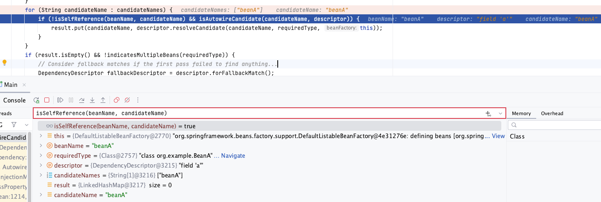

## 引言

在相同Bean中使用@Transactional时一个很常见的场景，程序员基本也都知道使用自我注入（Self-Injection）的方式去解决，这个本身没什么难度。

本文只是想考据一下Spring  Framework，具体是哪里的代码支持了自我注入。

## 同类调用中@Transactional的失效问题

我们偶尔会在想调用同一个类的方法时，对调用的方法添加事务，如下

```java
@Service
public class MyService {
    public void doSomething() {
        // ...
        doSomethingElse();
    }

    @Transactional
    public void doSomethingElse() {
        // ...
    }
}
```

但是此时@Transactional会失效，起不到事务的作用。主要原因在于@Transactional采用的是Spring中的AOP机制。AOP机制的介绍可以看以下链接

[Chapter 6. Aspect Oriented Programming with Spring](https://docs.spring.io/spring-framework/docs/2.0.x/reference/aop.html)

其中有一句需要注意

> *In addition, AspectJ itself has type-based semantics and at an execution join point both 'this' and 'target' refer to the same object - the object executing the method. Spring AOP is a proxy based system and differentiates between the proxy object itself (bound to 'this') and the target object behind the proxy (bound to 'target').*
> 

此处告诉我们AOP是基于代理系统的，作用于代理的目标对象，所以直接调用自身class的方法时是失效的。除非注入自身class作为代理对象 (self injection)。

## 如何自我注入(Self-Injection)

关于如何注入自身，可以看以下文章

[Self-Injection With Spring | Baeldung](https://www.baeldung.com/spring-self-injection)

从这里我们可以看出，有两种方式，一种是使用 **@Autowired** 注解，一种是使用 **ApplicationContextAware**，下面我们列举一下这两种方式

### 使用 **@Autowired**

```java
@Component
public class MyBean {
    @Autowired
    private MyBean self;

    public void doSomething() {
        // use self reference here
    }
}
```

```java
@Component
public class MyBean {
    @Autowired
    private MyBean self;

    public void doSomething() {
        // use self reference here
    }
}
```

### 使用**ApplicationContextAware**

```java
@Component
public class MyBean implements ApplicationContextAware {
    private ApplicationContext context;

    @Override
    public void setApplicationContext(ApplicationContext context) throws BeansException {
        this.context = context;
    }

    public void doSomething() {
        MyBean self = context.getBean(MyBean.class);
        // ...
    }
}
```

## 为什么自我注入(Self-Injection)不会引发循环引用 **(circular dependency)**

Spring Framework官方是在4.3版本之后支持的，具体可以看这条PR

[Injection support for Collection/Map beans and self references · spring-projects/spring-framework@4a0fa69](https://github.com/spring-projects/spring-framework/commit/4a0fa69ce469cae2e8c8a1a45f0b43f74a74481d#diff-7647ef528e5ffcfdb8ce8b88d189a906a1e7b46778323bc92cb9783a4991d5ab)

可以看到判断Self-Injection最关键的方法是isSelfReference，入参beanName是需要注入的self bean，candidateName是当前正在初始化的bean

```java
/**
	 * Determine whether the given beanName/candidateName pair indicates a self reference,
	 * i.e. whether the candidate points back to the original bean or to a factory method
	 * on the original bean.
	 */
	private boolean isSelfReference(@Nullable String beanName, @Nullable String candidateName) {
		return (beanName != null && candidateName != null &&
				(beanName.equals(candidateName) || (containsBeanDefinition(candidateName) &&
						beanName.equals(getMergedLocalBeanDefinition(candidateName).getFactoryBeanName()))));
	}
```

其次我们看一下isSelfReference的调用方法findAutowireCandidates，beanName指的是当前需要注册的bean，requiredType是需要注入的class类型，descriptor主要是对需要注入的bean的具体描述，如name、required等等。考虑到requiredType有可能是接口类，故通过BeanFactoryUtils.*beanNamesForTypeIncludingAncestors*方法可以拿到具体的需要注入的beanNames，并放在candidateNames。

```java
/**
	 * Find bean instances that match the required type.
	 * Called during autowiring for the specified bean.
	 * @param beanName the name of the bean that is about to be wired
	 * @param requiredType the actual type of bean to look for
	 * (may be an array component type or collection element type)
	 * @param descriptor the descriptor of the dependency to resolve
	 * @return a Map of candidate names and candidate instances that match
	 * the required type (never {@code null})
	 * @throws BeansException in case of errors
	 * @see #autowireByType
	 * @see #autowireConstructor
	 */
	protected Map<String, Object> findAutowireCandidates(
			@Nullable String beanName, Class<?> requiredType, DependencyDescriptor descriptor) {

		String[] candidateNames = BeanFactoryUtils.beanNamesForTypeIncludingAncestors(
				this, requiredType, true, descriptor.isEager());
		Map<String, Object> result = CollectionUtils.newLinkedHashMap(candidateNames.length);
		for (Map.Entry<Class<?>, Object> classObjectEntry : this.resolvableDependencies.entrySet()) {
			Class<?> autowiringType = classObjectEntry.getKey();
			if (autowiringType.isAssignableFrom(requiredType)) {
				Object autowiringValue = classObjectEntry.getValue();
				autowiringValue = AutowireUtils.resolveAutowiringValue(autowiringValue, requiredType);
				if (requiredType.isInstance(autowiringValue)) {
					result.put(ObjectUtils.identityToString(autowiringValue), autowiringValue);
					break;
				}
			}
		}
		for (String candidate : candidateNames) {
			if (!**isSelfReference**(beanName, candidate) && isAutowireCandidate(candidate, descriptor)) {
				addCandidateEntry(result, candidate, descriptor, requiredType);
			}
		}
		if (result.isEmpty()) {
			boolean multiple = indicatesMultipleBeans(requiredType);
			// Consider fallback matches if the first pass failed to find anything...
			DependencyDescriptor fallbackDescriptor = descriptor.forFallbackMatch();
			for (String candidate : candidateNames) {
				if (!**isSelfReference**(beanName, candidate) && isAutowireCandidate(candidate, fallbackDescriptor) &&
						(!multiple || getAutowireCandidateResolver().hasQualifier(descriptor))) {
					addCandidateEntry(result, candidate, descriptor, requiredType);
				}
			}
			if (result.isEmpty() && !multiple) {
				// Consider self references as a final pass...
				// but in the case of a dependency collection, not the very same bean itself.
				for (String candidate : candidateNames) {
					if (**isSelfReference**(beanName, candidate) &&
							(!(descriptor instanceof MultiElementDescriptor) || !beanName.equals(candidate)) &&
							isAutowireCandidate(candidate, fallbackDescriptor)) {
						addCandidateEntry(result, candidate, descriptor, requiredType);
					}
				}
			}
		}
		return result;
	}
```

### Spring 4.2版本测试

现在我们使用Spring 4.2的版本做一下测试。我们使用**1.3.8.RELEAS**版本的spring-boot-starter-parent，其对应的spring.version是**4.2.8.RELEASE**。测试类如下：

- BeanA使用@Autowired自我注入
- BeanC使用ApplicationContextAware自我注入

```java
@Component
public class BeanA {
    @Autowired
    private BeanB b;
    @Autowired
    private BeanA a;

}

@Component
public class BeanB {
}

@Component
public class BeanC implements ApplicationContextAware {
    private ApplicationContext context;

    @Override
    public void setApplicationContext(ApplicationContext applicationContext) throws BeansException {
        this.context = context;
    }

    public void doSomething() {
        BeanC self = context.getBean(BeanC.class);
    }
}
```

启动之后报错如下：

```java
Caused by: org.springframework.beans.factory.BeanCreationException: Could not autowire field: private org.example.BeanA org.example.BeanA.a; nested exception is org.springframework.beans.factory.NoSuchBeanDefinitionException: No qualifying bean of type [org.example.BeanA] found for dependency: expected at least 1 bean which qualifies as autowire candidate for this dependency. Dependency annotations: {@org.springframework.beans.factory.annotation.Autowired(required=true)}
	at org.springframework.beans.factory.annotation.AutowiredAnnotationBeanPostProcessor$AutowiredFieldElement.inject(AutowiredAnnotationBeanPostProcessor.java:573) ~[spring-beans-4.2.8.RELEASE.jar:4.2.8.RELEASE]
	at org.springframework.beans.factory.annotation.InjectionMetadata.inject(InjectionMetadata.java:88) ~[spring-beans-4.2.8.RELEASE.jar:4.2.8.RELEASE]
	at org.springframework.beans.factory.annotation.AutowiredAnnotationBeanPostProcessor.postProcessPropertyValues(AutowiredAnnotationBeanPostProcessor.java:331) ~[spring-beans-4.2.8.RELEASE.jar:4.2.8.RELEASE]
	... 16 common frames omitted
Caused by: org.springframework.beans.factory.NoSuchBeanDefinitionException: No qualifying bean of type [org.example.BeanA] found for dependency: expected at least 1 bean which qualifies as autowire candidate for this dependency. Dependency annotations: {@org.springframework.beans.factory.annotation.Autowired(required=true)}
	at org.springframework.beans.factory.support.DefaultListableBeanFactory.raiseNoSuchBeanDefinitionException(DefaultListableBeanFactory.java:1380) ~[spring-beans-4.2.8.RELEASE.jar:4.2.8.RELEASE]
	at org.springframework.beans.factory.support.DefaultListableBeanFactory.doResolveDependency(DefaultListableBeanFactory.java:1126) ~[spring-beans-4.2.8.RELEASE.jar:4.2.8.RELEASE]
	at org.springframework.beans.factory.support.DefaultListableBeanFactory.resolveDependency(DefaultListableBeanFactory.java:1021) ~[spring-beans-4.2.8.RELEASE.jar:4.2.8.RELEASE]
	at org.springframework.beans.factory.annotation.AutowiredAnnotationBeanPostProcessor$AutowiredFieldElement.inject(AutowiredAnnotationBeanPostProcessor.java:545) ~[spring-beans-4.2.8.RELEASE.jar:4.2.8.RELEASE]
	... 18 common frames omitted
```

由此可以看到，BeanA的写法造成了循环引用导致NoSuchBeanDefinitionException异常；BeanC的写法没有报错。

### Spring 4.3版本测试

使用**1.4.0.RELEASE**版本的spring-boot-starter-parent，其对应的spring.version是**4.3.2.RELEASE**。类似构建如上的BeanA、BeanB和BeanC，启动后发现并无异常。

打断点到DefaultListableBeanFactory可以看到：



## 总结

Spring是在**4.3**版本支持了”自己注入自己”，对应到springboot的版本是**1.4.0**
