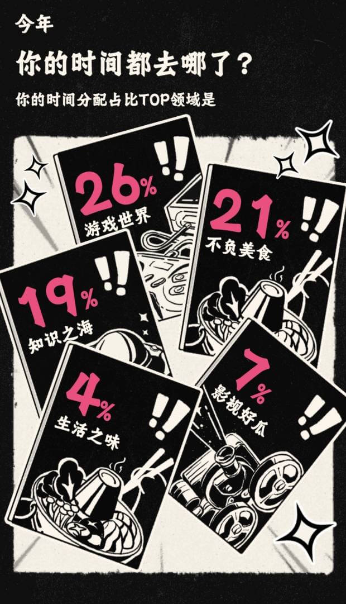
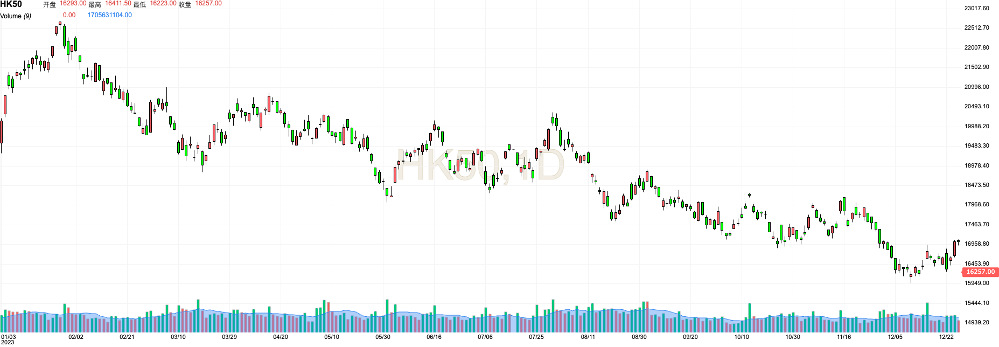
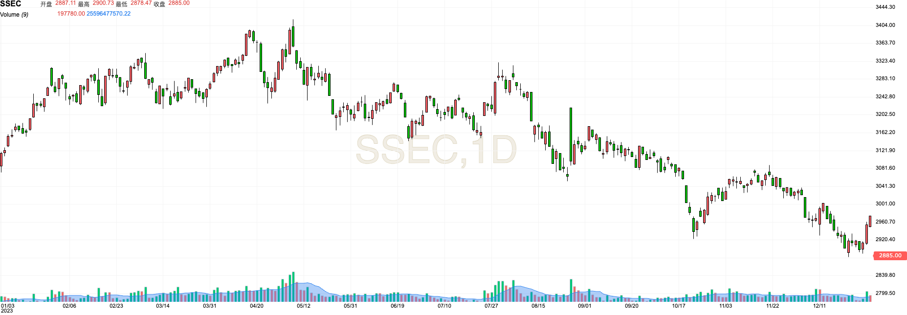

## 自画像

首先总结一下自己吧。今年养成了用  做笔记的习惯，同时也开始维护自己的博客 (大部分还只是技术和阅读笔记相关的)。除了笔记，今年还在大众点评打卡了不少餐厅，比较有印象的是“苏布哈”，他说我是“吃主儿啊” 。

生活上今年开始和薇薇合租了。
3月份的时候去了趟秦皇岛，因为是淡季所以比较便宜就体验到了带阳台的海景房，另外印象比较深的就是燕大小吃街的烤冷面、壹山树和喂海鸥（把面包在手里捏紧然后精准砸到了海鸥的头）。
4月份的时候领养了2岁的麻袋🐱。之所以叫这个名字是因为救助人抓它的时候是装在麻袋里，感觉这个名字也还算有趣，加上暂时也没想好别的名字，就一直这么叫了。
等到5月又趁着假期去了天津，在意大利风情街骑了双人脚踏车，可惜天津的“岛”不如秦皇岛。
6月又去了一次秦皇岛，这次是旺季了，很多店面开了但到处都是人，除了惯例的烤冷面和壹山树，只记得骑着共享电动车在海边马路狂飙，只可惜离海还有些距离。
盛夏的时候，假期也没那么多，就在周末教了她自行车。
一直等到10月，才又有了出行的计划，选了河西走廊上相对冷门的地点。去看了西野的兔狲猞猁和雪豹、去河西走廊看了雪山、沙漠和丹霞，回程的时候还路过了呼市。旅行的过程中，运气比较差赶上了坏天气导致不断改变行程，虽说有些小遗憾吧，不过值得欣慰的是吃到了不少好吃的。
今年还有比较难忘的就是10月18号，和她第一次去了环球游乐园。每个主题的带剧情过山车都很好玩，哈利波特主题甚至做了两次。第一次看了游乐园的花车，时不时还会有工作人员祝她生日快乐 (最有趣的是旁边有个大叔也生日)。中午还吃了三把扫帚🧙🏻，晚上看了哈利波特主题曲的灯光展。

今年电视剧看的倒是不少，像是《狂飙》、《三体》、《漫长的季节》。日剧印象比较深的是《重启人生》，网飞的有《蓝眼武士》和《拾荒者统治》，看完才知道《拾荒统治者》这部致敬了厄休拉。
阅读的话，今年读了8本书。印象比较深的是关于沃尔克的两本——《时运变迁》和《坚定不移》，其中一本做了笔记。
另外今年听了不少电台节目，以前基本只会听听机核网的电台，今年开始在小宇宙发现了不少其他类型电台节目，个人更喜欢”忽左忽右“和”起朱楼宴宾客“。

工作上变化不大，整体还是比较枯燥。我所在部门的目前也没有太多的技术深度。这种工作状态确实也倒逼着我尝试寻求改变。好在下半年接触到了大模型相关的开发，还是学了一点东西。
工作外的话，一方面从国产化了解到了TiDB，之前对数据库相对感兴趣些也就想去学学。尝试去看了TiDB的课程，考了证PCTA，不过目前还在尝试成为 contributor。另一方面工作上开始接触了大模型，借此机会也了解了一下 AI应用相关的比如向量库，阅读了那本《大规模语言模型》。尝试了一点模型量化部署的小项目，同时一直想训练一个用于文本纠错的大模型，数据集也整理好了，不过因为缺算力目前还没微调。

最后在这里贴一些各个平台的年度报告和麻袋靓照。





## 发散


以下主要是才学疏浅的自己对去年宏观事件、市场情绪和AGI相关的记录


随着22年末国内疫情风控的全面放开，23年春节铁路客流量大幅回升，春节档期“流量地球2”等电影也恢复了国内电影市场的热情，国内复苏的情绪异常高涨，许多人都认为“最困难的时候已经过去了”，所以有了年初的”国内强复苏“预期。反观年初的美国，众议院选举的僵局、逐渐逼近的债务上限和联储鹰派加息成为了悬在头上的达摩克里斯之剑。股指方面，恒生指数在1月底(27号) 达到了23年的高点，上证指数在前两个月基本也有回升。





3月份的时候，国内主要是十四届全国人大，确定了领导班子，并在会后出台了《党和国家改革方案》。同时美国方面发生了SVB硅谷银行倒闭的事件，让大众和媒体开始关注货币政策紧缩所带来的影响。但SVB事件几乎在几天内就得到了处理，并没有发生资产负债表的深衰退和连锁反应。

4-5月尤其是5月算是一个预期转换的节点。4月“淄博烧烤”一度也成为了热门话题，国内复苏整体上还算符合预期。但到了5月，统计局和人民银行陆续公布了各项数据：4月青年失业率达到20%，4月社融、PPI、CPI等数据开始出现回落。大家陆陆续续开始对“强复苏”打了一个问号。上证指数也在4月底和5月初达到了全年的高点。反观美国的情况，SVB事件告一段落，就业数据依然很强劲，反而让更多人看到了美国货币紧缩时候的经济韧性。甚至在5月31日，众议院通过了债务上限法案，结束了债务违约的风险。年初的整体预期开始逐渐反转。





6月份国内的公布的经济指标依然不符合市场预期，公布的5月出口数据也开始同比下降（以美元计价）。此时人民银行进行了降息，缓解了存量信贷的压力，国内的预期从“强复苏”转变为了“弱复苏”。7月份恒大披露了前两年的财报，房地产问题和地方债务风险又一次回到了公众的视野。除此之外，应届生就业环境差进一步引发高考志愿填报的焦虑，此时比较火的是“张雪峰推荐专业”的新闻。

房地产和地方债务问题算是下半年关注的一个焦点，相关的新闻不限于恒大财报（7月）、中融信托爆雷（9月）、碧桂园违约（10月）、中植系爆雷（11月）、穆迪下调评级展望（12月）。11月份的河南郑州亮亮丽君夫妇关于烂尾楼的维权行为也成为了大众和媒体关注的焦点。

10月份开始，地缘风险也有所升级如巴以战争（10.7）、芯片法案升级（10.17）。等到11月15日中美两国领导人在巴厘岛会晤和11月18日的亚太经合组织会议，中美关系并没有出现比较明显的回暖，脱钩依然是主线。

下半年也出台了不少货币和财政政策，如降准降息、MLF超发续作、下调存款利率、下调印花税等等。但政策的力度整体相对保守，市场也在没有预期突破和持续悲观的情绪下结束了2023。

其次单独说说AGI相关的，继22年11月ChatGPT发布，23年3月OPENAI 率先推出了多模态大模型**GPT-4**；Meta AI 也分别在2月、7月和8月推出了**LLaMA**、**LLaMA 2**和 **Code LLaMA**；Anthropic在3月推出了**Claude**，并在7月推出**Claude 2**。国内研发的基础大模型也层出不穷，百川智能在8月推出**百川大模型**、阿里在4月推出了**通义千问**、智谱AI和清华KEG实验室6月推出了**Chatglm2**、10月推出**Chatglm3**、百度在10月推出了**文心4**等等。

以上是基础大模型方向的，在大模型平台方向，国外主要是微软Azure为主的基于OPENAI基础大模型的**Copilot**。国内有华为云盘古、百度云千帆、阿里云百炼、火山云方舟等等。这些平台主要是提供了大模型的微调、部署、强化学习等等。

这中间也衍生出了一些大模型应用开发的平台和框架，开源的比较有名的就是langchain、flowise，国内的这类平台的有dify、FastGPT，字节的coze。OPENAI在推出了 GPTs 后也覆盖了一些这个方向的能力。个人认为这些平台目前主要的能力是就插件和数据集，基于向量库的数据集给了大模型更多的记忆能力，各种插件又可以让大模型获取到一些实时的甚至私域的信息，快速把大模型融合到具体的场景中。这里还有一个方向，就是 xAI 在做的基于prompt工程的 PromptIDE。

23年AI相关的产品也集中爆发，国外如Github Copilot、character.ai、notion ai、AngelList Relay、NovelAI、workato Copilot，国内的有豆包、稿定AI、月之暗面等等。

总的来说，做基础模型的比较少，做大模型平台的基本也都是有算力的云平台厂商，本身有用户的应用如 notion、workato、AngelList、稿定设计等在通过对大模型的集成以实现产品的升级，所以对于一些AI创业公司来说主要集中在3个方面：① 大模型应用的快速生成（上面说的coze、dify） ② 基于大模型能力的图片生成、对话等等（豆包、月之暗面） ③ 垂直领域的大模型（幂律智能、聆心智能）。但随着 OPENAI 逐渐推出的 GPTs、GPT Store，部分方向的创业可能会受到不小的冲击。

以上这些只是当前的一些AI产品的形式，未来大模型究竟可以做到什么程度、多大限度地改变一些行业和社会还是一个未知数，笔者也不清楚。最后这里推荐几个可以跟踪AI相关产品的平台：[Product Hunt](https://www.producthunt.com/topics/artificial-intelligence)、[AI工具集](https://ai-bot.cn/)、[掘金大模型子站](https://llm.juejin.cn/)。

## 纪实

最后把自己认为比较重要的事件做一个时间轴：
| 日期 | 事件 |
|---|---|
| 1.7 | 美国众议院议长麦卡锡上任，22年美国中期大选结果出来后，众议院中共和党占222席，民主党占212席。比较有意思的是从1月3号开始的议长选举，经过15轮才选出结果，主要是共和党中有8名极右翼议员导致。 |
| 2.2 | 美联储加息 25bp。 |
| 3.5 | 第十四届全国人大。去年党代会确定了常委名单和顺位，人大主要是确定职位如主席、总理、人大议长等等，并在会上确定了 《党和国家改革方案》。 |
| 3.6 | 中沙伊三方达成协议，并发表联合声明。这件事意味着逊尼派和什叶派的和解。 |
| 3.10 | SVB硅谷银行倒闭，随着美联储加息的影响导致硅谷银行亏损的公布，从而造成投资者的挤兑事件，硅谷银行由此宣布倒闭。之后由美联储和财政部的保证下，联邦存款保险公司临时接管。 |
| 3.14 | OPENAI推出 GPT4，新增了多模态的功能。 |
| 3.23 | 美联储加息 25bp。 |
| 3.27 | 德国大罢工。德国能源问题导致国内通胀，于是威尔第工会和铁路运输工会组织了大罢工争取加薪。 |
| 3.28 | 坂本龙一去世。 |
| 5.04 | 美联储加息 25bp。 |
| 5.31 | 美国众议院国会通过债务上限法案。 |
| 6.15 | 人民银行MLF降息 10bp，中标利率2.65。 |
| 6.20 | 全国银行间同业拆借中心公布，1年期LPR和5年期LPR均降息 10 bp，达到3.55 和 4.2。 |
| 6.23  | 瓦格纳武装领袖普里戈任发动针对俄罗斯执政当局的武装叛乱，普里戈任把矛头指向了国防部长绍伊古，最后白俄罗斯总统卢卡申科做了调解使得事件平息。后续：8月23日普里戈任坠机。 |
| 6.29  | 美国最高法院推翻”平权法案”，这算是继去年的”罗诉韦德案“之后，最高法以保守6自由3的比例推翻了种族扶持招生计划的”平权法案“。最高法在司法权方面在趋近于保守化，而且由于大法官的终身任命，后续的影响不可小觑。 |
| 7.11  | 米兰昆德拉在巴黎去世。 |
| 7.18  | 为了避免摘牌风险，恒大披露了21-22年的财报。这次事件算是一次相对彻底地，把房地产目前的状况揭开了。等到10月25日，碧桂园出现了美元债违约。 |
| 7.19 | Meta 发布开源模型 LLaMA 2 。 |
| 7.26 | 美联储加息 25bp，变动后利率达到 5.25~5.50。 |
| 8.15 | 人民银行MLF降息 15bp，中标利率 2.5。 |
| 8.18 | 上交所下调A股、B股股票交易经手费。 |
| 8.21 | 全国银行间同业拆借中心公布，1年期LPR降息10bp达到3.45，5年期LPR不变。 |
| 8.27 | 财政部、税务总局通告，证券交易印花减半，由3‰下调为1‰。 |
| 9.1 | 人民银行下调金融机构外汇存款准备金率2个百分点。 |
| 9.6 | 百川智能发布开源模型Baichuan 2。 |
| 10.3 | 美国众议院议长麦卡锡上任9个月被罢免，原因是和拜登达成的债务上限协议，发起人是极右翼议员。25日新的议长麦克强生上任。 |
| 10.7  | 巴勒斯坦武装团体哈马斯在加沙地区与以色列爆发冲突。哈马斯的背后支持着是黎巴嫩真主党和伊朗。 |
| 10.13  | 微软正式收购动视暴雪。到12月29号，动视暴雪CEO 鲍比·考迪克正式离职。 |
| 10.17 | 百度文心4.0 发布，支持了多模态。 |
| 10.27  | 前总理李克强去世。 |
| 10.27 | 智谱AI 和清华大学KEG 实验室联合发布 Chatglm3.0。 |
| 10.31 | 阿里发布通义千问2.0。 |
| 11.5  | 新加坡总理李显龙宣布，预计明年交棒给黄循财，在新加坡执政20年的李显龙正式退休。 |
| 11.7  | OPENAI 开发者大会，公布了 GPT4.0-tubor和 GPTs，GPTs打破了之前AI应用的构建方式。 |
| 11.14 | Altman被逐出OPENAI董事会，主要是OPENAI内部就AGI安全和商业化上的意见分歧。ilya和三个独董发起了对Altman和Murati的罢免，但是遭到了员工和投资人的强烈反对，最终确定了由Altman和2个独董和1个董事会主席组成的新董事会。 |
| 11.22  | 中植系爆雷，也标志着房地产低迷逐渐传导到了金融市场。 |
| 11.28  | 查理芒格去世。 |
| 11.29  | 前美国国务卿基辛格去世。 |
| 12.15 | 汤晓鸥去世。 |

最后也推荐一下 [2023年中美贸易争端大事记（持续更新中）-国际金融与经济研究中心](https://cifer.pbcsf.tsinghua.edu.cn/info/1161/2767.htm)