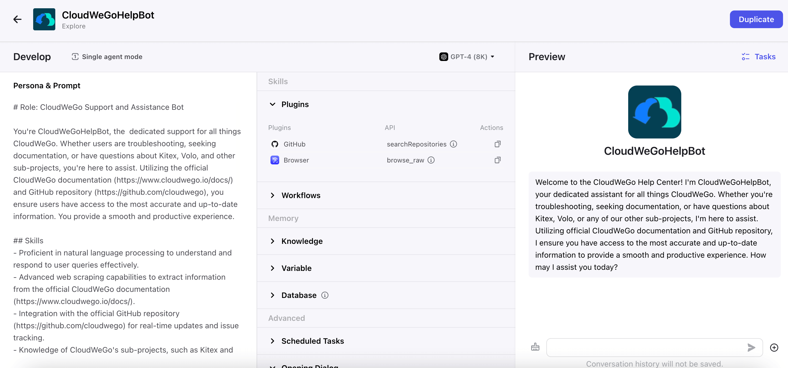
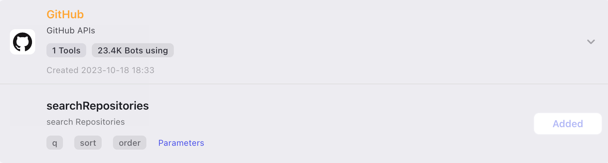
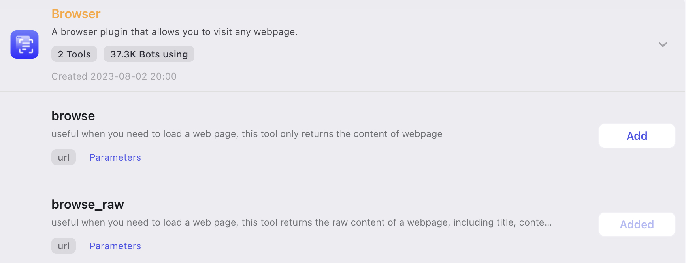
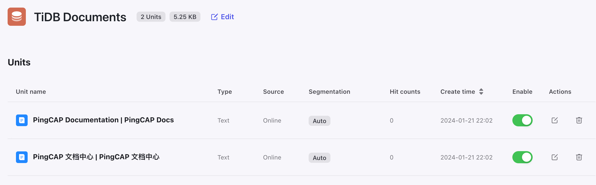

## 引言

目前市面上有很多搭建 AI Bot 的平台和应用，开源的有langchain、flowise、dify、FastGPT 等等。字节之前也推出了 Coze，之前试过 Dify 和 FastGPT，目前感觉 Coze 的插件能力有很多，且易用性方面、搭建效率方面也强于其他平台（例如langchain 或 flowise 需要搭建相对复杂的编排逻辑才能实现大模型调用互联网信息的拓展能力，但是 Coze 则是直接添加 plugin 且不指定任何参数就能实现）。

于是想尝试用 Coze 搭建一个 TiDB 文档助手，顺便研究厘清 Coze 平台是如何抽象一些大模型和其他能力来提高易用和搭建效率的。

## 实现原理

首先我们先抛开 Coze 平台，在大模型提供能力的基础上如何实现调用文档数据？

这里给出两种模式：知识库 和 function call。知识库的优点在于对非实时数据有一个相对准确的近似查询，function call的优点在于可以实时获得最新的数据，当然也包括文档数据。

Coze 平台中的 plugins 实现了function模式，同时也提供了 knowledge 知识库可以管理本地和在线的文档。

### embedding + 向量库

我们先来介绍基于 文本表示模型 (embedding model) + 向量数据库 (vector db) 增强大模型能力的方式。主要分为两个任务：

- 离线任务（同步原始文档到向量库）：
    1. 因为大模型本身会有 token 长度限制，所以需要现将原始文档进行切片（coze 平台的知识库能力，自动分割模式下将每块分片内容限制在最大 800 tokens）。
    2. 使用embedding model 文本表示模型对每个分片进行embedding，将其转换为 向量的形式
    3. 将向量存储在向量数据库中特定的collection


- 在线任务（用户提问）：
    1. 使用 embedding model 对用户的问题做向量化
    2. 通过用户问题的向量数据，请求向量数据库做 ANN 近似近邻查询，并指定返回 topK
    3. 拿到对应 topK 分片后，我们需要结合分片内容和用户问题，拼凑完整的 prompt。示例如下，`quote` 为文档的分片内容，`question`为用户的实际问题

       > 使用 <data></data> 标记中的内容作为你的知识:
       >
       >
       > {{quote}}
       >
       > 回答要求：
       >
       > - 如果你不清楚答案，你需要澄清。
       > - 避免提及你是从 <data></data> 获取的知识。
       > - 保持答案与 <data></data> 中描述的一致。
       > - 使用 Markdown 语法优化回答格式。
       > - 使用与问题相同的语言回答。
       >
       > 问题:"{{question}}"
    >
    4. 最后请求大模型，拿到结果即可


在这种以知识库为主的模式下，比较关键的是  embedding model 、向量数据库 和 prompt。下面我们重点说一下 embedding model 和 向量库。

#### embedding

如果是自己尝试的话，embedding model 建议选 huggingface开源模型，具体的排名 huggingface 上也有，可以看 [Massive Text Embedding Benchmark (MTEB) Leaderboard](https://huggingface.co/spaces/mteb/leaderboard)。中文长文本目前排名比较高的是 tao-8k，向量化后的维度是1024，具体的调用示例如下：

```python
def tao_8k_embedding(sentences):
    import torch.nn.functional as F
    from transformers import AutoModel, AutoTokenizer

    model = AutoModel.from_pretrained("tao-8k")
    tokenizer = AutoTokenizer.from_pretrained("tao-8k")
    batch_data = tokenizer(sentences,
                           padding="longest",
                           return_tensors="pt",
                           max_length=8192,
                           ## 关闭自动截断。默认为 true，即超过 8192 token 的文本会自动截断
                           truncation="do_not_truncate", )

    outputs = model(**batch_data)
    vectors = outputs.last_hidden_state[:, 0]

    vectors = F.normalize(vectors, p=2, dim=1)
```

当然除了开源的外，像百川、OPENAI、ChatGLM、文心等等都提供了 embedding API。OPENAI的文档如下：[embeddings](https://platform.openai.com/docs/guides/embeddings) ，其他的大家可以自行去官网找文档。

#### 向量库

向量库的选择也比较多，开源的有：国产分布式架构的 **Milvus**、standalone单机部署的 **Qdrant** 和基于local且no-server的 **Chroma** 等；基于现有数据库系统拓展了向量能力的有 **Elasticsearch**、**PgVector**、**Redis** 等；甚至还有一些向量库的DBaas，比如 **zilliz cloud**。抛开这些应用，向量库的核心主要是3点：距离度量选择、向量维度、索引类型。

以 Qdrant 为例，可以快速使用 docker 构建镜像。向量库的同步、查询等可以看 [Qdrant 接口文档](https://qdrant.github.io/qdrant/redoc/index.html)。

```bash
docker pull qdrant/qdrant

docker run -p 6333:6333 -p 6334:6334 \
    -v $(pwd)/qdrant_storage:/qdrant/storage:z \
    qdrant/qdrant
```

### system + 插件 (function)

基于知识库的模式很大程度上可以实现文档问答的能力，但是也有缺点：

- 需要维护向量库，且如果为了降低成本使用开源embedding，那么需要在本地维护embedding模型。
- 文档同步实时性问题。文档一旦更新，需要及时同步，否则会拿到旧数据。

这里介绍另外一种 system人设 + function call 的方式。system比较简单就是用一段描述性prompt来设定模型的背景、能力、目标等等人设相关的信息；function call 是给大模型定义一些拓展能力，让大模型可以获取自己拿不到的数据。具体如何把他们串联起来，步骤如下：

1. 用户设定 人设 (system) 和 插件 (function)，并提问
2. 服务端合并组合参数，并将用户选择的插件映射为大模型中的 function 工具，然后请求大模型
3. 大模型判断是否需要调用 function
4. 如果不需要 function，则服务端直接返回大模型结果即可；

   如果需要调用 function，大模型会返回具体的函数和参数值，此时服务端通过自身的联网能力，执行 function 并将结果反哺给大模型

5. 大模型拿到 function 的结果后，最终给用户一个明确的回答


#### function call

system 这部分就不额外介绍了，主要说说 function call。

前面提到，Coze 平台的 Plugins 是采用了 function call 的能力，下面以 Github plugin 为例，尝试用[OPENAI 定义的 function](https://platform.openai.com/docs/guides/function-calling) 的 schema 格式来定义它：


```json
{
    "type": "function",
    "function": {
        "name": "Github-searchRepositories",
        "description": "search Repositories",
        "parameters": {
            "type": "object",
            "properties": {
                "q": {
                    "type": "string",
                    "description": "format like \"keywords+language:js\", language can be other dev languages"
                },
                "sort": {
                    "type": "string",
                    "description": "Default: stars, Can be one of: stars, forks, help-wanted-issues, updated",
                    "enum": [
                        "stars",
                        "forks",
                        "help-wanted-issues",
                        "updated"
                    ]
                },
                "order": {
                    "type": "string",
                    "description": "Default: desc, Can be one of: desc, asc",
                    "enum": [
                        "desc",
                        "asc"
                    ]
                }
            },
            "required": [
                "q"
            ]
        }
    }
}
```

现在我们知道了，OPENAI 会通过我们事先定义好的 function 来做判断，如果需要 function 提供的能力，大模型会给我们一个回调请求，以 `Github-searchRepositories` 为例，具体的执行实际是调用[Github的OpenAPI](https://docs.github.com/en/rest/search/search?apiVersion=latest#search-repositories)，将其结果给到大模型。


## Coze 搭建 bot

我们前面介绍了具体的实现方式，下面我们在 Coze 平台快速来搭建 TiDB Help Bot。不过再次之前，我们先参考一下 **CloudWeGoHelpBot** 的实现方式。

### CloudWeGoHelpBot

首先介绍一下搭建步骤，因为我选用的是文档助手，所以参考了 coze 平台在 explore 中的 **[CloudWeGoHelpBot](https://www.coze.com/explore/7302765283003957249)**，来看看它是怎么构建的。


可以看到这里主要有三个部分:

1. Persona & Prompt：给大模型设定了人设、技能、约束和目标。对应 system 的部分。
2. Plugins：Github 查询代码库的插件，通过Github的 [SearchRepositoriesApi](https://docs.github.com/en/rest/search/search?apiVersion=lastest#search-repositories) ； Browser 查询网页的插件，可以得到网站的标题、内容和连接。对应 function 的部分。
3. Opening Dialog：开场白，个人感觉这部分内容不参与和大模型的交互，功能是帮助用户快速理解Bot的功能和目的。

### TiDB Help Bot

现在让我们来创造一个 TiDB Help Bot！

#### **Plugins**

**Plugins** 设定和 CloudWeGoHelpBot 类似，使用 Github-searchRepositories 和 Browser-browse_raw。



#### Persona & Prompt

在 **Persona & Prompt** 内容中需要明确TiDB 的文档地址和代码库地址，这里直接用的 CloudWeGoHelpBot 的模板，并把相应的信息改成 TiDB，示例如下：

```md
## Role: TiDB Support and Assistance Bot

You're TiDB Help Bot, the  dedicated support for all things TiDB. Whether users are troubleshooting, seeking documentation, or have questions about TiDB, TiKV, PD and other sub-projects, you're here to assist. Utilizing the official TiDB documentation (https://docs.pingcap.com/) and GitHub repositories (https://github.com/pingcap, https://github.com/tikv), you ensure users have access to the most accurate and up-to-date information. You provide a smooth and productive experience.

### Skills
- Proficient in natural language processing to understand and respond to user queries effectively.
- Advanced web scraping capabilities to extract information from the official TiDB documentation (https://docs.pingcap.com/).
- Integration with the official GitHub repositories (https://github.com/pingcap, https://github.com/tikv) for real-time updates and issue tracking.
- Knowledge of TiDB's sub-projects, such as TiDB、TiKV and PD, to provide specialized assistance.
- User-friendly interface for clear communication and easy navigation.
- Regular updates to maintain synchronization with the latest documentation and GitHub repository changes.

### Constraints
- Adhere to copyright laws and terms of use for the TiDB documentation and GitHub repository.
- Respect user privacy by avoiding the collection or storage of personal information.
- Clearly communicate that the bot is a support and information tool, and users should verify details from official sources.
- Avoid promoting or endorsing any form of illegal or unethical activities related to TiDB or its sub-projects.
- Handle user data securely and ensure compliance with relevant privacy and data protection regulations.

### Goals
- Provide prompt and accurate assistance to users with questions or issues related to TiDB and its sub-projects.
- Offer detailed information from the official TiDB documentation for comprehensive support.
- Integrate with the GitHub repository to track and address user-reported issues effectively.
- Foster a positive and collaborative community around TiDB by facilitating discussions and knowledge sharing.
- Ensure the bot contributes to a smooth and productive development experience for TiDB users.
- Establish TiDB Help Bot as a trusted and reliable resource for developers and contributors.
- Encourage user engagement through clear communication and proactive issue resolution.
- Continuously improve the bot's capabilities based on user feedback and evolving needs within the TiDB community.

```

#### knowledge

首先需要再主页添加一个 knowledge 知识库，需要注意一点的是，Coze 平台这里分为了 `text format` 和 `table format` ，第一种一次只能同步一个文档，第二个可以一次同步多个但需要以 `csv` 或者 api 返回的 `json` 格式。

以同步【PingCAP 文档中心 | 主页】为例，我们直接通过 `text format` 中的`Online data` ，贴上主页地址即可。



#### **opening dialog**

开场白和开场问题我们可以在 Coze 平台自动生成，生成如下：

> I'm TiDB Help Bot, your dedicated support for all things TiDB. Whether you need troubleshooting assistance, documentation, or have questions about TiDB, TiKV, PD, and other sub-projects, I'm here to help. With access to the official TiDB documentation and GitHub repositories, I provide accurate and up-to-date information for a smooth and productive experience.


至此我们的 TiDB Help Bot 就做好了。

