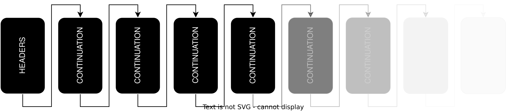

## 引言
想写此文的原因是在 Hackernews 上看到一个基于 HTTP/2 协议的 CONTINUATION Flood 问题，想搞明白产生的原因，顺便温习 HTTP/2 的规范。

为了让协议规范和引发的安全问题看起来更直观，本文会辅以 golang 的  [golang.org/x/net](http://golang.org/x/net) 源码来解释。

## HTTP/2

### 概述

先回顾一下 HTTP/2 协议。它和 HTTP/1.1 最大的不同在于：

- HTTP/1.1 是一个文本协议，协议的基础单元是 **message** ，**message** 之间会用 **CRLF** (`\r\n`) 做分隔，例如：`POST /foo?name=menu&value= HTTP/1.1\r\nHost: google.com\r\nTransfer-Encoding: chunked\r\nContent-Type: aa/bb\r\n\r\n3  \r\nabc\r\n0\r\n\r\n`
- HTTP/2 是一个二进制协议，协议的基础单元是 **frame**，HTTP/2连接的起始内容是 `PRI * HTTP/2.0\r\n\r\nSM\r\n\r\n` ，其次是 **frame**。同时 HTTP/2 中使用了 **HPACK** 对传输的内容做了压缩。


💡 对于 HTTPS，实际上是在 HTTP 协议上加了一层 SSL/TLS，需要先通过证书解密得到二进制和文本信息




### Frame 格式

先了解一下 Frame 的结构，固定以前9个字节开头分别代表 Length（3字节/24bit）、Type（1字节/8bit）、Flags（1字节/8bit）、Reserved（1bit）和 Stream Identifier （31bit），其次是具体的 payload 内容。需要注意的是 Reserved 的 1bit 往往是可以忽略的。下面展示一个具体的格式和例子：

```go
HTTP Frame {
  Length (24),             // 00 00 0C; Frame length: 12
  Type (8),                // 01; Frame type: HEADERS

  Flags (8),               // 04; Flags: END_HEADERS

  Reserved (1),
  Stream Identifier (31),  // 00 00 00 01; Stream Identifier: 1

  Frame Payload (..),      // 87 01 84 8D 4E 3D 6F C8; Binary data for request header information
}
```

了解了协议本身的 **Frame** 定义后，以 [golang.org/x/net](http://golang.org/x/net) 源码为例，我们看看代码中解析的时候是如何定义的

```go

type FrameType uint8
type Flags uint8

type FrameHeader struct {
	valid bool // caller can access []byte fields in the Frame

	// Type is the 1 byte frame type. There are ten standard frame types
	Type FrameType

	// Flags are the 1 byte of 8 potential bit flags per frame.
	Flags Flags

	// Length is the length of the frame, not including the 9 byte header.
	// The maximum size is one byte less than 16MB (uint24), but only
	// frames up to 16KB are allowed without peer agreement.
	Length uint32

	// StreamID is which stream this frame is for. Certain frames
	// are not stream-specific, in which case this field is 0.
	StreamID uint32
}

```

### Frame 类型

Frame 类型 的类型共有10种，不同类型是通过 Frame 中的 Type 来进行区分。在 [golang.org/x/net](http://golang.org/x/net) 中是这样定义的：

```go
const (
	FrameData         FrameType = 0x0
	FrameHeaders      FrameType = 0x1
	FramePriority     FrameType = 0x2
	FrameRSTStream    FrameType = 0x3
	FrameSettings     FrameType = 0x4
	FramePushPromise  FrameType = 0x5
	FramePing         FrameType = 0x6
	FrameGoAway       FrameType = 0x7
	FrameWindowUpdate FrameType = 0x8
	FrameContinuation FrameType = 0x9
)

var frameName = map[FrameType]string{
	FrameData:         "DATA",
	FrameHeaders:      "HEADERS",
	FramePriority:     "PRIORITY",
	FrameRSTStream:    "RST_STREAM",
	FrameSettings:     "SETTINGS",
	FramePushPromise:  "PUSH_PROMISE",
	FramePing:         "PING",
	FrameGoAway:       "GOAWAY",
	FrameWindowUpdate: "WINDOW_UPDATE",
	FrameContinuation: "CONTINUATION",
}
```

下面我们来具体讨论这10种类型：

- **DATA**：包含请求体或响应体的 Frame，这个 Frame 必须有 **Stream Identifier**，因为在传输过程中会对整体 payload 进行分块流式传输
- **HEADERS**：包含了请求头或响应头，同样这个  Frame 也必须有 **Stream Identifier**
- ~~**PRIORITY**：这个 Frame 目前已经弃用，之前主要用于指定流的依赖关系和优先级~~
- **RST_STREAM**：用于立即终止流，在发送请求被取消或者发生错误时会传递这个 Frame。**RST_STREAM** 是流中的最后一个 Frame。
- **SETTINGS**：用于在建立连接时双方发送的连接参数配置，如流控窗口大小、最大帧大小等等。在 **SETTINGS** 定义的 `Flags` 中，有 1bit 用来作为 `ACK` 标识符其余7bit没用到。

  连接一方如果接收了对方的参数配置，那么需要将 `ACK` 置为 1 且在 **SETTINGS** 中不传递其余内容；如果双方都没有传递 ACK 则以为这参数配置的协商失败，将会报错 **`SETTINGS_TIMEOUT`**。

  在 server 和 client 的场景中，往往必须由 client 进行进行确认并传递 `ACK`，否则 server 端可以直接结束连接。例如 [golang.org/x/net](http://golang.org/x/net)  中的 `server.go` 是这么执行的：

    ```go
    func (sc *serverConn) processSettings(f *SettingsFrame) error {
    	sc.serveG.check()
    	if f.IsAck() {
    		sc.unackedSettings--
    		if sc.unackedSettings < 0 {
    			// Why is the peer ACKing settings we never sent?
    			// The spec doesn't mention this case, but
    			// hang up on them anyway.
    			return ConnectionError(ErrCodeProtocol)
    		}
    		return nil
    	}
    	if f.NumSettings() > 100 || f.HasDuplicates() {
    		// This isn't actually in the spec, but hang up on
    		// suspiciously large settings frames or those with
    		// duplicate entries.
    		return ConnectionError(ErrCodeProtocol)
    	}
    	if err := f.ForeachSetting(sc.processSetting); err != nil {
    		return err
    	}
    	sc.needToSendSettingsAck = true
    	sc.scheduleFrameWrite()
    	return nil
    }
    ```

- **PUSH_PROMISE**：用于在连接处于 `open` 或者 `half-closed (remote)` 状态时，服务端主动推动的 Frame
- **PING**：用于测量通信双方的最短往返时间。PING 分为发送方和响应方，响应方需要返回标识符 `ACK`
- **GOAWAY**：用于发起一个连接关闭或者严重错误的信号。相比 **RST_STREAM** ，**GOAWAY** 可以更加优雅地退出，一般是由服务端主动发起的
- **WINDOW_UPDATE**：用于仅对 DATA 中的内容做流控。**WINDOW_UPDATE** 一般都是由 server 端发起，告诉 client 可以传递多少数据。流控是运行在两个维度中的：整个连接`serverConn`  和 每个独立的流 `stream` 。这意味着在处理DATA时，我们可以在整个连接或每个流的维度对server读取和client发送进行流量控制。例如在 [golang.org/x/net](http://golang.org/x/net)  中的 `func (sc *serverConn) processData(f *DataFrame) error` 方法中是这么处理的：

```go

func (sc *serverConn) processData(f *DataFrame) error {
	...
	
	if st == nil || state != stateOpen || st.gotTrailerHeader || st.resetQueued {
		...
		// 暂时从server端的流控窗口减去 DATA 帧中的内容长度
		// 然后告诉 client 端可以继续处理 length 长度的内容
		// 最后恢复 server 端流控窗口的长度
		// 之所以先take后add，是为了防止在给client发送 WINDOW_UPDATE 期间，读取了额外内容
		sc.inflow.take(int32(f.Length))
		sc.sendWindowUpdate(nil, int(f.Length))
	}
	
	if f.Length > 0 {
		...
		
		if pad := int32(f.Length) - int32(len(data)); pad > 0 {
			sc.sendWindowUpdate32(nil, pad)
			sc.sendWindowUpdate32(st, pad)
		}
	}
	...
}

func (sc *serverConn) sendWindowUpdate(st *stream, n int) {
	sc.serveG.check()
	const maxUint31 = 1<<31 - 1
	for n >= maxUint31 {
		sc.sendWindowUpdate32(st, maxUint31)
		n -= maxUint31
	}
	sc.sendWindowUpdate32(st, int32(n))
}

func (sc *serverConn) sendWindowUpdate32(st *stream, n int32) {
	sc.serveG.check()
	if n == 0 {
		return
	}
	if n < 0 {
		panic("negative update")
	}
	var streamID uint32
	if st != nil {
		streamID = st.id
	}
	sc.writeFrame(FrameWriteRequest{
		write:  writeWindowUpdate{streamID: streamID, n: uint32(n)},
		stream: st,
	})
	var ok bool
	if st == nil {
		// 恢复 server 端conn的流控窗口
		ok = sc.inflow.add(n)
	} else {
		// 恢复 server 端stream的流控窗口
		ok = st.inflow.add(n)
	}
	if !ok {
		panic("internal error; sent too many window updates without decrements?")
	}
}
```

- **CONTINUATION**：只要**HEADER**、**PUSH_PROMISE**或**CONTINUATION** 还没有设置 `END_HEADERS` 标识，**CONTINUATION** 便可以用于继续发送任意数量的数据块，这部分数据会被作为Header 数据。我们在下面会具体说这部分内容。

## CONTINUATION Flood 攻击

其实在上面的源码部分已经可以看出端倪。

我们先总结一下 HTTP/2 协议中对重构HTTP头部的描述，即 Header 部分可以通过两种方式表示（引用自 [*name-field-section-compression-a*](https://datatracker.ietf.org/doc/html/rfc9113#name-field-section-compression-a)）：

- 设置了 `END_HEADERS` 标识的一个 **HEADERS** 或者 **PUSH_PROMISE** 帧
- 一个没设置 `END_HEADERS` 标识的**HEADERS** 或者 **PUSH_PROMISE** 帧，和一个或数个 **CONTINUATION** 帧，最后一个 **CONTINUATION** 需要设置 `END_HEADERS` 标识

CONTINUATION Flood 攻击正是针对第二点，在发送最后一个 **CONTINUATION** 前，HTTP/2 的 server 端会将需要解析和组合的部分放在内存中



这种攻击会导致四种风险：

- CPU占用量耗尽。读取额外的 Header 会导致 CPU 使用率升高，从而让其他响应变慢。这种风险往往是因为活跃连接过多，导致 server 无法及时响应其他请求导致的。解决的办法就是通过优化活跃连接数、提高连接处理效率、释放不活跃连接等方式。
- OOM内存溢出。个别HTTP/2 server 的实现比较简单，仅仅是将 **CONTINUATION** 读入内存，从而导致单个连接就可以导致 OOM；如果 server 端仅对 headers 大小进行了限制，但是没有限制超时时间，这样攻击者也可以请求多个连接来引发OOM。
- 仅发送几个帧后导致server崩溃。这是一个比较特殊且极其严重的问题，如果 server 端没有处理好 **CONTINUATION** 中途断开的情况，那么只需要几个帧就可以时服务器崩溃。

### Golang CASE

现在让我们以 [golang.org/x/net](http://golang.org/x/net) 为例（v0.22.0及以前的版本）为例，看看是如何引发 **CONTINUATION Flood** 问题的。定位到 `frame.go` 中的 `func (fr *Framer) readMetaFrame(hf *HeadersFrame) (*MetaHeadersFrame, error)` 方法中：

```go
type ContinuationFrame struct {
	http2.FrameHeader
	headerFragBuf []byte
}

func (f *ContinuationFrame) HeaderBlockFragment() []byte {
	return f.headerFragBuf
}

func (fr *Framer) readMetaFrame(hf *HeadersFrame) (*MetaHeadersFrame, error) {
	...
	// MAX_HEADER_LIST_SIZE
	var remainSize = fr.maxHeaderListSize()
	hdec := fr.ReadMetaHeaders
	hdec.SetEmitFunc(func(hf hpack.HeaderField) {
		...
		if !httpguts.ValidHeaderFieldValue(hf.Value) {
			invalid = headerFieldValueError(hf.Value)
		}
		isPseudo := strings.HasPrefix(hf.Name, ":")
		if isPseudo {
			if sawRegular {
				invalid = errPseudoAfterRegular
			}
		} else {
			sawRegular = true
			if !validWireHeaderFieldName(hf.Name) {
				invalid = headerFieldNameError(hf.Name)
			}
		}

		if invalid != nil {
			hdec.SetEmitEnabled(false)
			return
		}
		
		// 限制头部大小
		size := hf.Size()
		if size > remainSize {
			hdec.SetEmitEnabled(false)
			mh.Truncated = true
			return
		}
		remainSize -= size

		mh.Fields = append(mh.Fields, hf)
	})
	
	...
	var hc headersOrContinuation = hf
	for {
		frag := hc.HeaderBlockFragment()
		// 解码器写入
		if _, err := hdec.Write(frag); err != nil {
			return nil, ConnectionError(ErrCodeCompression)
		}

		// END_HEADERS 标识
		if hc.HeadersEnded() {
			break
		}
		
		if f, err := fr.ReadFrame(); err != nil {
			return nil, err
		} else {
			hc = f.(*ContinuationFrame) // guaranteed by checkFrameOrder
		}
	}
	...
}
```

可以看到这里开启了一个循环以构建headers，退出条件有三种：

1. `hdec.Write` 方法返回异常：`hdec` 是 HPACK 解码器，当出现解码异常时会产生错误。
2. `END_HEADERS` 标识：这里很好理解，即 **HEADER** 或者 **CONTINUATION** 添加了`END_HEADERS` 标识后会推出循环。
3. `fr.ReadFrame`方法返回异常：`fr`是当前的 `Framer` 对象，所以这里主要是读取帧里的内容，会发生错误的情况主要有读取内容的长度校验失败、帧排序问题、连接问题等。

这里还要具体解释一下 `hdec` 中的 `EmitFunc` 。

在执行`hdec.Write` 方法是会调用 `emit` 的回调方法，回调方法中判断了如果 headers 长度超过了 **MAX_HEADER_LIST_SIZE**，那么会关闭 `emit` 回调——`hdec.SetEmitEnabled(false)` ，同时不会在向 `MetaHeadersFrame` 添加数据，**但是这并没有阻止上面的 for 循环**！

不仅如此，`emit` 回调中的产生的其他异常也不会返回或打断循环，例如 headerFieldNameError、errPseudoAfterRegular 和 headerFieldValueError 也只是设置 `emitEnabled` 为`false` 。

这会使得攻击者在发送超过 **MAX_HEADER_LIST_SIZE** 的 **CONTINUATION** 帧后，server 端并不会停止接收 **CONTINUATION** 帧，这意味着攻击者可以发任意数量的 **CONTINUATION** 且一直不传递`END_HEADERS` 标识，以此来消耗无止境的消耗服务器的资源。

### GO-2024-2687

在最新的 [golang.org/x/net](http://golang.org/x/net) 中已经处理了这个问题，具体可以看 [GO-2024-2687](https://deps.dev/advisory/osv/GO-2024-2687)。

我们主要看看源码修改的部分，可以在 [https://go-review.googlesource.com/c/net/+/576155](https://go-review.googlesource.com/c/net/+/576155) 看到，我们把他贴到下面：

```go
func (fr *Framer) readMetaFrame(hf *HeadersFrame) (*MetaHeadersFrame, error) {
	...
	var remainSize = fr.maxHeaderListSize()
	var invalid error // pseudo header field errors
	hdec := fr.ReadMetaHeaders
	hdec.SetEmitEnabled(true)
	hdec.SetMaxStringLength(fr.maxHeaderStringLen())
	hdec.SetEmitFunc(func(hf hpack.HeaderField) {
		if VerboseLogs && fr.logReads {
			fr.debugReadLoggerf("http2: decoded hpack field %+v", hf)
		}
		if !httpguts.ValidHeaderFieldValue(hf.Value) {
			// Don't include the value in the error, because it may be sensitive.
			invalid = headerFieldValueError(hf.Name)
		}
		isPseudo := strings.HasPrefix(hf.Name, ":")
		if isPseudo {
			if sawRegular {
				invalid = errPseudoAfterRegular
			}
		} else {
			sawRegular = true
			if !validWireHeaderFieldName(hf.Name) {
				invalid = headerFieldNameError(hf.Name)
			}
		}

		if invalid != nil {
			hdec.SetEmitEnabled(false)
			return
		}

		size := hf.Size()
		if size > remainSize {
			hdec.SetEmitEnabled(false)
			mh.Truncated = true
			remainSize = 0
			return
		}
		remainSize -= size

		mh.Fields = append(mh.Fields, hf)
	})
	// Lose reference to MetaHeadersFrame:
	defer hdec.SetEmitFunc(func(hf hpack.HeaderField) {})

	var hc headersOrContinuation = hf
	for {
		frag := hc.HeaderBlockFragment()

		// 打断条件添加了 remainSize 的判断
		// 在头部超出 **MAX_HEADER_LIST_SIZE** 限制后，remainSize 会变成 0
		if int64(len(frag)) > int64(2*remainSize) {
			if VerboseLogs {
				log.Printf("http2: header list too large")
			}
			return nil, ConnectionError(ErrCodeProtocol)
		}

		// 添加了 emit 回调方法中其他异常对for循环的打断
		if invalid != nil {
			if VerboseLogs {
				log.Printf("http2: invalid header: %v", invalid)
			}
			return nil, ConnectionError(ErrCodeProtocol)
		}
		
		if _, err := hdec.Write(frag); err != nil {
			return nil, ConnectionError(ErrCodeCompression)
		}

		if hc.HeadersEnded() {
			break
		}
		if f, err := fr.ReadFrame(); err != nil {
			return nil, err
		} else {
			hc = f.(*ContinuationFrame) // guaranteed by checkFrameOrder
		}
	}

}
```

## 参考

[HTTP/2 CONTINUATION Flood: Technical Details](https://nowotarski.info/http2-continuation-flood-technical-details/)

[RFC 9113: HTTP/2](https://datatracker.ietf.org/doc/html/rfc9113)

[RFC 9112: HTTP/1.1](https://www.rfc-editor.org/rfc/rfc9112.html)