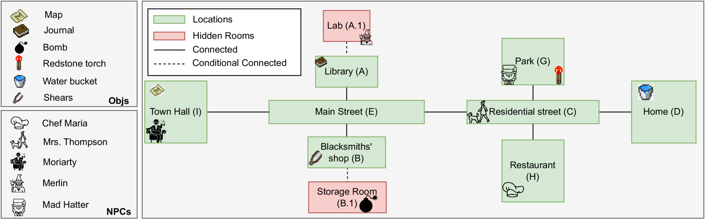
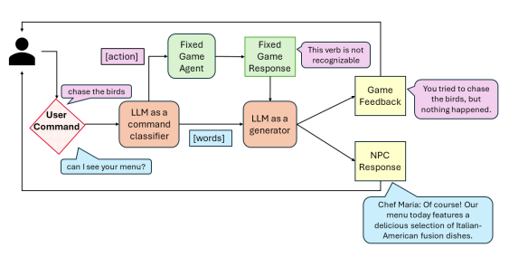

## 引言

日前微软研究院在 `arxiv` 发布了一篇名为 [**Player-Driven Emergence in LLM-Driven Game Narrative**](https://arxiv.org/abs/2404.17027) 的论文，讨论了将大模型 LLM 应用在玩家和 NPC 中的对话，以此对游戏中的对话和叙事结构提供更多的灵活性和丰富度。

## **Dejaboom!**

论文中的研究者门开发了一款用 [TextWorld](https://github.com/microsoft/TextWorld) + GPT-4 实现的名为 **Dejaboom!** 的文字解密游戏。

在游戏中玩家会重复经历相同的一天。每天从家里醒来，通过探索村庄或和NPC对话来消耗步数并尝试。当步数达到30步时，炸弹会爆炸，爆炸后会回到一天的开始并重置村庄和NPC。

下面是这个游戏的地图：

### 地点和物品

这个游戏包括了6个地点：家、公园、图书馆、餐厅、铁匠铺和市政厅，还有了两个隐藏房间，分别位于铁匠铺和图书馆。隐藏房间需要特定事件来触发，并且炸弹就藏在铁匠铺的隐藏房间中。

玩家可以自由移动，同时可互动的物品有两类：拆炸弹的组件（家里的水桶、公园的红石火炬、铁匠铺里的剪刀）和 提供线索的物品（图书馆里的拆弹器工具箱、市政厅里的地图）。

### NPC

除了上述外，游戏还设置了5个NPC角色：

- Mrs. Thompson：一个在住宅街遛狗的老妇人，她是激活公园里 Mad Hatter 的关键人物。
- Mad Hatter：来自爱丽丝梦游仙境的角色，他知道炸弹的位置，但是隐藏在公园的需要和 Mrs. Thompson 交谈后激活。
- Chef Maria：她是餐厅的厨师，她会提供 Merlin 和 Moriarty 的位置。
- Merlin：来自亚瑟王的角色，在图书管理的隐藏房间里。他是制造炸弹的人，并且有拆弹器工具箱。
- Moriarty：来自福尔摩斯的角色，他在市政厅，并且是整个事件的幕后策划者。就是他让 Merlin 制造的炸弹。

这里 NPC 的对话内容是通过 GPT-4 生成的，每个 NPC 都被赋予了一个背景故事、个性和对话触发的一系列条件。

### 解谜

对于玩家来说，主要有两个目标：

1. 找到炸弹的位置：玩家需要先找到 Mrs. Thompson，并说服她透露 Mad Hatter 的位置。其次需要找到 Mad Hatter，他会给玩家一个谜题，解开他就能知道炸弹在铁匠铺的隐藏房间。
2. 获取并组装拆炸弹的工具：玩家有两种方式可以找到：第一种是收集拆弹工具所需要的 3 个物品；第二种是是和厨师 Maria 交谈，解锁 Merlin 的位置，然后劝说 Merlin 将解锁的工具包交给你。

### 与大模型的交互

如下图。用户的命令首先会通过 GPT-4 被意图识别(function calling) 为用户动作 或 与NPC对话。

如果用户触发了一个动作，这个动作会被传递给一个固定的游戏代理，可以理解为一段固定的执行逻辑。然后会将这段逻辑执行的结果传递给 GPT-4， GPT-4 会根据执行结果生成一个比较合适的游戏反馈。例如用户“追逐小鸟”，游戏内部的执行逻辑认为这个动作无法识别或者是非法的，然后将这个信息交给 GPT-4， GPT-4 总计后返回 “你试图追逐鸟儿，但什么也没发生”。

如果用户触发了一段对话，这个对话会给到 GPT-4，需要注意的是在这里调用 GPT-4 的时候会根据用户对话的 NPC 人设、游戏背景、和 NPC 的对话历史等信息来生成适当的 NPC 对话。例如用户对厨师 Maria 说 “我可以看看你的菜单吗”，厨师 Maria 根据GPT-4生成的回复是 “当然可以！我们今天的菜单特色是意大利-美国融合菜系的美味选择”。

## 用户体验

论文团队找了28个人设限1小时体验游戏。经统计，玩家平均做了75步，按照30步炸弹爆炸的设定，每个玩家平均完了2.5次。28个玩家中有六人解除了炸弹。

我们收集了一些玩家称赞的点：

1. 20% 的玩家认为游戏提供了更加灵活的命令选择和错误纠正能力
2. 20% 的玩家认为 NPC 进行了真实且有趣的对话
3. 10% 的玩家认为可以使用自然语言而不是特定关键词来探索游戏
4. 由于游戏的灵活性，玩家认为可以创造“自己的”冒险体验
5. 即使每次爆炸后游戏会重置，但是玩家不会完全重复欣赏一遍
6. 56% 的玩家认为游戏中最新颖的部分是与 NPC 互动的流畅性

玩家也指出了一些改进点：

1. 40% 的玩家都提出了延迟问题—— 大模型响应慢
2. 10% 的玩家发现角色前后的不一致性——大模型丢失上下文关系
3. 10% 的玩家发现NPC回应重复——prompt 提示词设置的过于保守
4. 14.28% 的玩家希望 NPC 可以更加神秘——prompt 提示词导致在个别情况下 NPC 透露太多信息

## 游戏叙事的涌现

论文作者分析了 28 位玩家的日志，这些日志包括玩家在游戏中的行为、游戏反馈、对 NPC 的发言、NPC 的回应，并用 GPT-4 将游戏日志转化为叙事图。叙事图是一个有向无环图，每个节点代表玩家在游戏中的策略，有向边代表游戏中的时间推进。

通过玩家的叙事图和游戏设计师预期的叙事图对比，以此发现在使用了大模型的情况下玩家创建的新叙事节点，这被称为叙事的涌现。

以下是论文作者们整理的有向无环图。其中蓝色节点代表**设计师预期内的游戏叙事**，绿色节点代表**玩家创建的新节点**，即涌现的节点。

> 对于具体如何构建叙事图，可以详看论文 [https://arxiv.org/abs/2404.17027](https://arxiv.org/abs/2404.17027)
> 

## 总结

目前 LLM 大多被用在文本游戏中，例如本论文主要集中在辅助用户游玩上，LLM 的灵活性让 NPC 的回答更多样、玩家的选择更自由等等。对于论文中提到的 LLM 延迟的问题，也许可以通过量化模型来解决；对于前后不一致的问题，目前越来越多的 LLM 开始支持超长上下文，基本也不会是问题。

除了我这里说到的在线任务，目前也有很多研究员在探索离线场景，如生成 NPC 脚本、叙事场景、对话、游戏关卡，或者用 LLM 驱动 NPC 等等。

最后个人感觉也许 LLM 在 *rogue-like* 类型的游戏也许会有一个不错的发挥。

## 参考

https://github.com/microsoft/TextWorld

https://github.com/microsoft/jericho

[https://arxiv.org/abs/2404.17027](https://arxiv.org/abs/2404.17027)