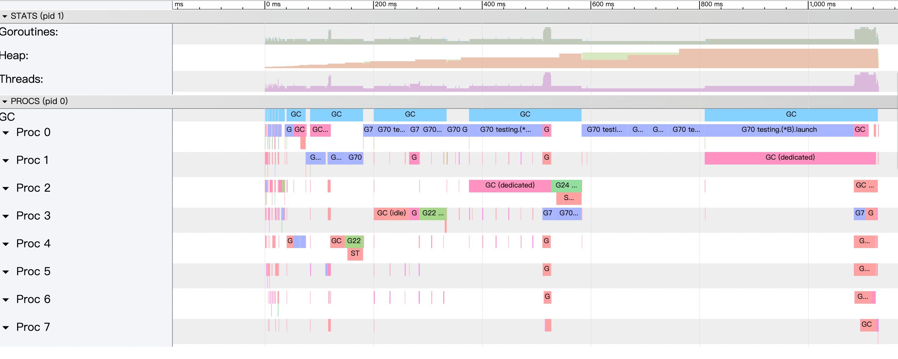
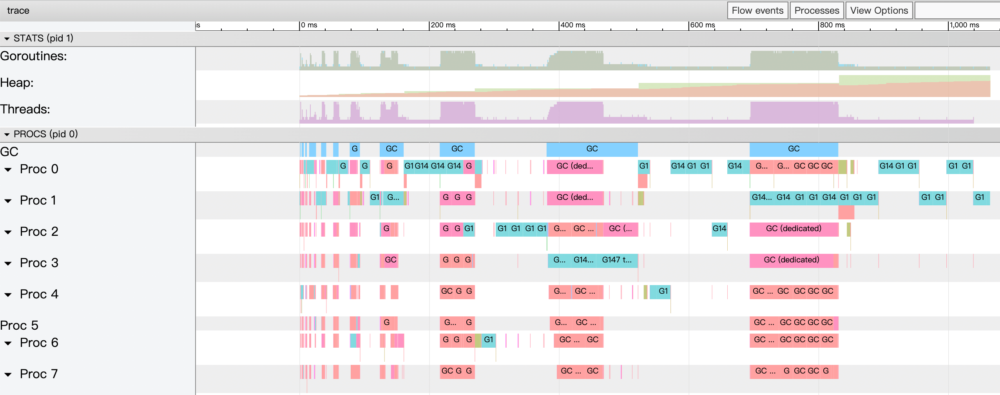

## 引言

本文主要想整理Go语言中值传递和指针传递本质上的区别，这里首席分享William Kennedy的一句话作为总结：

> ***Value semantics keep values on the stack, which reduces pressure on the Garbage Collector (GC). However, value semantics require various copies of any given value to be stored, tracked and maintained. Pointer semantics place values on the heap, which can put pressure on the GC. However, pointer semantics are efficient because only one value needs to be stored, tracked and maintained.***
> 

大意可以理解为Golang中，值对象是存储在stack栈内存中的，指针对象是存储在heap堆内存中的，故使用值对象可以减少GC的压力。然而，指针传递的效率在于，存储、跟踪和维护过程中只需要传递一个值。

基于以上的认识，我们用以下例子来试试

## 结构体定义

以下面一个简单的struct作为示例

```go
type S struct {
   a, b, c int64
   d, e, f string
   g, h, i float64
}
```

我们分别构建初始化值对象和指针对象的方法

```go
func byValue() S {
	return S{
		a: math.MinInt64, b: math.MinInt64, c: math.MinInt64,
		d: "foo", e: "foo", f: "foo",
		g: math.MaxFloat64, h: math.MaxFloat64, i: math.MaxFloat64,
	}
}

func byPoint() *S {
	return &S{
		a: math.MinInt64, b: math.MinInt64, c: math.MinInt64,
		d: "foo", e: "foo", f: "foo",
		g: math.MaxFloat64, h: math.MaxFloat64, i: math.MaxFloat64,
	}
}
```

## 对象传递

### 内存地址

首先我们来探究在不同的function传递时，值对象和指针对象在内存地址方面有什么不同。我们创建两个function如下：

```go
func TestValueAddress(t *testing.T) {
	nest1 := func() S {
		nest2 := func() S {
			s := byValue()
			fmt.Println("------ nest2 ------")
			fmt.Printf("&a:%v,  &b:%v, &c:%v, &d:%v, &f:%v, &g:%v, &h:%v, &i: %v\n",
				&s.a, &s.b, &s.c, &s.d, &s.f, &s.g, &s.h, &s.i)
			return s
		}
		s := nest2()
		fmt.Println("------ nest1 ------")
		fmt.Printf("&a:%v,  &b:%v, &c:%v, &d:%v, &f:%v, &g:%v, &h:%v, &i: %v\n",
			&s.a, &s.b, &s.c, &s.d, &s.f, &s.g, &s.h, &s.i)
		return s
	}
	s := nest1()
	fmt.Println("------ main ------")
	fmt.Printf("&a:%v,  &b:%v, &c:%v, &d:%v, &f:%v, &g:%v, &h:%v, &i: %v\n",
		&s.a, &s.b, &s.c, &s.d, &s.f, &s.g, &s.h, &s.i)
}

func TestPointAddress(t *testing.T) {
	nest1 := func() *S {
		nest2 := func() *S {
			s := byPoint()
			fmt.Println("------ nest2 ------")
			fmt.Printf("&a:%v,  &b:%v, &c:%v, &d:%v, &f:%v, &g:%v, &h:%v, &i: %v\n",
				&s.a, &s.b, &s.c, &s.d, &s.f, &s.g, &s.h, &s.i)
			return s
		}
		s := nest2()
		fmt.Println("------ nest1 ------")
		fmt.Printf("&a:%v,  &b:%v, &c:%v, &d:%v, &f:%v, &g:%v, &h:%v, &i: %v\n",
			&s.a, &s.b, &s.c, &s.d, &s.f, &s.g, &s.h, &s.i)
		return s
	}
	s := nest1()
	fmt.Println("------ main ------")
	fmt.Printf("&a:%v,  &b:%v, &c:%v, &d:%v, &f:%v, &g:%v, &h:%v, &i: %v\n",
		&s.a, &s.b, &s.c, &s.d, &s.f, &s.g, &s.h, &s.i)
}
```

两个方法对应的输入如下：

```go
// TestValueAddress输出
------ nest2 ------
&a:0xc00007e2a0,  &b:0xc00007e2a8, &c:0xc00007e2b0, &d:0xc00007e2b8, &f:0xc00007e2d8, &g:0xc00007e2e8, &h:0xc00007e2f0, &i: 0xc00007e2f8
------ nest1 ------
&a:0xc00007e240,  &b:0xc00007e248, &c:0xc00007e250, &d:0xc00007e258, &f:0xc00007e278, &g:0xc00007e288, &h:0xc00007e290, &i: 0xc00007e298
------ main ------
&a:0xc00007e1e0,  &b:0xc00007e1e8, &c:0xc00007e1f0, &d:0xc00007e1f8, &f:0xc00007e218, &g:0xc00007e228, &h:0xc00007e230, &i: 0xc00007e238

// TestPointAddress输出
------ nest2 ------
&a:0xc00007e1e0,  &b:0xc00007e1e8, &c:0xc00007e1f0, &d:0xc00007e1f8, &f:0xc00007e218, &g:0xc00007e228, &h:0xc00007e230, &i: 0xc00007e238
------ nest1 ------
&a:0xc00007e1e0,  &b:0xc00007e1e8, &c:0xc00007e1f0, &d:0xc00007e1f8, &f:0xc00007e218, &g:0xc00007e228, &h:0xc00007e230, &i: 0xc00007e238
------ main ------
&a:0xc00007e1e0,  &b:0xc00007e1e8, &c:0xc00007e1f0, &d:0xc00007e1f8, &f:0xc00007e218, &g:0xc00007e228, &h:0xc00007e230, &i: 0xc00007e238
```

由此我们可知，值对象由于是分配在栈内存上的，所以他的生命周期跟随func：当function执行完毕时，对应function内部的对象也会被销毁被重新copy到新的栈内存；指针对象由于是分配在堆内存中的，即便function执行完毕，栈内存被清理也不会改变其分配的内存地址，而是由GC统一管理。

故值对象在不同的func中传递时，势必会引起栈内存中的copy

### 性能

然后让我们来看，仅在一个func中，值对象和指针对象的性能如何。

通过创建Benchmark以追踪他在循环中的性能：

```go
func BenchmarkValueCopy(b *testing.B) {
	var s S
	out, _ := os.Create("value.out")
	_ = trace.Start(out)

	for i := 0; i < b.N; i++ {
		s = byValue()
	}

	trace.Stop()
	b.StopTimer()
	_ = fmt.Sprintf("%v", s.a)
}

func BenchmarkPointCopy(b *testing.B) {
	var s *S
	out, _ := os.Create("point.out")
	_ = trace.Start(out)

	for i := 0; i < b.N; i++ {
		s = byPoint()
	}

	trace.Stop()
	b.StopTimer()
	_ = fmt.Sprintf("%v", s.a)
}
```

然后执行以下语句

```go
go test -bench=BenchmarkValueCopy -benchmem -run=^$ -count=10 > value.txt
go test -bench=BenchmarkPointCopy -benchmem -run=^$ -count=10 > point.txt
```

benchmark stat如下：

```go
// value.txt
BenchmarkValueCopy-8   	225915150	         5.287 ns/op	       0 B/op	       0 allocs/op
BenchmarkValueCopy-8   	225969075	         5.348 ns/op	       0 B/op	       0 allocs/op
BenchmarkValueCopy-8   	224717500	         5.441 ns/op	       0 B/op	       0 allocs/op
...

// point.txt
BenchmarkPointCopy-8   	22525324	        47.25 ns/op	      96 B/op	       1 allocs/op
BenchmarkPointCopy-8   	25844391	        46.27 ns/op	      96 B/op	       1 allocs/op
BenchmarkPointCopy-8   	25628395	        46.02 ns/op	      96 B/op	       1 allocs/op
...
```

由此可以看出，值对象的初始化比指针对象初始化要快

然后我们通过trace日志来看看具体的原因，使用以下命令：

```go
go tool trace value.out
go tool trace point.out
```


value.out


point.out

经过trace日志可以看出，值对象在执行过程中没有GC且没有额外的goroutines；指针对象总共GC 967次。

## 方法执行

创建基于值对象和指针对象的空function如下：

```go
func (s S) value(s1 S) {}

func (s *S) point(s1 *S) {}
```

对应的Benchmark如下：

```go
func BenchmarkValueFunction(b *testing.B) {
	var s S
	var s1 S

	s = byValue()
	s1 = byValue()
	for i := 0; i < b.N; i++ {
		for j := 0; j < 1000000; j++  {
			s.value(s1)
		}
	}
}

func BenchmarkPointFunction(b *testing.B) {
	var s *S
	var s1 *S

	s = byPoint()
	s1 = byPoint()
	for i := 0; i < b.N; i++ {
		for j := 0; j < 1000000; j++  {
			s.point(s1)
		}
	}
}
```

Benchmark stat如下：

```go
// value
BenchmarkValueFunction-8   	     160	   7339292 ns/op

// point
BenchmarkPointFunction-8   	     480	   2520106 ns/op
```

由此可以看到，在方法执行过程中，指针对象是优于值对象的。

## 数组

下面我们尝试构建一个值对象数组和指针对象数组，即[]S和[]*S

```go
func BenchmarkValueArray(b *testing.B) {
	var s []S
	out, _ := os.Create("value_array.out")
	_ = trace.Start(out)

	for i := 0; i < b.N; i++ {
		for j := 0; j < 1000000; j++ {
			s = append(s, byValue())
		}
	}

	trace.Stop()
	b.StopTimer()
}

func BenchmarkPointArray(b *testing.B) {
	var s []*S
	out, _ := os.Create("point_array.out")
	_ = trace.Start(out)

	for i := 0; i < b.N; i++ {
		for j := 0; j < 1000000; j++ {
			s = append(s, byPoint())
		}
	}

	trace.Stop()
	b.StopTimer()
}
```

获取到的benchmark stat如下

```go
// value array   []S
BenchmarkValueArray-8   	       2	 542506184 ns/op	516467388 B/op	      83 allocs/op
BenchmarkValueArray-8   	       2	 532587916 ns/op	516469084 B/op	      85 allocs/op
BenchmarkValueArray-8   	       3	 501410289 ns/op	538334434 B/op	      57 allocs/op

// point array   []*S
BenchmarkPointArray-8   	       8	 232675024 ns/op	145332278 B/op	 1000022 allocs/op
BenchmarkPointArray-8   	      10	 181305981 ns/op	145321713 B/op	 1000018 allocs/op
BenchmarkPointArray-8   	       8	 329801938 ns/op	145331643 B/op	 1000021 allocs/op
```

然后是用trace日志看看具体的GC和Goroutines的情况：

```go
go tool trace value_array.out
go tool trace point_array.out
```



value_array.out



point_array.out

通过以上的日志可知，[]S相较于[]*S仍然有更少的GC和Goroutines，但是在实际的运行速度中，尤其是需要值传递的情况，[]*S还是优于[]S的。此外，在使用[]S修改其中某一项的值的时候会存在问题，如下

```go
// bad case
func TestValueArrayChange(t *testing.T) {
	var s []S
	for i := 0; i < 10; i++ {
		s = append(s, byValue())
	}

	for _, v := range s {
		v.a = 1
	}

	// assert failed
	// Expected :int64(1)
  // Actual   :int64(-9223372036854775808)
	assert.Equal(t, int64(1), s[0].a)
}

// good case
func TestPointArrayChange(t *testing.T) {
	var s []*S
	for i := 0; i < 10; i++ {
		s = append(s, byPoint())
	}

	for _, v := range s {
		v.a = 1
	}

	// assert success
	assert.Equal(t, int64(1), s[0].a)
}
```

## 总结

如同一开始所说的，值对象是跟随func存储在栈内存中的，指针对象是存储在堆内存中的。

对于值对象来说，当func结束时，栈内的值对象也会跟着从一个栈复制到另一个栈；同时存储在栈内存中意味着更少的GC和Goroutines。

对于指针对象来说，在堆内存中存储无异会增加GC和Goroutines，但是在func中传递指针对象时，仅需要传递指针即可。

综上，对于仅在方法内使用的对象，或想跨方法传递的一些小的对象，那么可以使用值对象来提升效率和减少GC；但是如果需要传递大对象，或者跨越更多方法来传递对象，那么最好还是使用指针对象来传递。

## 拓展阅读

[Golang - 关于指针与性能](https://hedzr.com/golang/pointer/go-pointer/)

[Go: Should I Use a Pointer instead of a Copy of my Struct?](https://medium.com/a-journey-with-go/go-should-i-use-a-pointer-instead-of-a-copy-of-my-struct-44b43b104963)

[Design Philosophy On Data And Semantics](https://www.ardanlabs.com/blog/2017/06/design-philosophy-on-data-and-semantics.html)

[Frequently Asked Questions (FAQ) - The Go Programming Language](https://go.dev/doc/faq#stack_or_heap)

[Go 语言内存分配器的实现原理](https://draveness.me/golang/docs/part3-runtime/ch07-memory/golang-memory-allocator/)

[Go 语言内存管理三部曲（二）解密栈内存管理_栈_网管_InfoQ写作社区](https://xie.infoq.cn/article/530c735982a391604d0eebe71)