## 整体架构

TiDB 大体可以分为三个模块TiDB Server, PD Cluster 和 Storage Cluster。

- **TiDB Server** 的功能类似于Mysql中的Server端，用于 <u>*处理客户端的连接*</u>、<u>*解析和优化SQL语句*</u>、<u>*生成执行计划*</u> 等等。除此之外，因为TiDB底层存储是LSM-Tree而不是B+ Tree，所以还需要将<u>*关系型数据转换成KV格式*</u>。此外还有<u>*GC*</u>、<u>*DDL执行*</u>、<u>*缓存*</u>和<u>*热点小表*</u>等功能。
- **PD Cluster** 是 TiDB 相比于传统数据库独有的一个模块，这个模块也是 TiDB 作为分布式系统的核心。主要的功能有<u>*元数据的存储*</u>、TiDB 集群中<u>*微服务的注册和调用*</u>、分布式事务/全局ID(<u>*TSO*</u>)的生成 和 集群的<u>*负载均衡*</u>。为了实现这些，PD集成了 **etcd**。
- Storage Cluster 是TiDB 的存储模块，为了实现 **HTAP**(OLAP + OLTP)，这部分又被分成两个存储模块——**TiKV**(行式存储) 和 **TiFlash** (列式存储)。
    
    TiKV 为了支持OLTP业务，类似传统数据库引擎会有MVCC多版本并发管理、锁机制、算子下堆、事务隔离、ACID等等功能，底层的存储结构使用的是rocksdb实现的LSM-Tree。
    
    TiFlash 是为了支持OLAP业务，TiFlash的数据是基于TiKV异步复制过来的。
    

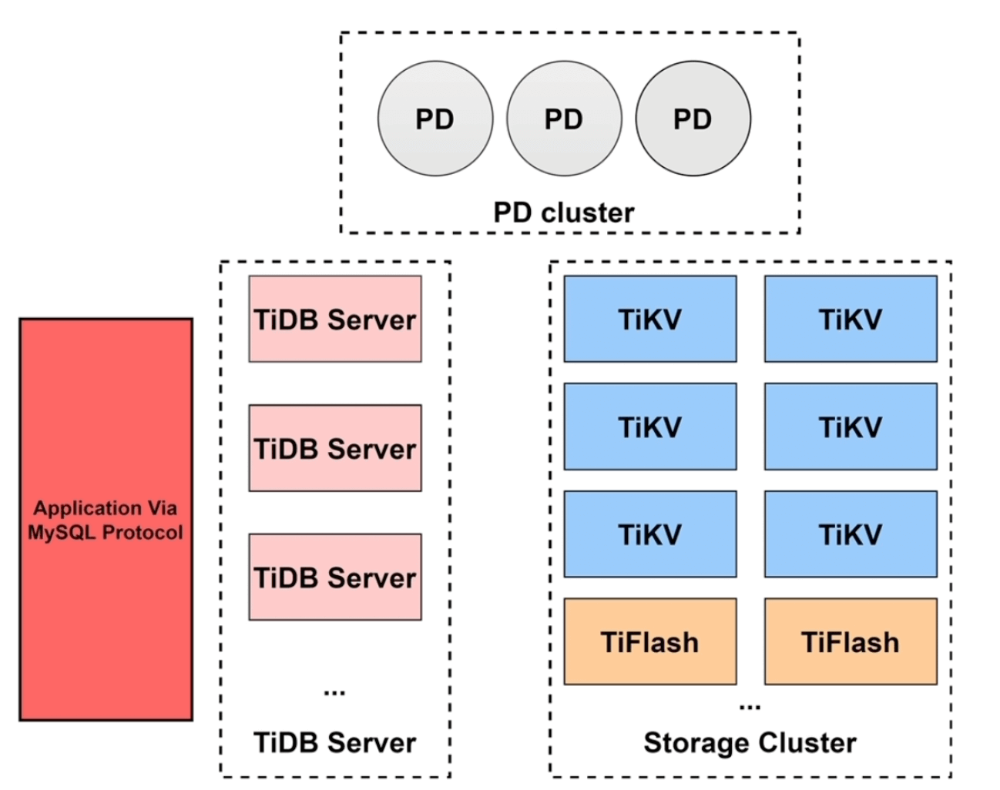

## 分模块梳理

上面我们对三个模块进行了梳理，下面我们具体剖开每个模块，看看具体的细节

### TiDB Server


#### 编译、优化、执行

- `Protocol Layer` 是协议层，用于管理客户端的连接和身份认证
- SQL的解析和编译是 `Parse` 和 `Compile` 模块处理的，主要的作用是：SQL → AST语法树 → 执行计划(Plan)
    
    `Parse` 模块会将SQL语句解析成AST语法树，AST语法树是`pkg/parser/ast` 目录中定义的基于 **Node** 的一组用于存储SQL语句信息的对象，比如 DMLNode对象中会包含读写字段(FieldList)、表名(TableName)、条件信息(OnCondition)等等。
    
    `Compile` 模块会将 AST语法树转换成执行计划(**SQL Plan**)，这部分对应的代码在`pkg/planner` 目录下，Plan 对象会根据 ast.Node 即AST语法树来生成，并在创建Plan的过程中会进行<u>*验证*</u>、<u>*逻辑优化*</u> 和 <u>*物理优化*</u>，也会创建对应的session上下文。

    
还有一点需要注意，`Compile` 模块中提供了将Plan对象转为对应存储类型(StoreType)的执行器(Executor)，在执行器中包含KV结构数据，即`Compile` 模块会将解析SQL生成的关系型数据转换成对应的KV结构数据。
    


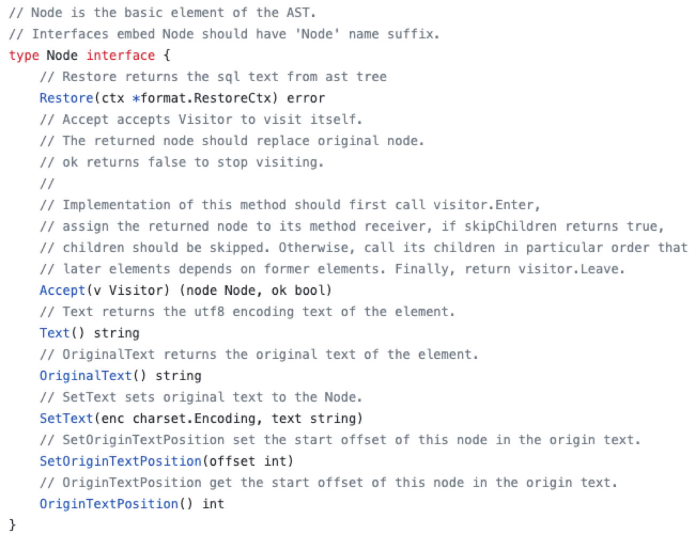





- 经过上面的解析和编译 ，我们来到了执行`Executor`模块，它更像是一个 TiDB Server 中的调度模块，用于调度 `Transaction`、`KV` 和 `DistSQL` 模块。
    
    每个 Exec 中会包含对应的 从Plan计划中传递过来的 session 上下文 (sessionctx)，session中会包含事务管理器(TxnManager)的调用方法，以便在执行过程中管理事务。
    
    事务具体的实现都是封装在 `Transaction` 模块，对应代码中则是在 `pkg/sessiontxn` 目录下。
    
    拿到 Executor 后，之后就是具体的执行阶段，针对比较简单的仅 <u>*根据主键或者唯一索引的等值查询*</u> 都是通过 `KV` 模块处理的；相对复杂的任务(job)会通过 `DistSQL` 将其转换成基于单表的子任务(subjob)。
    
    不论是`KV`还是 `DistSQL` 最终都会通过调用`TiKV Client` 来获取引擎层的数据。

    
`Executor`模块既然负责了执行的调度，那有关 **算子下推** 的调度也是在此模块做的。具体的代码在`pkg/executor/coprocessor.go`
    
    
    **算子下推** 指的是将一部分函数计算交给引擎层(TiKV和TiFlash)，以减轻Server层和引擎层在网络IO上的开销，它将本需要Server层处理的工作交给了引擎层，Server层只需要对引擎层的结果进行聚合即可。由此可见，为了支持算子下推，引擎层也需要支持一部分函数执行。
    
    - TiKV可以支持 TopN 和 Limit 的算子下推
    - TiFlash可以支持 TableScan、Selection、Hash/Stream Aggregation、TopN、Limit、Project、HashJoin、Windows等算子，支持了几乎所有的SQL函数的下推


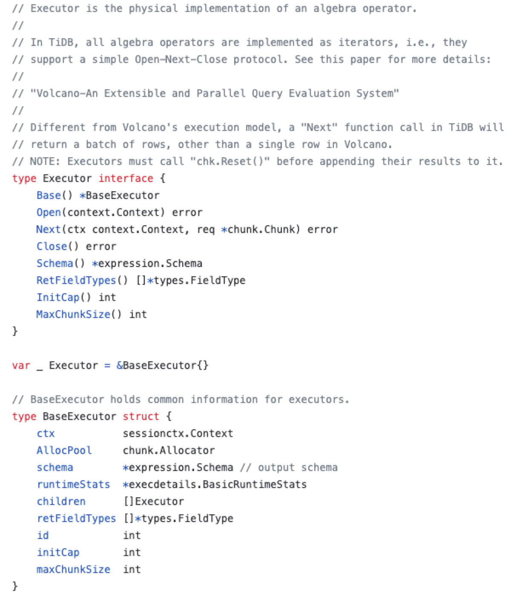

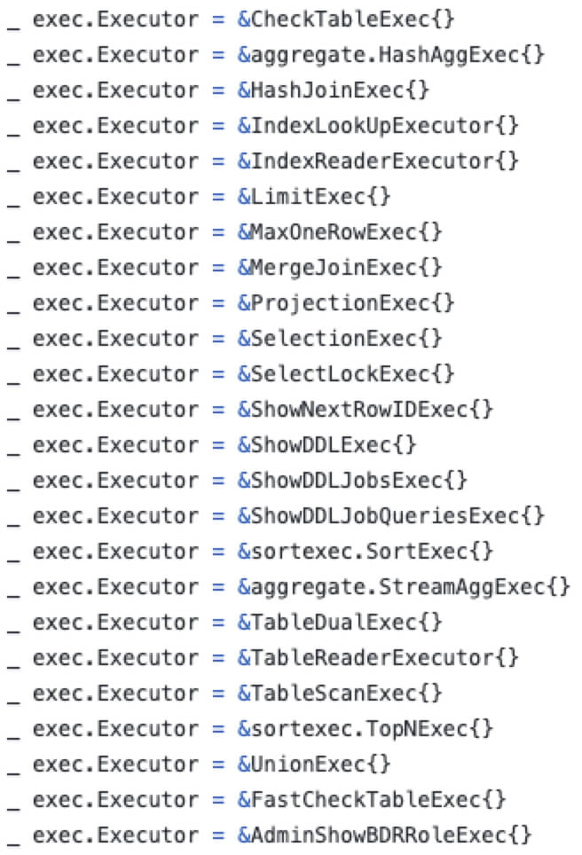



#### **online DDL**

**online DDL** 相关模块——`start job`, `workers` 和 `schema load`


online DDL 仅在TiDB v6.2.0之前有效，这之后采取了并发DDL框架，详见 [DDL 语句的执行原理及最佳实践](https://docs.pingcap.com/zh/tidb/stable/ddl-introduction)


- TiDB Server集群中所有实例的`start job` 模块都可以接收DDL语句，并将其放入 TiKV 中的 `job queue`
- 在 TiDB Server 的集群中，只有一个 Leader节点，也可以称为 Owner 节点，只有Owner节点的`workers` 模块会生效，从TiKV中获取持久化的队列( ***物理DDL***队列`general job queue` 和 ***逻辑DDL***队列`add index job queue`)，执行job，并在直接结束后记录到历史队列 `history queue`
- `schema load` 是 TiDB 中表结构schema的缓存，主要用于DDL语句的查询


#### 缓存

- 缓存模块——`memBuffer` 和 `cache table`
    
    TiDB Server的缓存主要是存储在 `membuffer` 模块，会缓存下面三个数据：SQL结果、线程缓、元数据和统计数据，可以通过**tidb_mem_quota_query**阈值参数限制每条SQL的缓存占用大小，如果超过此阈值，可以通过**oom-action**参数设置返回ERROR或打印日志等oom动作。
    
    `cache table` 主要是用于*热点小表缓存*，此功能主要用于**查询频繁**、**数据量不大**、**极少修改**的场景，因此想使用热点小表的功能需要满足以下几个条件：
    
    1. 表的总数据量不大 (小于64M)
    2. 表的读取频繁 (查询频繁、数据量小、极少修改)
    3. 不做DDL，热点小表支持DDL操作，进行DDL需要先关闭热点小表缓存

    
针对极少的写场景，热点小表缓存如何保证一致性？                                                                 设定 **缓存租约** 参数 tidb_table_cache_lease ，默认5s。① 租约时间内，读操作直接读缓存，无法进行写操作 ② 租约到期时，缓存中的数据过期，写操作不在堵塞，读写操作都直接请求TiKV ③ 数据更新完毕后后，租约继续开启，回到步骤1

    


#### GC

- GC机制——GC主要是清理 TiKV 中由 MVCC 产生的历史版本。GC操作是仅由TiDB Server集群中 <u>**Leader节点**</u> 发起，执行GC前，Server会找到一个safe point，小于safe point 时间的数据将会被请求，默认是safe point是当前减去十分钟，可以通过 **GC Left Time** 设定，即 GC Left Time 默认是10分钟。
    
    TiDB Server集群每10分钟会进行一次GC操作。首先清除 <u>*表或者字段被drop*</u> 的数据，其次清除<u>*被delete的数据*</u>，最后清除这些数据相关的 <u>*锁信息*</u>。
    

### PD

前面说到PD是TiDB分布式集群的大脑，提供的能力主要是服务整体集群的分布式一致性、高可用。PD是基于`etcd`实现的，主要的功能大体可以分为以下几类：

- 分布式集群中唯一键的生成：TSO的生成、全局和事务ID的生成
- 数据存储：存储集群中的服务信息(元数据)、集群中的调度信息
- 负载均衡策略：集群中的调度规则、标签(label)能力

#### **数据存储**

PD会记录集群中每个实例的元数据信息、TiDB 集群的环境变量信息(如Server中的GC Left time)、集群的调度信息、使用过的TSO、规则信息、资源组等等。具体是通过 `leveldb` 存储的。

#### **TSO 的生成**

TSO是一个 int64的整数型，主要是由 `physical` (unix时钟，精确到毫秒) 和 `logical` (逻辑相对时钟) 组成，TSO的分配都是由PD集群中的 <u>**Leader 节点**</u> 分配的。TiDB Server 在请求PD 获取 TSO的时候是调用Leader节点，通过<u>**异步 callable-future**</u> 的方式获取的，避免了PD生成TSO的等待时间。





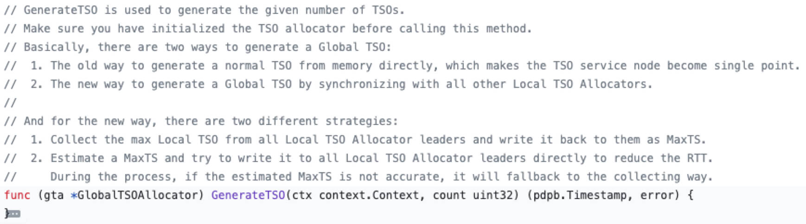

还需要注意一点的是， PD在分配TSO的时候会对TSO进行落盘，即会产生IO操作，所以在分配过程中会分配 **一段时间窗口** 的TSO并缓存到内存，在TiDB Server 多次获取的过程中，只需要从内存中获取TSO即可，大大增加了并发性。源码在 [pd](https://github.com/tikv/pd) 的`pkg/tso/global_allocator.go`


#### **负载均衡**

对于负载均衡所需要的实例状态信息，由TiKV节点周期性地通过心跳(heart beat)的方式传递给PD。其中这部分信息包含 **store heartbead**(TiKV实例的状态信息) ****和 **region heartbeat** (TiKV中每个Region的状态信息)。

基于这些信息，PD支持读写均衡、region容量分配均衡、热点数据打散、扩容缩容、故障恢复等等功能，这些属于比较常规的负载均衡策略，这里不做详细说明。下面主要说明一下PD提供的 *label 标签* 功能。

针对大规模的分布式集群业务，服务会部署在不同的IDC机房、不同的子网上，为了提供用户对于跨机房业务的调度配置，TiDB 在 PD 中提供了 label，具体的代码在`pkg/schedule/labeler` 


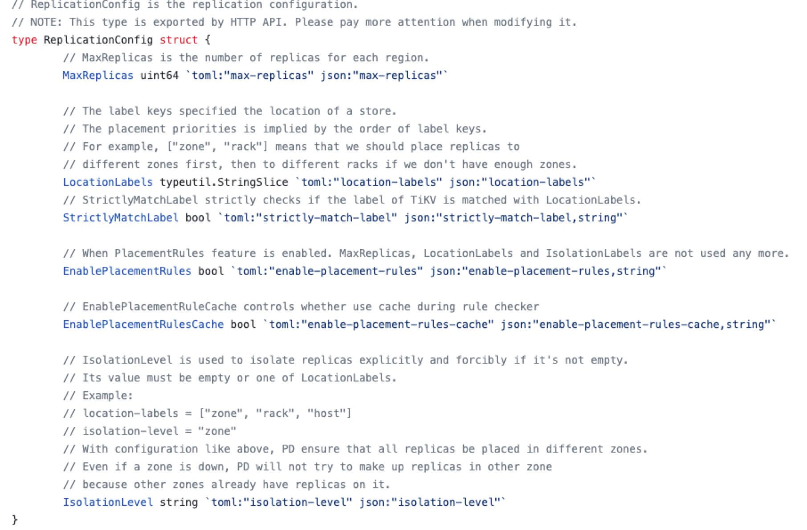
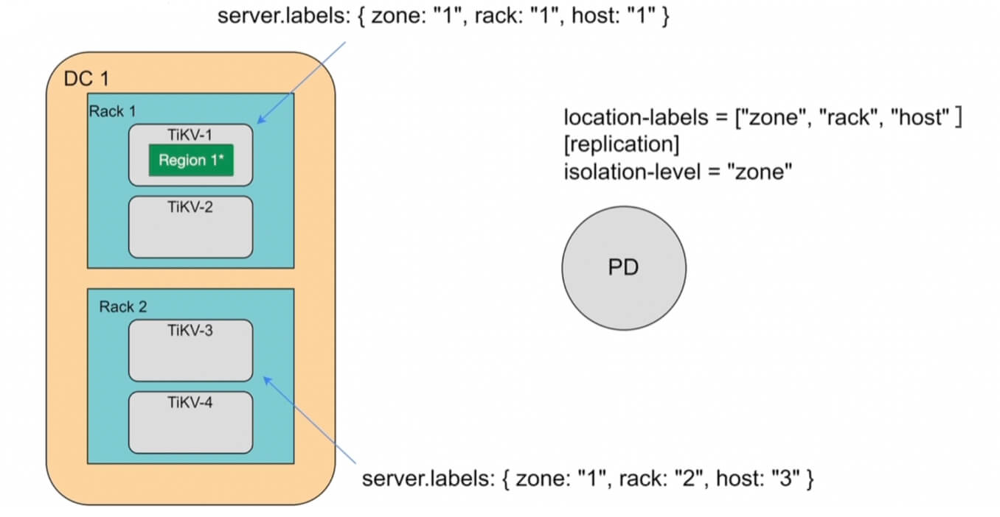


PD 中定义了ReplicationConfig来读取label相关的配置，比较重要的几个变量有：

- max-replicas：每个区域的副本数
- location-labels：标签列表，列表中的顺序代表标签的优先级
- isolation-level：显式强制隔离副本的label，即在此配置中的label key至少在3个不同的label value中有副本

### TiKV

#### **rocksdb**

TiKV的存储数据结构是基于[`rocksdb`](https://github.com/facebook/rocksdb) 的 LSM-Tree (全称是 *Log-Structured Merge*-*tree*)，存储的格式是KV键值对，通过分块 + 二分查找的方式找到对应的记录。

LSM-Tree会在内存中分配1个`MemTable`块和若干个 `immutable MemTable`，这些块以链表的形式连接在一起；同理磁盘中的 `SSTable` 也会按照层级串联起来且大小不断递增；需要注意的是 `Level 0` 的 SSTable 数据是 `immutable MemTable` 数据的复刻 (rocksdb会尽可能块地将 immutable MemTables 刷盘到 L0的SSTable中)。

> 内存中的`immutable MemTable` = 磁盘中的 `Level 0 SSTable`
> 

当 `MemTable` 填满时，会刷盘到`immutable MemTable`，后台进程会将`immutable MemTable` 的数据刷新到磁盘中Level 0 的 SSTable ，当Level 0 的SSTABLE文件达到4个时，会进行压缩并存储到Level 1，以此类推。

写操作时，直接将写请求记录在内存的`MemTable` 和磁盘的 `WAL` 日志即可

读操作时，TiKV在 MemTable 上有提供了一个`Block Cache` 的缓存，用于缓存最近最常读取的数据，`Block Cache` 中没有再依次读取`MemTable`、`immutable MemTable`、`SSTable`

还需要注意一点数据写入都是到内存的MemTable，那么如何保证一致性？

答案是：WAL —— `Write Ahead Log`


既然 LSM-Tree 是KV形式存储，那么一个表中的不同索引要怎么查找？

这里就需要引入**列簇Column Families**，即每个column对应一组`MemTable`、`immutable MemTable`和`SSTable`。

下面我们从 rocksdb 源码的数据结构，来串一下上面的功能

```cpp
// [db/column_family.h]
// 列簇集合
class ColumnFamilySet {
	private:
	  friend class ColumnFamilyData; // 默认主键列簇
		// 列簇集合
		UnorderedMap<std::string, uint32_t> column_families_;
	  UnorderedMap<uint32_t, ColumnFamilyData*> column_family_data_;
		
}

// [db/column_family.h]
// 单列簇数据
class ColumnFamilyData {
	private:
	  friend class ColumnFamilySet;
		// 列信息
		uint32_t id_;
	  const std::string name_;
		// 版本信息
	  Version* dummy_versions_;  // Head of circular doubly-linked list of versions.
	  Version* current_;         // == dummy_versions->prev_

		MemTable* mem_; // MemTable
	  MemTableList imm_; // immutable MemTable
	  SuperVersion* super_version_; // 所有版本(当前+历史版本)
	
		// ColumnFamily 形成双向链表
		ColumnFamilyData* next_;
	  ColumnFamilyData* prev_;

}

// [db/memtable_list.h]
// 所有 immutable memtables 的集合的引用，数组存在 MemTableListVersion 中
// 官方注释也说明 MemTableList即imm 会尽快刷新到 L0 的SST中
class MemTableList {
	const int min_write_buffer_number_to_merge_;
	MemTableListVersion* current_;
	// 仍需刷盘的elements数量
	int num_flush_not_started_;
	// 当前内存使用量
	size_t current_memory_usage_;
}

// [db/memtable_list.h]
// 保存了 immutable memtables 数组
class MemTableListVersion {
	// 没有刷盘的 Immutable MemTables
	std::list<MemTable*> memlist_;
	// 已经落盘的 MemTables
	std::list<MemTable*> memlist_history_;
}

// [db/memtable.h]
class MemTable {
	// MemtableRep 里包含了 SkipListRep 和 HashSkipListRep
	// 具体可以看 [db/memtablerep.h]
	const size_t kArenaBlockSize;
	ConcurrentArena arena_;
  std::unique_ptr<MemTableRep> table_;
  std::unique_ptr<MemTableRep> range_del_table_;

	// flush 相关
	bool flush_in_progress_;  // started the flush
  bool flush_completed_;    // finished the flush
  uint64_t file_number_;    // filled up after flush is complete
	std::atomic<FlushStateEnum> flush_state_;
}
```

根据上面的数据结构，我们可以得到下面这张图


#### 分布式事务 (MVCC + 2PC)

分布式事务的设计思想沿用了 ****Google Percolator**** ([<u>*Google.Inc. (2010). Large-scale Incremental Processing Using Distributed Transactions and Notifications.*</u>](https://storage.googleapis.com/pub-tools-public-publication-data/pdf/36726.pdf)) 提出的分布式事务，主要分为两部分

1. 基于MVCC机制的快照读
2. 事务的两阶段提交 prewrite-commit

稍微总结一下 ****Percolator**** ：

- 数据结构层面，定义了一种带TSO时间戳的KV格式，其中 key 是行关键字(row)，列关键字(column)，以及时间戳(timestamp)的组合，value 是任意的 byte 数组
    
    ```bash
    Key:   row:string, column:string,timestamp:int64
    Value: string
    ```
    
- 架构层面分为3个组件：**Client、 TSO** 和 **Bigtable**，其中Client是分布式事务流程的控制者、两阶段提交的协调者，TSO全局唯一且递增的时间戳，Bigtable是持久化的分布式存储

关于Percolator更详细的内容可以看这篇文章，这里不在展开说明—— [<u>*PolarDB数据库内核月报. 11(2018). Database · 原理介绍 · Google Percolator 分布式事务实现原理解读*</u>](http://mysql.taobao.org/monthly/2018/11/02/)


对应到TiDB，首先我们需要知道 TiDB 中的KV格式是如何设计的。TiDB为表的每个索引分配了一个索引ID，用`IndexId`表示。

对于**主键和唯一索引**，可以根据键值key快速定位到对应的 RowID；如果是唯一索引，value对应RowID主键的值，如果是主键则是具体的数据：

```bash
Key:   tablePrefix{tableID}_indexPrefixSep{indexID}_indexedColumnsValue
Value: RowID
```

对于不需要满足唯一性约束的普通二级索引，一个键值可能对应多行，需要根据键值范围查询对应的 RowID：

```bash
Key:   tablePrefix{TableID}_indexPrefixSep{IndexID}_indexedColumnsValue_{RowID}
Value: null
```

生成 IndexKey 这部分代码在tidb中的`pkg/tablecodec/tablecodec.go`

```go
var (
	tablePrefix     = []byte{'t'}
	recordPrefixSep = []byte("_r")
	indexPrefixSep  = []byte("_i")
	metaPrefix      = []byte{'m'}
)

// 生成 index key
func GenIndexKey(loc *time.Location, tblInfo *model.TableInfo, idxInfo *model.IndexInfo,
	phyTblID int64, indexedValues []types.Datum, h kv.Handle, buf []byte) (key []byte, distinct bool, err error) {
	
	// 判断 unique
	if idxInfo.Unique {	
		for _, cv := range indexedValues {
			if cv.IsNull() {
				distinct = false
				break
			}
		}
	}
	TruncateIndexValues(tblInfo, idxInfo, indexedValues)
	// 分配定长buf
	key = GetIndexKeyBuf(buf, RecordRowKeyLen+len(indexedValues)*9+9)
	// table id, 返回 t[tableID]_i
	key = appendTableIndexPrefix(key, phyTblID)
	// index id，返回 t[tableID]_i[indexId]
	key = codec.EncodeInt(key, idxInfo.ID)
	// indexedColumnsValue
	key, err = codec.EncodeKey(loc, key, indexedValues...)
	if err != nil {
		return nil, false, err
	}
	
	if !distinct && h != nil {
		// 二级索引
		// RowID
		if h.IsInt() {
			key = append(key, codec.IntHandleFlag)
			key = codec.EncodeInt(key, h.IntValue())
		} else {
			key = append(key, h.Encoded()...)
		}
	}
	return
}
```

在MVCC的加持下，会在Key中记录 version 信息，，例如：

```bash
Key1_Version1 -> Value
Key2_Version2 -> Value
Key2_Version1 -> Value
```

当然这部分也是基于上面提到的 `GenIndexKey` 方法上，添加TSO时间戳；这部分代码在tidb的`pkg/store/helper/helper.go` ，但实际获取mvcc的 key 是通过请求tikv拿到的，因为中间可能会涉及加锁，具体在tikv的`src/storage/txn/commands/mvcc_by_key.rs` 和 `src/storage/mvcc`， 这里只展示部分代码

```go
// GetMvccByEncodedKeyWithTS get the MVCC value by the specific encoded key, if lock is encountered it would be resolved.
func (h *Helper) GetMvccByEncodedKeyWithTS(encodedKey kv.Key, startTS uint64) (*kvrpcpb.MvccGetByKeyResponse, error) {
	// 构造 tikv 请求
	tikvReq := tikvrpc.NewRequest(tikvrpc.CmdMvccGetByKey, &kvrpcpb.MvccGetByKeyRequest{Key: encodedKey})
	for {
		...
		kvResp, err := h.Store.SendReq(bo, tikvReq, keyLocation.Region, time.Minute)
		...
		mvccResp := kvResp.Resp.(*kvrpcpb.MvccGetByKeyResponse)
		...
		
		// Try to resolve the lock and retry mvcc get again if the input startTS is a valid value.
		if startTS > 0 && mvccResp.Info.GetLock() != nil {
			...
			lockInfo := mvccResp.Info.GetLock()
			lock := &txnlock.Lock{
				Key:             []byte(encodedKey),
				Primary:         lockInfo.GetPrimary(),
				TxnID:           lockInfo.GetStartTs(),
				TTL:             lockInfo.GetTtl(),
				TxnSize:         lockInfo.GetTxnSize(),
				LockType:        lockInfo.GetType(),
				UseAsyncCommit:  lockInfo.GetUseAsyncCommit(),
				LockForUpdateTS: lockInfo.GetForUpdateTs(),
			}
			...
		
		}
		return mvccResp, nil
	}	
}
```

```rust
use crate::storage::{
    mvcc::MvccReader,
    txn::{
        commands::{find_mvcc_infos_by_key, Command, CommandExt, ReadCommand, TypedCommand},
        ProcessResult, Result,
    },
    types::MvccInfo,
    Snapshot, Statistics,
};
```


总结一下上面的内容，key的生成是在 TiDB Server 中完成的，然后TiDB Server拿到了TSO后(startTs)，会请求TiKV获取MVCC的信息



前面用大量篇幅说了TiDB的key生成和TiKV中MVCC key，下面讲一下 2PC流程。

2PC流程会涉及到 **乐观锁** 和 **悲观锁**，最主要的区别在于悲观锁会<u>在用户发起2PC前(执行阶段)，请求 TiKV 获取并持久化一个悲观锁</u>(for updata ts)，具体流程如下：

1. 用户开启事务，TiDB请求 PD 获取 `start_ts`
2. 用户执行SQL，通过`start_ts` 从TiKV获取数据，并写入TiDB内存
3. <u>*从 PD 获取当前 tso 作为当前锁的 for_update_ts，并将锁信息写入内存*</u> (悲观锁)
4. <u>*使用 `for_update_ts` 并发地对所有涉及到的 Key 发起加悲观锁（acquire pessimistic lock）请求 (悲观锁)*</u>
5. 用户发起提交，TiDB Server开启两阶段提交
6. **prewrite**：TiDB 请求TiKV 将数据写入 MemTable，并写入start_ts
    
    **commit**：TiDB 从 PD 获取 TSO，作为 `commit_ts`；请求TiKV，并给写入数据添加 `commit_ts`
    

最后推荐一下 TiDB  社区的专栏文章 ([*TiDB 悲观锁实现原理 2021.06.21*](https://tidb.net/blog/7730ed79))

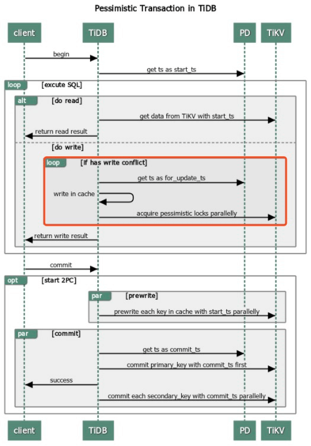

#### Region

前面我们讲到了相对微观的持久化的结构、事务等等，现在我们再从相对宏观的角度再来看整个 TiKV 集群。

TiDB 中每个表会对应多个 Region，Region划分的规则是

- Region达到96M后，会另起一个Region
- 对于历史数据的写入，会导致原已
- 达到96M的Region增大/减小
    - 如果Region增加到144M后，一个Region会分裂成两个Region
    - 如果Region过小时，Region会做合并

TiKV 集群中，每个Region至少会有3个副本 (1个leader 2个follower)，TiDB只和leader节点进行通信，leader和follower之间是通过 Raft 协议同步的，所以和 Raft 协议类似：

- leader会定期(<u>*heartbeat time internal*</u>)向 follower发起心跳，并将写日志同步到follower
- 如果一定时间内(<u>*election timeout*</u>) follower没收到心跳，会将自己的状态转为 candidate候选人


leader和 follower 之间的写日志同步是基于`raft log` 的，和 `rocksdb kv` 存放数据不同，`rocksdb raft` 仅存放 `raft log`，同步具体分为3步：

1. Propose：当 Region leader 收到写请求的时候，leader会将写请求变成 `raft log`
2. Append：将 raft log 写入到本地的 `rocksdb raft` 进行持久化
3. Replicate：leader 通过 raft 算法，将自己的日志复制到 follower，follower收到日之后写入到自己本地的`rocksdb raft` ，最后 follower将成功的消息返回给leader
4. Committed：当leader收到收到过半数发送的成功消息后，则完成commit

这里的commit不是指2PC中的commit阶段完成，而只是raft日志复制完成，实际上raft复制这一步是在2PC第二部commit中的一个步骤，raft日志复制完成后，2PC的commit操作才能完成。

### TiFlash

TiFlash是负责列式存储的模块，主要的核心功能如下：

- 异步复制：TiFlash数据来源
- 一致性：TiFlash中的MVCC快照读
- 智能选择：TiDB 自动选择 TiKV或者TiFlash 混用以提供最佳的查询速度，这也是HTAP的特性之一
- 计算加速：这部分主要是算子下推的功能，之前在介绍TiDB的时候也有所涉及

#### 异步复制

在对TiDB集群进行写入的过程中，并不会直接写TiFlash，也不会像TiKV的 follower 节点那样在写入的时候通过日志复制保持强一致性。TiFlash 是作为 `raft learner` 角色对TiKV中的数据进行**异步复制**。

步骤如下：

1. 同一个集群内的TiDB会维护一个TiFlash Replica Manager (注：此TiFlash Replica Manager功能在21年12月之前是放在TiFlash中的，之后迁到TiDB Server模块，参考[<u>*11.18.2021 ddl: Move TiFlash cluster manager module into TiDB*</u>](https://github.com/pingcap/tidb/issues/29924))
2. 当 TiDB 感知到写操作时，会转化为 PD 的 Placement Rule
3. PD 通过 Placement Rule 令 TiKV 分裂出制定 Key 范围的Region，为其添加 Learner Peer 并异步调度到集群中的TiFlash节点

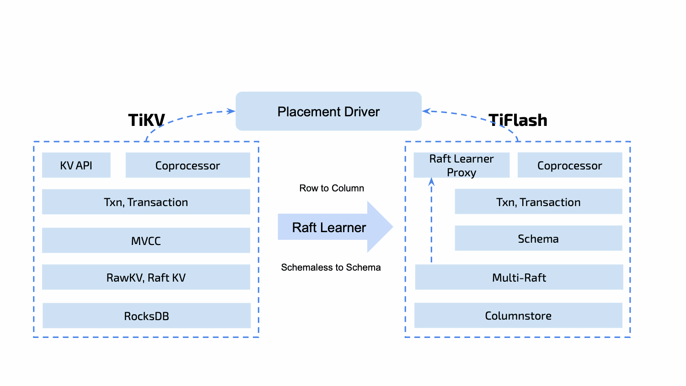

下面我们可以看一下部分代码，TiFlash Replica Manager这部分主要在 TiDB 的`pkg/domain/infosync/tiflash_manager.go` 中，这里定义了 ManagerCtx 的结构

```go
// 管理 PD 和 TiFlash 副本信息
type TiFlashReplicaManagerCtx struct {
	etcdCli              *clientv3.Client
	sync.RWMutex         // protect tiflashProgressCache
	tiflashProgressCache map[int64]float64
	codec                tikv.Codec
}

type TiFlashReplicaManager interface {
	...
	// 维护 PlacementRule
	SetPlacementRule(ctx context.Context, rule placement.TiFlashRule) error
	DeletePlacementRule(ctx context.Context, group string, ruleID string) error
	GetGroupRules(ctx context.Context, group string) ([]placement.TiFlashRule, error)
	
	// 管理和获取 TiFlash 副本信息
	GetStoresStat(ctx context.Context) (*pd.StoresInfo, error)
	CalculateTiFlashProgress(tableID int64, replicaCount uint64, TiFlashStores map[int64]pd.StoreInfo) (float64, error)
	UpdateTiFlashProgressCache(tableID int64, progress float64)
	GetTiFlashProgressFromCache(tableID int64) (float64, bool)
	DeleteTiFlashProgressFromCache(tableID int64)
	...
}
```

#### 一致性

我们知道 TiFlash 的数据是通过异步调度的，但TiDB是支持智能选择的，这就会产生一个问题：如何保证智能选择的时候保证TiFlash和TiKV的数据一致性？

在查询TiFlash的时候，TiFlash会请求TiKV leader节点来确认最新的 `raft log idx` ，如果自己不是最新的会等待最新的 `raft log` 同步过来，以保证自己的数据和 TiKV数据的一致性。具体的例子如下：

- T0 时刻：写入数据到 TiKV Leader
- T1 时刻：请求TiFlash获取数据
- T2 时刻：TiFlash 请求TiKV leader 获取最新的 `raft log idx` 并等待当前TiFlash中的 idx 追上，这个步骤也被称为 ***Learner Read***

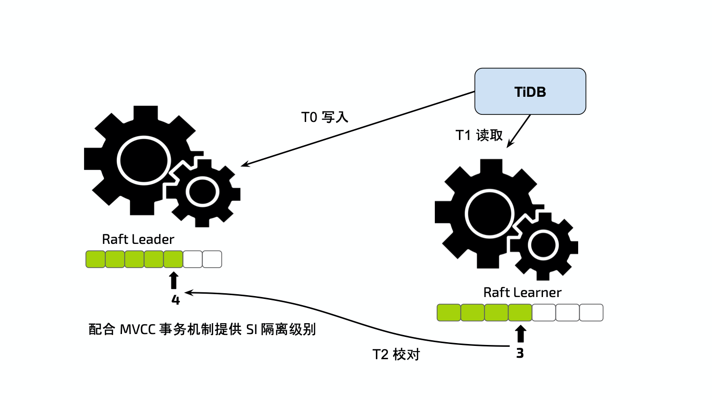

#### 智能选择

TiDB可以经由优化器自主选择行列，选择的逻辑是：优化器根据统计信息估算读取数据的规模，并对比列存和行存访问开销，然后做出最优选择。所以这部分是在Cpomplie阶段，即把 `AST` 语法树转换成`SQL Plan` 的时候完成的，对应的代码应该是 `pkg/planner/core/optimizer.go` ，这里就不具体展开了。

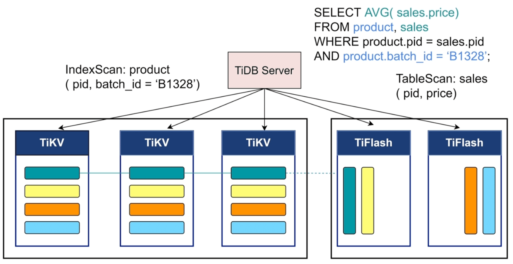

## 分功能梳理

我们在上面按服务模块挨个介绍了每个模块中的主要功能，下面这部分主要是想通过 DML和DDL 流程把上面的模块都穿起来。

### DML - 读操作

1. SQL 会被**TiDB Server** 中的`Protocol Layer` 协议层接收
2. **TiDB Server** 请求 PD 节点获取 TSO，标记为 `start_ts` 开始执行时间
3. 进入`Parse` 解析模块，将SQL语句解析为 AST 语法树
4. 将 AST 语法树交给`Compile` 模块，通过编译优化后，生成对应的`SQL Plan` 执行计划
5. SQL Plan 进入`Execute` 模块，`Execute` 先去`information schema` 缓存中获取表的元数据信息。如果是简单的点查，会下发到 `kv` 模块；如果是相对复杂的任务，会下发到 `DistSQL` 模块，由它们具体调用 client 请求 **TiKV**
6. 读请求到达 **TiKV** 后，会生成 snapshot 快照，进入`UnifyRead Pool`线程池
7. TiKV 会从`read pool`中拿到快照，并请求 `rocksdb kv` 执行查询

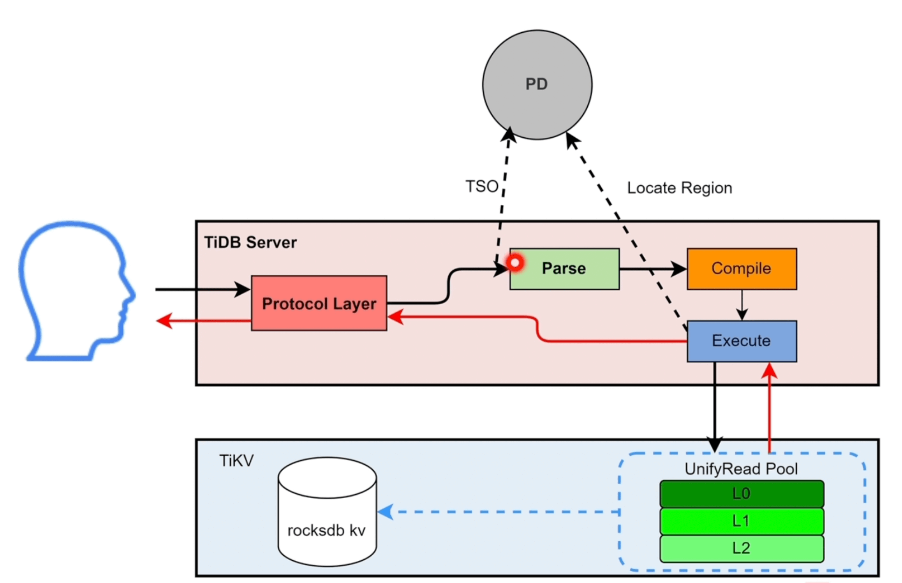

### DML - 写操作

前4步和读操作基本类似，这里我们直接从第5步开始

1. `Execute` 模块去 **TiKV** 查询需要修改的数据，此步骤和读操作类似
2. **TiDB Server** 拿到需要修改的原始数据后，将数据更新到 `memBuffer` 缓存；如果此时发生写冲突，需要请求PD获取 `for_update_ts` 时间戳 (悲观锁)
3. 用户发起提交后，调用 `Transaction` 模块发起两阶段提交 (2PC)，写操作都是`Transaction` 通过`KV`模块调用**TiKV**
4. 写操作会先发送给 **TiKV** 的`Scheduler`模块，它负责负责协调事务并发写入冲突，并将收到的写请求向下传递给`Raftsotre`
5. `Raftsotre` 模块拿到请求后会生成 `raft log` ，将`raft log`写入本地(*leader*)的 `rocksdb raft` 后，同步给 *follower*
6. 当过半follower将`raft log`写入本地`rocksdb raft` 并返回成功后，调用Apply模块将数据持久化到 `rocksdb kv` ，成功后返回 **TiDB Server**，至此2PC 的第一步完成
7. **TiDB Server** 再次请求 PD 获取 `commit_ts` 提交的TSO，再次调用**TiKV** 写入`commit_ts`
8. 最终将提交成功返回给用户

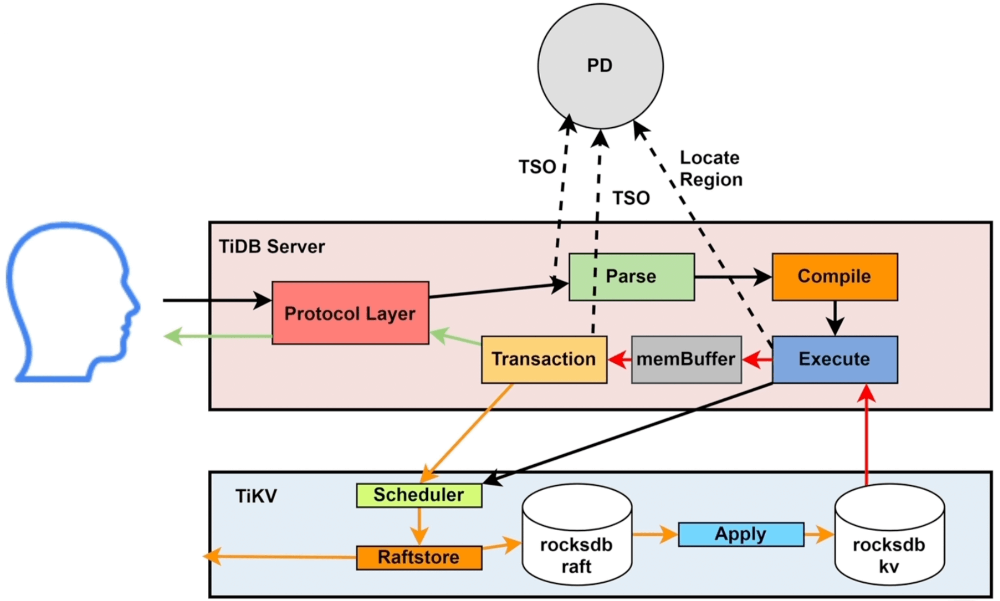

### DDL

之前在TiDB的`online DDL` 我们讲了相关模块，这里我们主要按照流程步骤描述一下：

1. 用户给任一的 **TiDB Server** 发送 DDL 请求
2. 经过解析、编译、优化之后调用`start job` 
    1. 如果当前的 **TiDB Server** 是 Owner 节点则直接调用`workers` 执行
    2. 否则将DDL 任务持久化到 **TiKV** 的`job queue`(物理DDL) 或 `add index queue`(逻辑DDL)。**TiDB Server Owner** 节点的`works` 模块从 **TiKV** 中的 queue 获取任务并执行
3. 执行完毕后，将历史任务持久化到TiKV的 `history queue`

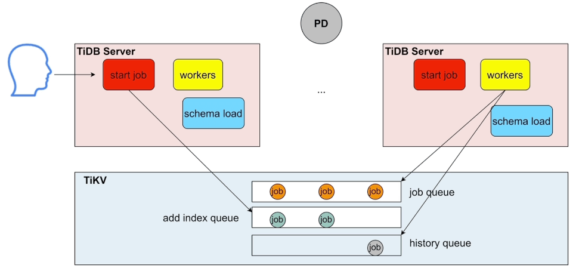

但是这种方式有几个问题：

- **TiDB Server** 集群中的 Owner节点只有一个，影响执行效率
- `job queue`或者`add index queue` 是先进先出，DDL任务会存在积压的情况
- 对于互相不影响的DDL任务，在执行的时候依然会被阻塞

所以在 **TiDB v6.2** 版本之后，推出了**并发DDL** 的框架

首先针对 Owner 节点添加了判断：

- 涉及一张表的DDL相互阻塞
- DROP DATABASE 和 数据库内所有DDL互相阻塞
- 逻辑 DDL 需要等待之前正在执行的逻辑 DDL 执行完才能执行 (逻辑DDL本身执行较快不怎么消耗资源)

在以上的限制后，进行了如下的升级：

- 集群中可以有多个 Owner 并行执行执行 DDL 任务
- DDL Job 不再是先进先出，而是通过选择可执行的 Job 集合