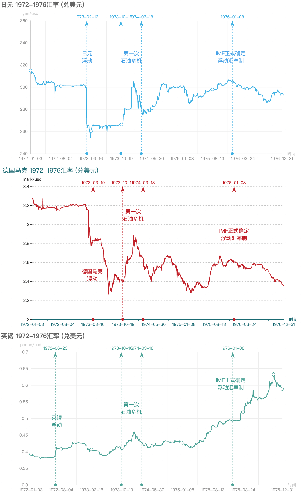
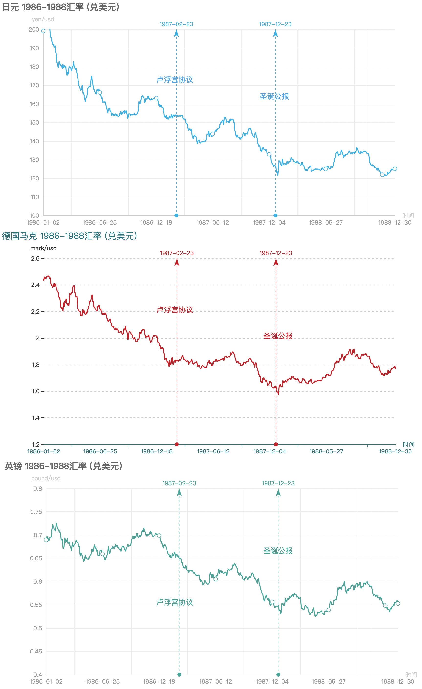

## 布雷顿森林体系

### 背景

二战结束后，为了避免货币动荡导致的大萧条。体系策划者想要一个处于国际监管和指导下的**固定汇率体系**，同时结束对国际贸易和服务的管制。在只有一国国际收支出现“基本失衡”的例外情况下，允许汇率变化。

为了实现这些目标，体系策划者们成立了两个拥有自己雇员的国际组织：

- 国际货币基金组织 IMF
- 国际复兴开发银行——世界银行

其他前提：

- 1946年美国和加拿大向英国提供了37.5亿美元的长期低息贷款，以补充恢复其储备，使英镑在国际上可流通
- 马歇尔计划：在2~3年内持续投入美国国民生产总值GNP的2%，以促进欧洲国家之间的贸易和经济合作，重建基础产业和交通设施

### 规则

布雷顿森林体系中的每个成员国，都有义务为其货币指定“平价par”，即以黄金或美元来确定本国货币的价格。

加入该体系的国家，必须时刻准备着，在持有其货币的他国货币当局提出要求时，将其本币兑换成黄金或美元。这种兑换采用他们所公布的平价，并在不超过1%的幅度内上下浮动。

1945年年底，在所有国家9.65亿盎司黄金的总储备中，美国拥有5.74亿盎司，美国是唯一一个能够切实做到“**保持黄金的可兑换**”的国家。最终由美元锚定 **35美元/盎司** 的价格。

- 凯恩斯的理论设想
    
    > 设想在国家已有的黄金储备之外，拟制一种新的超主权的国际货币（他将其命名为“班柯”）。成立一个“国际清算联盟”的世界性中央银行来发行班柯，班柯的价值与黄金挂钩但不可兑换。所有的国际交易都要用班柯计价和清算，各国也需要通过班柯存款账户来清算相应的官方债权债务。针对长期处于吸收别国储备的顺差国家，凯恩斯给出了两个解决方案：
    1. 扩大储备供应规模
    2. 建立某种自动机制，惩罚那些长期、大额贸易顺差积累了过多储备的国家（限制出口产品）凯恩斯的设想最终成为了IMF的 **特别提款权SDR** 的前身。
    > 

### 缺陷

**特里芬难题**

比利时经济学家罗伯特特里芬，出版了一本名为《黄金与美元危机》的书，指出了此观点：

伴随着贸易规模的扩大，所有的固定汇率体系都需要增加可用的货币，即增加可接受的国际货币，以满足增长的贸易和投资、融资需求。按照既定的价格水平，将来的黄金产量不足以满足这种需求，因而在布雷顿森林体系内部，满足增长需要的国际清偿手段来源只能是美元。而把美元转移到世界其他国家的唯一途径，就是**美国国际收支逆差**。

对美国以外的国家来说只有两种选择：

- 持有更多的美元储备
- 用美元储备从美国换取更多黄金（美元保持黄金可兑换是布雷顿森林体系的基础之一）

**第N种货币问题**

**不是每个国家都能独立地确定汇率水平，至少有一个国家得是被动的**。

假设有三个国家，A国和B国确定了本币对C国货币的汇率，这同时将确定A、B两国间的货币交叉汇率以及C国货币的汇率。如果C国不喜欢这种设计并试图改变其货币汇率，那么A、B两国就会受到干扰，并引发不稳定和不可预见的后果。

## 新经济政策 和 史密森学会协定

### 尼克松新经济政策

1970年年底，随着美国整体赤字的上升以及更多黄金的流失，美国财政部和经济学家测算，美元将需要贬值10~15%才能恢复均衡（具体贬值幅度取决于多少国家一同贬值）。沃尔克的初步结论是，主动停止黄金销售，为重大汇率调整以及体系必要的改革做准备，同时结合国内价格冻结及配套的财政、货币政策，以抑制通货膨胀。

1971年8月13日-15日，美国财政部与时任总统的尼克松在戴维营，确定了最终方案并发表了《新经济政策：和平的挑战》：

- 暂停美元对黄金的兑付
- 对进口商品增收10%的进口附加税
- 对国内新投资进行税收抵免，并废除国内汽车生产商7%的汽车消费税
- 削减联邦政府开支，减少对外经济援助
- 冻结工资和物价以控制通货膨胀

关闭黄金窗口之后，几个主要国家仍在强烈抵制其货币对美元向上浮动，以避免汇率升值。

> 尼克松新经济政策的主要目的是进行**汇率调整**，但汇率调整涉及到各国协商，所以这些政策主要是为了汇率调整做准备
> 

### 史密森学会协定

直到1971年12月底，十国集团就汇率调整等问题地界协定。主要内容如下：

- 黄金价格从35美元/盎司提高到38美元/盎司，即上涨8.5%
- 围绕新平价（或者叫“中心汇率”）的汇率波动边界从原来的1%提高到2.25%
- 美国取消进口附加税
- 其余国家货币对美元向上浮动，部分国家维持现有黄金平价
    - 日元从360日元/美元升值到308日元/美元，升值16.88%
    - 德国马克对美元升值13.57%
    - 意大利和瑞典维持本币对黄金贬值1%

最终计算美元贸易加权贬值幅度略低于8%，剔除权重很大的加拿大，测算结果是12%

> 史密森学会协定是在原有基础上，想维护一个新平价来保证固定汇率体系
> 

### 1971年汇率趋势图（兑美元）

## 浮动汇率

### 固定向浮动的转变

史密森学会协定后不久，投机力量转向英镑，外汇市场上发生了抛售英镑的风潮。1972年6月23日，迫于投机压力，英国保守党政府宣布让英镑浮动，英国的汇率浮动是史密森体系中心汇率的第一次正式突破。

1973年年初，爆发了针对意大利不稳定政局的投机，意大利人开始抛售里拉兑换瑞士法郎，几天后，瑞士宣布汇率浮动，此举又引发了针对美元的新投机潮。

之后，美国开始筹备汇率大幅调整的政策，最终协商的大致结果是：

- 美元对黄金贬值10%，即42.22美元/盎司
- 欧洲国家保持汇率对黄金不动，对美元升值10%
- 日元对黄金升值10%，对美元升值20%

日本最终承诺，允许日元自由浮动264日元/美元水平，即升值17%；如果市场压力明显，日本允许日元上升到257即升值20%。

但在汇率大幅调整的政策公布后，大量资金连续几天流向美元，同时金价很快开始急剧上升，达到90美元/盎司，大大超出42.22美元/盎司。一周时间里，美元又涌向欧洲各国的中央银行。

1973年3月19日，欧共体、美国和日本在巴黎召开紧急会议。欧洲各国和美国开始尝试采取联合浮动的安排。同时，美国承诺吸收一些欧洲美元，并控制无管理的欧洲美元市场。

1973年的诉诸浮动，主要原因在于——面对资本在全球外汇市场中的投机性流动，努力维持平价或中间汇率看上去都太过困难，各方普遍同意浮动汇率只是最后的手段。

与此同时，欧洲国家正在发展平价，即用于它们几国之间的固定汇率体系。1991年12月，欧洲各国政府首脑会议政治决定，不仅要实现固定汇率，而且要在2000年之前，在欧共体中所有证明有能力实施某些金融稳定政策的国家内实行统一货币——**欧元**。

> 浮动汇率体制早期，央行和财政官员以为中长期因素诸如购买力平价和国际收支调节将起到主要作用。但后来发现，短期的资本流动和利率差变得非常重要，除这些因素外，信息技术爆炸也加剧了焦点的快速转移。前一刻市场还在聚焦利率，后一刻则变成了国际收支数据，然后又转向政治动态。所以，想要确定短期行为中影响汇率浮动的决定因素是困难的。
> 

### 第一次石油危机

1973年10月——1974年3月，以沙特阿拉伯为首的石油输出组织OPEC宣布，对赎罪日战争期间支持以色列的国家（最初的目标国家是加拿大、日本、荷兰、美国和美国，随后禁运扩大到葡萄牙、罗德西亚和南非）实施石油禁用，史称**第一次石油危机**。在此期间石油价格上涨了3倍。

石油进口国的经济内外交困：当购买力从它们这里被虹吸到石油生产国和出口国时，它们面临通货紧缩；与此同时，当暴涨的油价波及至国内经济时，它们又遭到通货膨胀的威胁。

尽管OPEC有巨大的盈余回流，但这些顺差中积累的大部分美元存进了知名的国际大银行，特别是以短期欧洲美元的形式；而这些流动性充足的银行，又将这笔资金借给了由于油价上涨而陷入严重外部收支赤字的政府中，如拉美和日本等。这种中立性的市场操作，很快消除了石油危机造成的大部分金融恐慌。同时也让各国更加理解了市场决定的浮动汇率在协调国际失衡和巨额资本流动方面的优势。

### 浮动汇率制的协调 && 欧洲货币体系

1975年秋天，法国和美国两个在固定汇率和浮动汇率中论战的主要对手，商定出了一些条款，为浮动汇率提供了法律依据。在1976年1月的牙买加会议上，国际货币基金组织IMF的国际货币制度临时委员会，对协定修正案达成了一致，正式通过了协议修正案。具体内容如下:

> 汇率稳定虽被真诚期望，但只能在”有序的基本经济和金融状况“下出现，而不是由任何政府的具体决策来确定一个恰当的汇率。国家应该避免”操纵“汇率，而国际货币基金组织自身则应发挥严格监督作用，这样，通过干预或者其他方式扭曲市场的企图和行为将被遏止。
> 

之后各国做出努力，期望找到某种管理浮动汇率的方式。新方法的整体思想不是应对危机，而是合作以避免危机并促进稳定，即协调——所有国家的行动互为配合，最终，它们在实现国内和国际目标方面都会做得更好。

但随着火车头战略（德国日本采取扩张经济的措施，美国解除石油价格管制）、控制汇率波动的失灵，以及第二次石油危机的冲击，浇灭了世界追求协调的热情。自此世界进入一个政策非协调的时期。

相反，欧洲共同体在1979年成立了欧洲货币体系，以保护其成员免受美元动荡之苦，由此向欧元体系迈向了决定性的一步。

### 1972-1976年汇率趋势图（兑美元）

## 美国通胀和里根经济学

1965年至1982年美国经历了“大通胀”时期，其中79-82年更是产生了滞涨，即失业和通胀同时上升甚至引发衰退。

1980年底，里根赢得大选，并在1981年推出了里根经济学：

- 削减联邦开支
- 削减个人所得税并伴以投资的税收优惠
- 放松商业活动管制，减少政府对经济的调控与控制货币供应量
- 反通胀的货币政策，加息等

但事后分析，有两点误判：

1. 削减所得税并没有增加储蓄而是增加了消费；
2. 削减联邦开支的困难：国防支出的增加和社会福利支出（社会保障、医疗和其他由国会批准的中产阶级和老年人福利）的增加。

同时由于民主党和共和党的政治角力，更看重谁能把税减的更低，而不是伴随政府开支的削减；甚至一些顾问们认为降低政府开支的方式不是坚持依据税收量入为出，而是用赤字来威胁国会与民众，因为这涉及到政府开支和社会福利。由此引发了巨额的内部赤字（私人部门的储蓄和投资不足以维持和政府部门赤字，而导致国际收支不平衡）。同时配合货币政策，导致了更高利率、强美元和巨大的对外赤字。

随着时间的推移，高利率吸引了越来越多的海外的资本流入，从而帮助美国缓解了赤字和投资问题，使得美国从一个在1981年拥有1410亿美元国外净资产的债权国，转变成了一个在1985年净资产负债1110亿美元的债务国。

## 广场协议

随着1982年美国结束通胀开始复苏，到1984年到了顶点，同时强美元引发的高汇率导致进口激增，美国的贸易逆差在1984年突破了1000亿美元。伴随着欧洲和日本经济的疲软，和1978年的汇率相比，德国马克对美元贬值近50%，日元贬值1/3。

对美国自身来说，巨额预算赤字和大幅经常项目逆差严重依赖于海外借款，即外资流入。但外资流入基于的是对美元的信心，如果由于对美国再度通胀的担心，或由变化无常的投资者偏好，导致对美元信心的丧失，这是美联储所顾虑的。

同时英国面对英镑的贬值，也敦促美国更大力度、更大范围地干预。

到1985年3月，欧洲财政部长进行了干预，德国联邦银行一家就卖出了48亿美元。

所有这些力量最终汇聚于1985年9月22日的广场协议中。五国集团（美国、日本、英国、法国和德国）的财政部长和央行行长于纽约的广场饭店会晤，并发表一份非正式报告：

- 美元从目前位置向下调整10~12%的幅度，在短期内是容易实现的。伴随着这个调整，参与国家的干预责任将可以从干预义务中解放出来。
- 避免日元/欧洲货币间出现重大扭曲是有利的
- 不寻求美元急剧走低

在广场协议后的前七天(9月23日到10月1日)里，五国集团集体卖出了27亿美元，其中日本是12.5亿、法国卖出了6.35亿、美国卖出4.8亿、德国2.47亿、英国1.74亿。在第一周结束时，相对美元，日元已升值了11.8%，德国马克升值7.8%，法国法郎升值7.6%，英镑2.9%。

等到10月底时，十国集团干预共投入102亿美元，美国32亿美元，日本30亿美元，德国、法国、英国合计20亿美元，其他国家合计20亿美元。此时相对美元，日元升值了超过12%，欧洲货币升值9%。后来美元在没有更多干预的情况下继续下跌。

> 强大的日元 (日元升值) 给日本经济带来的好处多于损失：损失主要是出口产业特别是中小规模企业；好处在于更低的进口价格、更多的消费者满意度、海外投资机会以及更强的商业合理化激励。
> 
- “冲销”干预和“非冲销”干预——1983年4月《杰根森报告》(Jurgensen Report, *Report of the Working Croup on Exchange Market Intervention*)
    
    非冲销干预是指一国中央银行在买卖一种外币时，允许央行资产产生的变化去改变货币供应量和利率。例如美联储创造美元购买德国马克，同所有公开市场购买一样，那些美元增加银行准备金，最终是数倍于准备金增加额的货币流通量；在其他条件不变的情况下，利率将趋于下降。相反，如果外币的最初买入被中央银行通过卖出的其他资产所冲抵，比如国债，那样货币储备和货币政策将保持不变，这种干预就是冲销。
    
    但在现实中，几乎每个中央银行都有各自的货币政策目标，而不是根据外汇干预的数量来确定的。如果那种干预扩大或缩小了基本货币，那么本能的做法就是通过国内货币手段来冲抵。即在能力范围之内自动冲销干预。
    

## 卢浮宫协议

1986年初，经过广场协议做出的干预，美元自一年前的峰值平均下跌了25%。但是美国贸易逆差和经常项目赤字仍在攀升；日本和德国的经济增长也持续低迷，欧洲的失业率居高不下。

为了减少国际贸易格局和货币市场的不平衡，同时减轻美国贸易和预算的双赤字，美国代表基于“改变贸易顺差和贸易逆差国家储蓄与投资之间平衡状况的必要性“的共识，建议日本和德国政府采取更加积极的扩张措施，同时美国政府答应减少财政赤字。

于此同时，各国对更稳定的外汇市场有着更加强烈的需求。

- J曲线效应 和 滞后效应
    
    J曲线效应是指一国的贸易收支曲线在本国货币贬值后的最初一段时间里仍是趋势向下的，状如字母J。原因是，虽然一国对外贸易价格变化了，但进口量和出口量还没来得及对新的价格体系做出反应。
    
    滞后效应是指产业的进出口模式转换存在滞后性，即汇率变化与产业的相应反馈之间存在长时间的时滞。
    

最终在1987年2月，G7七国集团统一在巴黎卢浮宫会晤，主要的议题是：为减少国际不平衡而有可能制定的新宏观经济政策；能在多大程度上接纳美国希望将协调的政策机制正规化以及七国对汇率采取的共同立场。

最终敲定的具体内容是：

- 德国承诺加大已提出的1988年减税力度；日本银行降低贴现率，从3%降到2.5%；美国承诺减少财政赤字
- 同意建立起一种新的监督机制，利用经济指标来监测中长期规划的进展是否正常
- 承诺暂时努力将汇率维持在近期水平附近

其中第二点，利用各种既定的经济指标约束议程的总体思路是：

> 主要国家与国际货币基金组织合作，制定一系列尽可能客观的绩效统计指标：实际增长、通货膨胀、经常账户、预算开支和赤字、货币供应量、汇率以及其他。其中一些指标的目的或目标，将为各个国家分别设定，之后则被评估，以确保这些目标间的一致性。这些目标的落实将一起受到监测。如果政策需要调整以确保每个国家实现目标，那就通过会议来协调。不能实现议定的增长或国际收支目标的国家，将被要求采取补救措施。
> 

但在会议结束后，美元依然持续下跌并冲破了目标汇率。在媒体看来，政策协调显然没有发挥效用。

同时美国财政部一再催促德国实施宽松货币政策却遭到了拒绝；美国国会也在8月修正了《格拉姆-路德曼-霍林斯法案》，将平衡联邦预算的目标年从1991年推迟到了1993年，美国预算赤字的改善速度远低于市场预期。

后续经过美国财政部与日本沟通，10月日本政府宣布了一个6万亿日元的一揽子财政刺激计划；与德国当局的对话也于12月重启，讨论修改和加速德国税收改革方案的可能性，从而产生一些财政刺激效果。

七国集团试图再次挽救形势，决定在没有会议的情况下在12月23日发表”圣诞公报“，主要阐述了关注重点的转变：从广场协议上推低美元的最初目标，转变到卢浮宫会议中汇率与经济基本面相一致的声明。

## 人民币汇率并轨

1953到1979年，在”统收统支“的计划经济体制下，外汇收支平衡由国家统一调控，且整个国际货币体系采取的是固定汇率制。因此人民币也采用单一的固定汇率制。

1979到1985年，我国的外贸体制进行了重大改革，由国家垄断转为由外贸、工贸、大中型企业和三资企业共同经营。但由于人民币信用问题，实际外汇市场与官方报价之间出现了倒挂现象。为鼓励出口，实行了**官方牌价**和**贸易内部结算价**的双重汇率制度。到1985年，中国正式取消了贸易内部结算价，推出外汇调剂价，此时形成了**官方牌价**和**外汇调剂价**的双重汇率制度。所以从1979年到1983年这段时期，总结为人民币实行双轨制时期。

直到1993年12月28日，中国人民银行发布了“关于进一步改革外汇管理体制的公告”，规定自1994年1月1日起，人民币官方汇率与调剂**汇率并轨**，实行以市场供求为基础的、单一的、有管理的浮动制。

人民币汇率从93年12月的5.8元/美元(官方报价)，到1994年1月的8.7元/美元。

汇改主要内容如下：

- 官方汇率与外汇市场调剂汇率并轨
- 取消外汇留成制，实行强制结售汇制度
- 建立银行间外汇市场，实行会员制和公开竞价成交方式，以央行公布的基准价为参考，每日波动幅度限定在±0.3%以内

## 摘录

以下主要是对书中的部分摘抄：

*无论财政政策在经济上有什么优势，灵活使用财政政策均存在政治困难。这种困难非常明显地限制了国际经济政策合作的可能性，尽管有些情况下中央银行可以也应该发挥补充作用。*

*缺乏货币政策和财政政策的紧密协调，汇率的灵活性就成了一种必然。但现实中的浮动汇率，并未产生其忠实的支持者想象的那种外汇市场的稳定和有序状态。目前还不清楚汇率的上下波动如何影响我们真正关心的事情：贸易和经济活动的增长、价格和生产率水平。但事情的逻辑启发了我，长时间之后，经济效率的成本一定是巨大的。*

*毕竟，开放的经济秩序中的经济活动，更多基于“如果国际贸易和投资遵循比较优势模式，世界就会更好”的理念。比较优势是，在考虑了国家间不同的资源、劳动力供给和技术水平以及资本的可得性等因素，各国、地区应集中在其相对有效率的生产活动上。但当国家间的相对成本和价格受到20~50%甚至更大的汇率波动影响时，企业很难有效测算、确定持续的竞争优势领域。没有确定或零成本的方式可以对冲所有的不确定性，唯一确定的受益者，是那些操纵交易并发明了眼花缭乱的新工具来减少风险或便于投机的人们。*

*但这些风险和成本，似乎正在促使更多发达国家经营性的产业投资转向为本地或区域性市场生产。换句话说，现实世界的决策经常是防御性的，旨在规避汇率不确定和贸易保护主义压力，而不是效益最大化。这不可避免地导致开放市场的一些重要好处被削弱，后者维系者世界主要生产者间的激烈竞争。*

*毫无疑问，汇率大幅度波动独立于不同的经济表现，经济管理因而变得非常复杂，而经济管理又会极大地加剧汇率波动。战后时期的美国经验证明了一个现在看起来被普遍接受的相关观点。在帮助应对以往通货膨胀后果或严重国际失衡方面，尽管货币贬值（或升值）可能是合适甚至是必要的，但它不能代替更基本的政策去恢复竞争力、提高生产率和储蓄以及维持稳定。反复多次的贬值，实际上意味着放弃必要的政策决定，最后只会让维持增长和稳定的工作变得复杂。*

## 其他参考

[《时运变迁》](https://book.douban.com/subject/26894273/)

[The Future of the IMF's Special Drawing Right (SDR)](https://www.imf.org/en/Publications/fandd/issues/2019/12/future-of-the-IMF-special-drawing-right-SDR-ocampo)

[What is the SDR?](https://www.imf.org/en/About/Factsheets/Sheets/2023/special-drawing-rights-sdr)

[SDR的诞生与发展 ——人民币加入SDR系列文章之二](http://www.pbc.gov.cn/goujisi/144449/144464/3146416/index.html)

[改革开放三十年来人民币汇率体制的演变](http://www.cf40.com/news_detail/678.html)

[流动性经济学｜人民币汇率70年：汇率并轨的始末与纠结](https://www.thepaper.cn/newsDetail_forward_4033359)