

## kNN/ANN

k近邻算法全称是 ***k*-nearest neighbors algorithm**，简称**kNN**，最早是在1967提出的，论文DOI 是 **10.1109/TIT.1967.1053964**。

kNN算法想解决的问题如下：给定一个n维的向量数据集，和一个查询向量 Q，计算 Q 与数据集中所有向量之间的距离，然后按照距离大小，找到最接近 Q 的k个向量 (top k)。

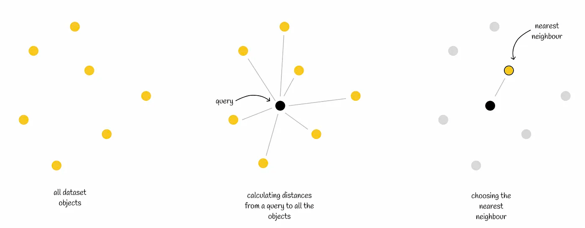

kNN算法有三点需要注意的

- 算法超参数 k
- 距离度量
- 排序和查询 topK

kNN 算法是一种暴力搜索(**brute-force**)，需要遍历所有数据集，大数据量情况下执行效率可想而知。于是就有了2种通过牺牲精度换取时间和空间的方式：

- 减少查询范围
- 减少向量维度

这种改进后的算法被称为 **近似最近邻算法（Approximate Nearest Neighbor, ANN）**。针对上面两种方式产生了两种对应的方法：

- 通过对**数据集划分**，减少查询范围，每个子集合中数据结构可以是树、图、倒排索引等等
- 使用**量化**(Quantization) 有损压缩高维向量，减少高维向量时的计算量，经常使用的是乘积量化 (Product quantization)

## 距离度量

距离度量决定了向量之间的距离 (distance)，很大程度上决定了空间的划分、候选节点和查询节点的距离和排序等等，这里列举5中距离的公式

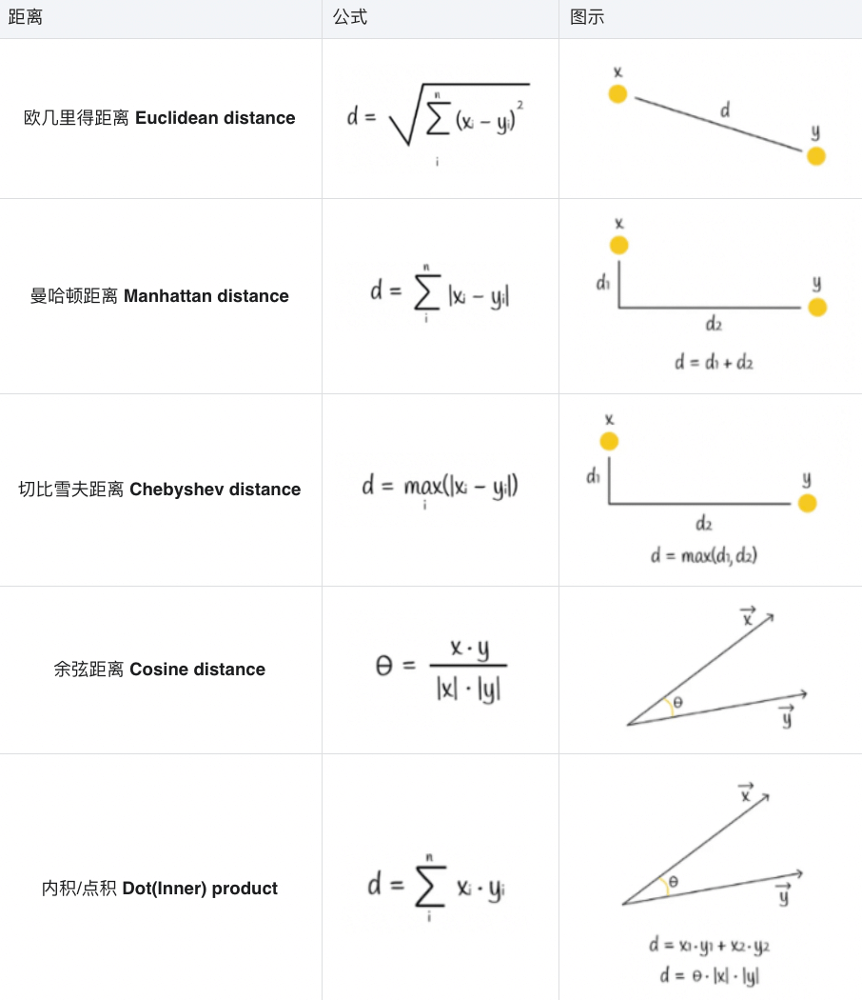


## 向量量化 (Vector Quantization)

矢量量化 (Vector Quantization) 可以向量压缩/编码/转换成长度更短、内存更高效的表示形式。显而易见地，这是一种有损压缩的方式，提升了ANN效率的同时牺牲了精度。但在实践中，这种精度损失是可以允许的。从数学的角度讲，是一种**向量离散化**的手段。

矢量量化中最有名的算法是乘积量化 (PQ, Product quantization)

#### 乘积量化 (Product quantization)

以乘积量化为例，首先我们会将向量分割成多个**子向量(subvectors)**。所有向量的子向量形成一个子空间，在子空间中进行 K-means 聚类算法，并记录在这个子空间中距离子向量最近的质心ID，所有子向量的质心ID组合起来，就是单个向量的PQ code。

量化过后，向量会被转换为n个质心ID，所以为了更有效地存储，质心ID的数量k往往是2的幂，对应的内存需要存储 \\(n * log(k)\\) 字节

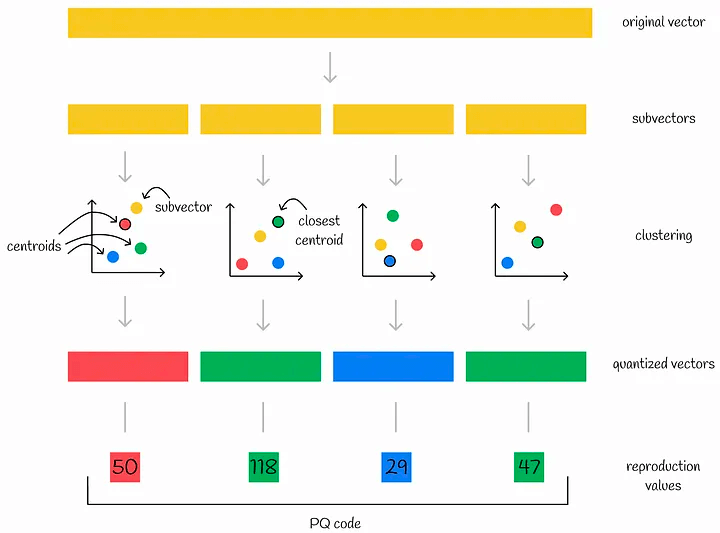

现在我们有了量化后的 PQ code 集合，那么如何在 PQ code 集合中进行 ANN 搜索？

同样地，将查询向量分割成n个子向量，每个子向量到对应子空间中所有质心的距离，以矩阵的形式存储在 d 中，我们把矩阵 d 中每个节点称为 **部分距离 (*partial distances*)**，个人感觉可以理解为相对距离。

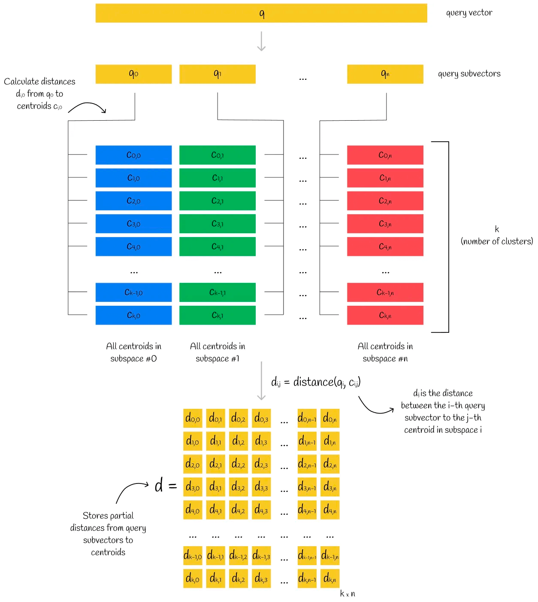

对于数据集中的向量，我们拿到每个向量的 PQ code，在矩阵 d 中找到每个子空间中对应质心的部分(相对)距离，这样我们得到了 n 个部分(相对)距离。假设对这组部分(相对)距离使用**欧几里得**计算，可以大体计算出当前样本对于查询向量的相对距离，根据这个距离排序就可以得到 topK。

这种方式计算出的样本向量和查询向量之间的距离，非常接近这两个向量之间的实际距离。

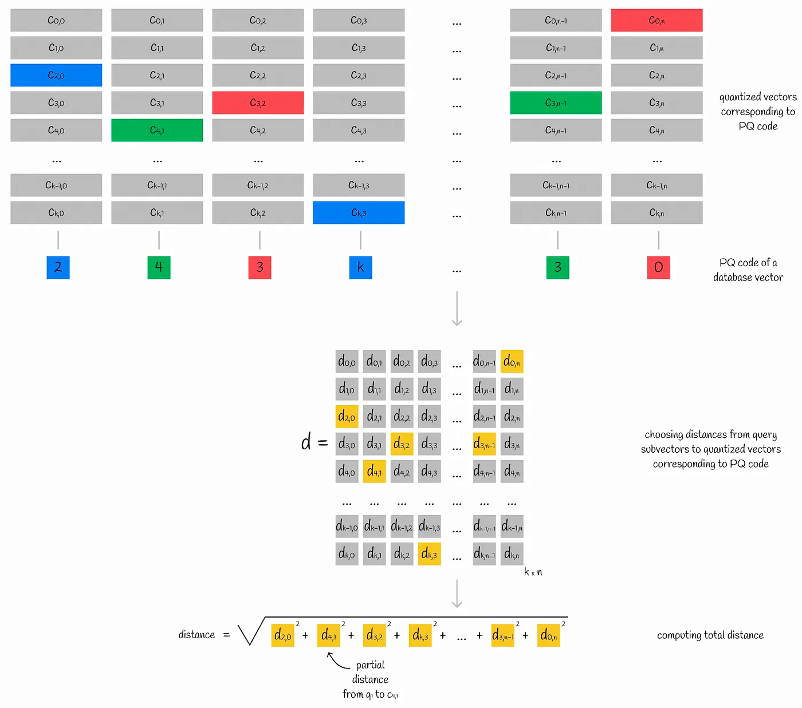

## 数据结构

先说一下 kNN 的算法实现，数据集的数据结构主要有两种：线性Linear 和 k维度数 K-D Tree。

- 线性 Linear 维护了一个线性数组来放所有的数据
- K-D Tree 用一个k维二叉树维护所有的数据

实现ANN算法需要分为2个维度：**空间的划分** 和 节点**数据结构的选择**。数据结构的选择比较多，有kd树、倒排索引IVF、图HNSW、哈希LSH等等，下面我们依次细说。

### 基于kd树的实现——以**Annoy为例**

先看一下kd树的数据结构，这里参考的是 [golearn/kdtree/kdtree.go](https://github.com/sjwhitworth/golearn/blob/master/kdtree/kdtree.go)

```go
type node struct {
	feature  int // -1: leaf, -2: nil
	value    []float64 // 空间矢量，该节点代表的空间范围
	srcRowNo int // 垂直于分割超平面的方向轴序号
	left     *node // 左子树
	right    *node // 右子树
}

// Tree is a kdtree.
type Tree struct {
	firstDiv *node
	data     [][]float64 // 数据矢量
}
```

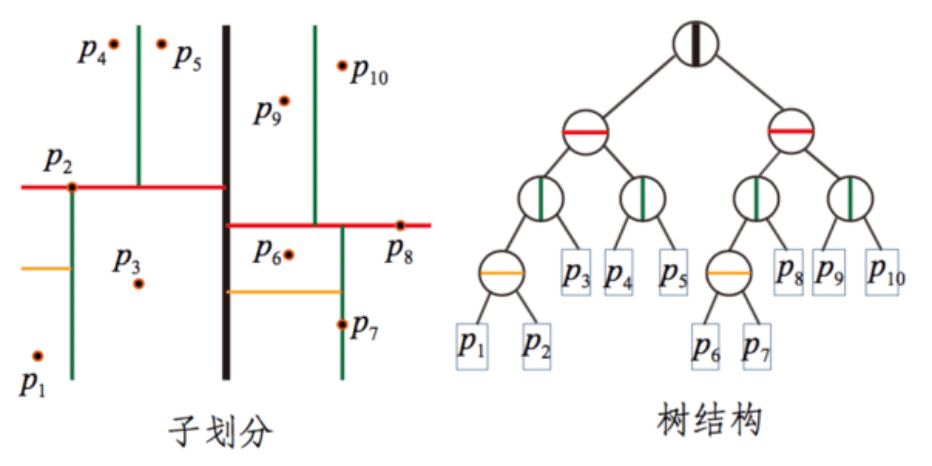

我们说到 kNN 和 ANN 的实现都可以使用kd树，ANN最大的改动点在于，是将单棵树划分为多棵树，以此提高执行效率。**Annoy** 正是使用了这种思路实现的 ANN 算法。

**Annoy** 的思路是，在整个 n 维空间中随机选取两个点，这两个点可以连成一个 n-1 维超平面 (*hyperplane*) ，此超平面的**法向平面**可以把整个空间分割为两部分。以此类推，当我随机选择N对点就有了N个法平面，可以将整个空间切分为 2N 块，直到将子空间中的样本数限制在K以内。

每一组随机拆分都可以构建一颗下图所示的树，我们依次来构建 M 组随机拆分，这样我们可以得到M个树，其中每棵树都包含了所有节点。此时我们就有了一个森林。

搜索的时候步骤如下

1. 根据森林中所有树的root节点构建一个优先队列
2. 找到每棵树中的k个近邻候选人
3. 移出重复的候选人
4. 计算去重后所有候选人和查询向量的距离
5. 根据距离队候选人排序
6. 返回 topK 

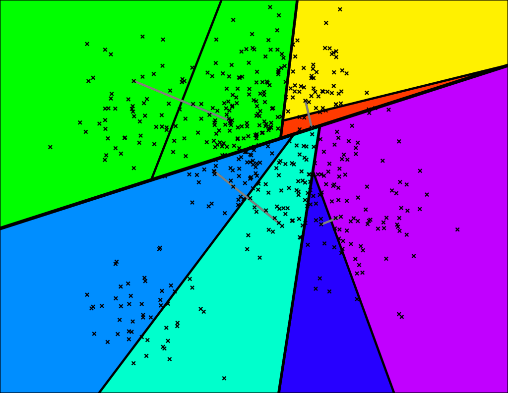

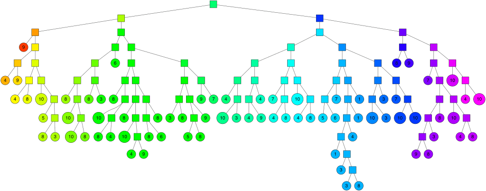

总结一下：

- 在空间的划分方面，**Annoy** 会提供多组分割，每组分割构成一颗树，每棵树内会有多个根据法平面切割的子空间，保持每个子空间维持K个节点
- 每个子空间中K个节点，通过K-D Tree的方式构建
- 距离选择方面，**Annoy** 提供了欧几里得距离、曼哈顿距离、余弦距离、汉明距离 和 点积距离 5种

最后十分推荐阅读 Annoy 开发者之一的 **Erik Bernhardsson** 写的这篇文章。

[Nearest neighbors and vector models – part 2 – algorithms and data structures](https://erikbern.com/2015/10/01/nearest-neighbors-and-vector-models-part-2-how-to-search-in-high-dimensional-spaces)

### 基于IVF倒排索引实现——以Faiss为例

倒排索引是一种常见的索引形式，顾名思义是一个单词/数字到文档ID的KV映射，如下图。再具体执行查询时，会先通过哈希函数计算出query的值，然后从 IVF 索引的哈希表中获取对应的映射值。映射值一般都是一组数据，然后遍历这组数据查询最近topK。Faiss 在底层正是用了这种数据结构。

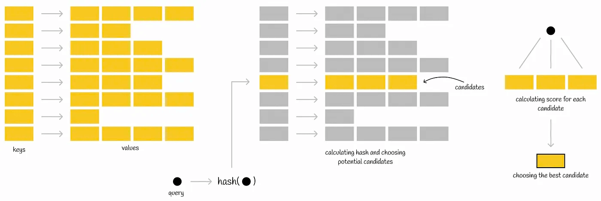

**[Faiss](https://github.com/facebookresearch/faiss)** (*Facebook AI Search Similarity*) 是 Facebook 提出的一种 ANN算法。

距离度量方面，**Faiss** 中提供了两种实现，具体的代码在`faiss/IndexFlat.h` :

- *IndexFlatL2*：欧几里得距离的实现
- *IndexFlatIP*：内积(inner product)的实现

空间划分方面 **Faiss** 实现了K-means聚类算法：

1. 随机初始k个聚类中心(也叫**质心** **centroids**)
2. 计算每个样本到质心的距离并将样本分配到最近的质心，由此组成聚类
3. 然后对每个聚类中样本求平均，得到新的一组聚类质心；如果前后质心有变化，则使用新的质心组重复步骤2，无变化则下一步
4. 质心不再变化时，则代表我们找到了相对优质的质心
5. 以这些质心和聚类所属的样本划分空间，此时我们就得到了**沃罗诺伊图**（Voronoi Diagram)

查询的时候，只需要找到距离查询向量最近的 **nprobe** 个质心，计算候选子空间内个样本和查询向量的距离并排序即可。

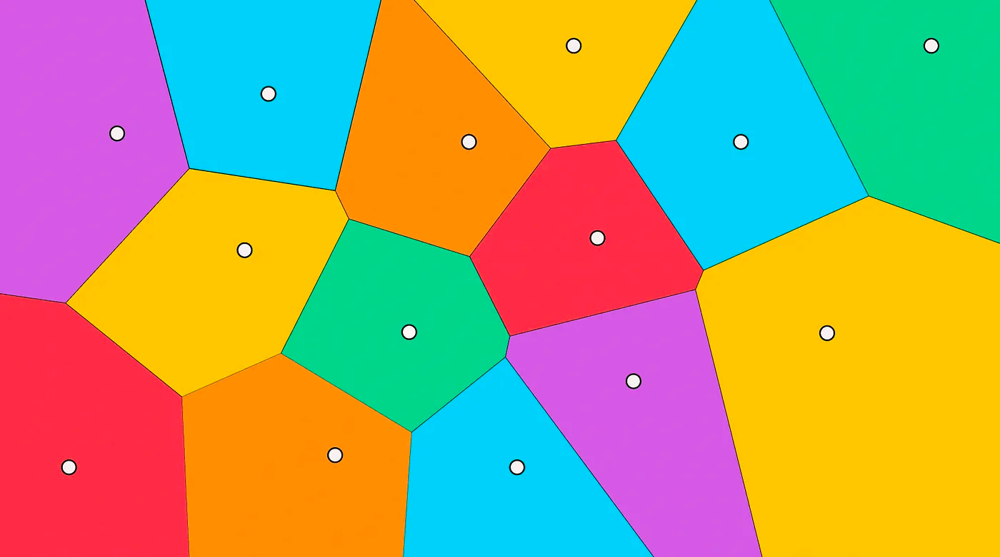

下面看看 IVF倒排索引方面，faiss中定义了一个头文件用来表示IVF的基础实现 `faiss/IndexIVF.h`,

```cpp
struct Level1Quantizer {
	Index* quantizer = nullptr; /// 向量-倒排列表映射的量化器
	size_t nlist = 0; /// 倒排列表的数量/Voronoi单元空间的数量
}

struct IndexIVFInterface : Level1Quantizer {
	size_t nprobe = 1;    /// ANN查询时候的探针数量，即确定近似候选人所需的区域数
  size_t max_codes = 0;
}

struct IndexIVF : Index, IndexIVFInterface {
	InvertedLists* invlists = nullptr; /// 倒排列表的指针
	int parallel_mode = 0; /// 是否使用 OpenMP 并行
}
```

倒排索引的实际内容都存储在 **InvertedLists** 中，具体的数据结构如下

```cpp
typedef int64_t faiss_idx_t; ///< all indices are this type
typedef faiss_idx_t idx_t;

struct InvertedLists {
	size_t nlist;     /// 倒排索引的数量
  size_t code_size; /// 每个向量的大小 code size per vector in bytes
  bool use_iterator;
}

/// 倒排列表数组的实现 (默认)
struct ArrayInvertedLists : InvertedLists {
    std::vector<std::vector<uint8_t>> codes; 
    std::vector<std::vector<idx_t>> ids;
}
```

#### IVFPQ

上面讲了 **faiss** 如何进行分区，我们再结合前面说到的 PQ 量化算法，这就有了 IVFPQ，具体的步骤如下

1. 对整个向量空间，通过 K-means 找到质心(centroid)并划分为 n 个 Voronoi 单元
2. 每个Voronoi单元中的样本，计算其到质心(centroid)的相对距离，即以质心作为0点得到相对向量
3. 对每个Voronoi单元中样本的相对向量进行 PQ 乘积量化，即将Voronoi单元中的相对向量样本拆成子向量，对子向量空间做聚类得到质心，将向量转换成 PQ code

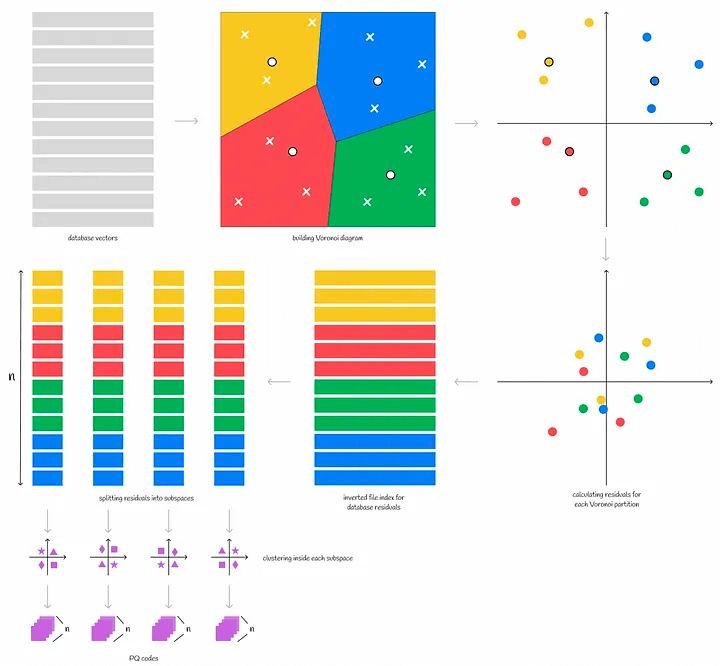

总结一下

- 在空间划分方面，**Faiss** 实现了 K-means 算法选出质心，并使用了主成分分析(PCA, *Principal components analysis*) 和 乘积量化(PQ, Product quantization) 对向量进行了降维和量化
- 子空间存储方面，**Faiss** 提供了 IVF 倒排索引、HNSW 和 LSH 3种方式，这里主要介绍了IVF
- 距离度量方面，**Faiss** 实现了欧几里得和内积2种距离

最后 **Faiss** 的文档可以看下面这个

[faiss wiki](https://github.com/facebookresearch/faiss/wiki)

[faiss-tutorial](https://www.pinecone.io/learn/series/faiss/faiss-tutorial/)

### 基于HNSW图的实现——以pgvector为例

HNSW全称是分层的可导航小世界 (**[*Hierarchical Navigable Small World*](https://arxiv.org/pdf/1603.09320.pdf)**)。

先来看 NWS 即可导航小世界，也被称为德劳内图 (Delaunay Graph)：假定有个X个向量样本，每个样本需要和M个相邻样本相连，构建的过程中只需要依次求出样本距离当前图中所有节点的距离，并连接M个节点即可。

搜索的时候使用贪心算法，选择一个节点作为头结点，计算头结点及其相连节点到查询节点的距离，如果头结点最近，则当前头结点是他近邻节点，否则选择更近的节点并重复上述步骤。

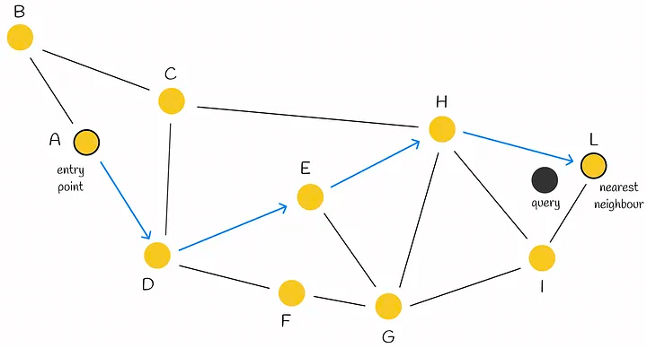

HNSW 是在 NSW 的基础上进行了分层，这种分层思想借鉴了**跳表(skip-lists)**，唯一的区别是在于跳表是对链表进行分层，而 HNSW 是对 NSW 图进行分层。

构建 HNSW 的时候，相比构建NSW，“如何确定节点插入的层数”是HNSW最需要关注的问题。

[HNSW的论文](https://arxiv.org/abs/1603.09320)中提出了一种计算每个插入节点的level公式。其中 \\(m_L\\) 是归一化因子，值越大 \\(l\\) 就越大，代表节点在较高层上出现的概率越大；L 是最大层数。

$$
   l = L - ln(unif(0..1)) *m _L
$$

在查询的时候，从最上层的头结点开始，找到邻居节点中距离查询节点最近的，直到找到当前层的距离查询节点最近的节点，然后到下一层查询，以此类推，直到查询到第0层，即可找到最近邻节点。

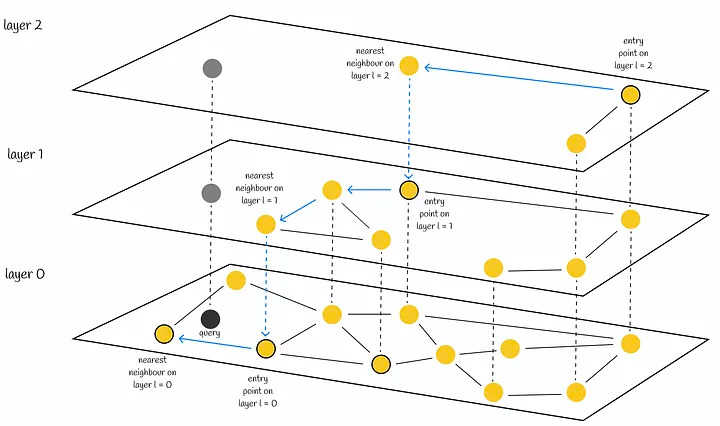

[pgvector](https://github.com/pgvector/pgvector) 实现了以这种数据结构的ANN算法，pgvector 以PostgresSQL插件的方式为其提供的 ANN 近似查询的能力，先来看代码中定义的数据结构

```c
// 向量
typedef struct Vector
{
	int32		vl_len_;		/* varlena header (do not touch directly!) */
	int16		dim;			/* number of dimensions */
	int16		unused;
	float		x[FLEXIBLE_ARRAY_MEMBER];
}			Vector;

// 节点
typedef struct HnswElementData
{
	List	   *heaptids;
	uint8		level;  // 层数
	HnswNeighborArray *neighbors; // 近邻节点数组
	BlockNumber blkno; // 块号
	OffsetNumber offno;  // 补偿号
	Vector	   *vec;  // 向量
}			HnswElementData;

typedef struct HnswMetaPageData
{
	uint32		magicNumber;
	uint32		version; // 版本
	uint32		dimensions; // 维度
	uint16		m; // 
	uint16		efConstruction;
	BlockNumber entryBlkno; // 入口块号
	OffsetNumber entryOffno; // 入口offset
	int16		entryLevel; // 入口层数
	BlockNumber insertPage;
}			HnswMetaPageData;

typedef HnswMetaPageData * HnswMetaPage;
```

其次我们看看 pgvector 中如何给节点分配层数

```c
#define HNSW_DEFAULT_M	16

// 最佳 ML 值
#define HnswGetMl(m) (1 / log(m))
// 计算最大层数
#define HnswGetMaxLevel(m) Min(((BLCKSZ - MAXALIGN(SizeOfPageHeaderData) - MAXALIGN(sizeof(HnswPageOpaqueData)) - offsetof(HnswNeighborTupleData, indextids) - sizeof(ItemIdData)) / (sizeof(ItemPointerData)) / m) - 2, 255)

// 随机数，介于0-1之间
#if PG_VERSION_NUM >= 150000
#define RandomDouble() pg_prng_double(&pg_global_prng_state)
#else
#define RandomDouble() (((double) random()) / MAX_RANDOM_VALUE)
#endif

/*
 * 每个节点上层的最大连接数
 */
int HnswGetM(Relation index)
{
	HnswOptions *opts = (HnswOptions *) index->rd_options;

	if (opts)
		return opts->m;

	return HNSW_DEFAULT_M;
}

// 初始化节点
HnswInitElement(ItemPointer heaptid, int m, double ml, int maxLevel)
{
	HnswElement element = palloc(sizeof(HnswElementData));

	// 计算层数
	int			level = (int) (-log(RandomDouble()) * ml);

	if (level > maxLevel)
		level = maxLevel;

	element->level = level;
	...
}
```

pgvector最早还实现了基于IVF的 ANN实现，这部分就不详细展开。

#### IVF-HNSW

在2018年的论文[Revisiting the Inverted Indices for Billion-Scale Approximate Nearest Neighbors](https://github.com/dbaranchuk/ivf-hnsw) 提出了一种 HNSW + IVF 的方法，并称可以处理亿级向量数据的ANN查询。核心的点主要有以下几点：

- 使用 HNSW 对数据集进行空间划分，通过层次结构，将数据集划分为多个区域。HNSW中的节点对应一个质心，一个质心代表一个子空间。
- 针对每个子空间，有一个IVF索引来存储所属的所有向量
- 对IVF索引中的向量进行 PQ 编码来对向量进行量化

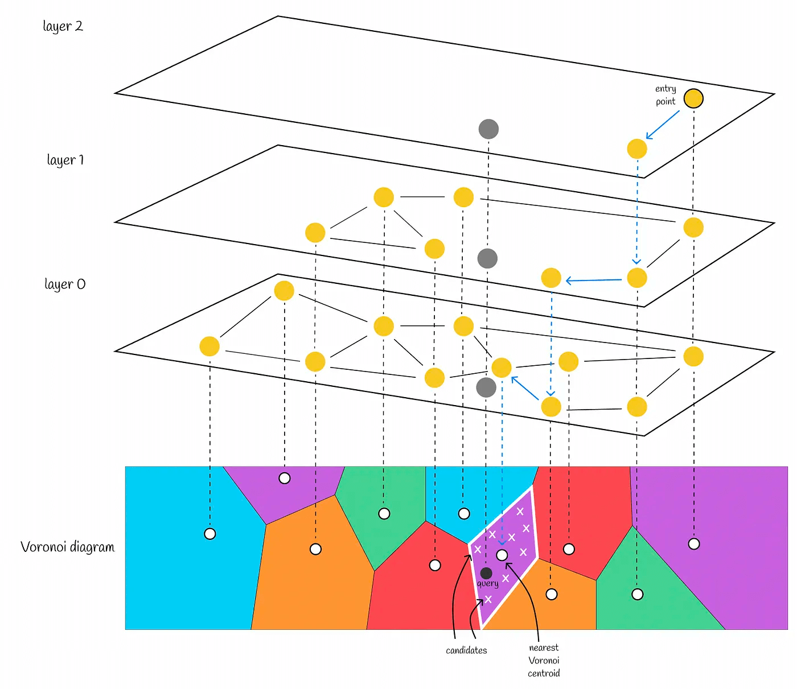

### 基于LSH哈希的实现——以FALCONN为例

**LSH**全称是***Local Sensitive Hashing***，局部敏感哈希 。

顾名思义，是通过将数据向量转换成哈希值，从而缩小搜索范围，近邻节点意味着更容易发生碰撞。LSH算法主要包含3个步骤：

1. **Shingling:** 使用 k-gram 将文本切分成连续k个字符组成的序列，然后用one-hot算法对每个序列进行编码，完成将文本转换为向量。
    
    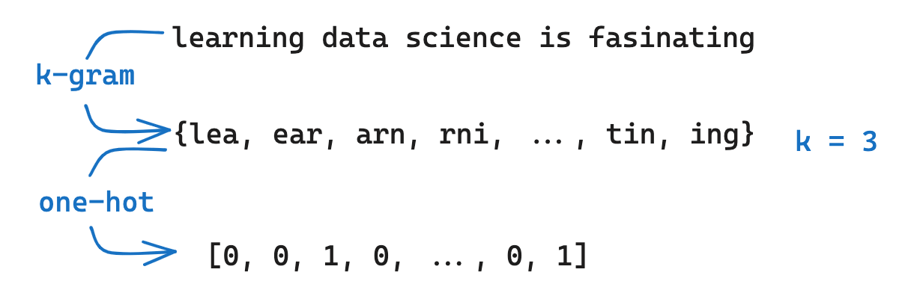
    
2. **MinHashing**: 将 shingling得到的向量转化为”签名”(**signature**)，这一步的主要目的是将向量转换为更小的维度(**MinHashing**)，这种签名signature可以保留其样本的相似度。
    
    这一步我们首先需要**随机生成**多个**置换向量**，MinHashing方法会对置换向量和样本向量进行置换，返回置换后第一个等于1的索引。如下图，我们使用1个置换向量，向量通过MinHashing之后会得到3。
    
    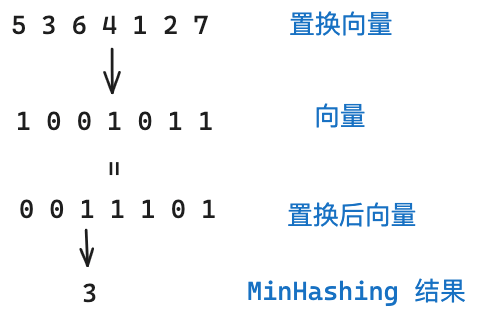
    
    接下来我们使用多个置换向量，然后得到每个向量的MinHashing后的值，对这个值做 **signature** 相似性 和 **Jaccard** 相似性，如下图：
    
    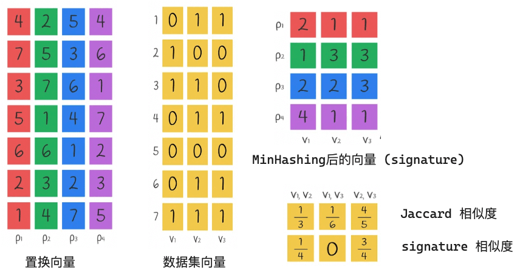
    
    最后我们说明一下 **signature** 相似性 和 **Jaccard** 相似性的计算方式，以 V1,V2 这对向量为例
    
    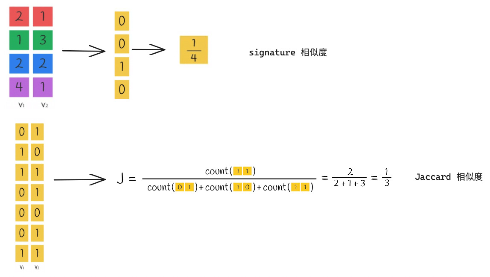
    
    我们可以看到，通过signature计算出的相似度**大体等于**Jaccard 相似度，这意味着我们可以将向量转换成 signature，然后计算他们的相似度，这比我们直接通过原始向量使用Jaccard Index 计算出的相似度效率更高！


💡 综上，MinHashing 这一步就是将原始向量转换为signature，这种signature可以有效的保留相似信息，因为 \\(signature 相似度 \approx Jaccard 相似度\\)

    
3. LSH function:  LSH 方法是将签名块散列到不同的存储桶中。
    
    首先把 singature 拆分为多个相等的部分，每个部分被称为波段(bands)，每个波段包含r的值。比如 singature 有9个值，按3个一组分，则有3个波段，每个波段有3个值。
    
    然后分别对每个波段进行hash映射，映射到单独的存储桶中。如果signature被拆成n份，则代表有n个存储桶。
    
    

回顾一下，我们通过**Shingling**把文本→向量，再调用**MinHashing**将向量→signature签名，最后通过**LSH**方法对签名分段hash，并存储在不同的buckets桶中。

查询的时候我们只需要将query先转换成向量，然后计算signature签名，再对签名分片，找到对应分片的存储桶中的value，拿到里面对应的向量，和哪个向量hash冲突最多就代表它是最近近邻节点。

> 现在让我们再反过来思考LSH局部敏感哈希的含义，局部的意思是指 signature 分片，敏感指的是在每个分片的存储桶中的hash冲突，这就有了我们一开始包括最后所说的：signature分片hash碰撞的次数越多，代表和查询向量相似度也越高。
> 

FALCONN 正式实现了这种LSH算法的思想，但这里暂时不再详细描述了(懒了)。
具体的项目地址是[FALCONN](https://github.com/FALCONN-LIB/FALCONN)，项目中的wiki比较推荐看[LSH-Primer](https://github.com/FALCONN-LIB/FALCONN/wiki/LSH-Primer)。


## 拓展1：ANN 基准测试

最后推荐一个网站，对主流的大部分 ANN 算法基准测试进行了整理

[ANN-Benchmarks](https://ann-benchmarks.com/)

## 拓展2：数据向量化

前面主要介绍了我们有一个向量数据集情况下，如何查询 topk。这里简单介绍一下如何做数据向量化。

以文本向量化为例，向量化的方法有词袋模型、TF-IDF、共现矩阵、词嵌入(word embedding)等等，目前使用最多的是**词嵌入**，其中的算法原理可以看 [NLP–文本向量化](https://deeplearning-doc.readthedocs.io/en/latest/deeplearning/NLP/NLP-text-vector.html)。

当前基于词嵌入(embedding)所实现的模型如下：

| 模型 | 项目/文档地址 |
| --- | --- |
| M3E (Moka Massive Mixed Embedding) | https://github.com/wangyuxinwhy/uniem |
| BGE (baai general embedding) | https://github.com/FlagOpen/FlagEmbedding |
| text-embedding-ada-002 | https://cloud.baidu.com/doc/WENXINWORKSHOP/s/alj562vvu |
| 文心 Embedding | https://cloud.baidu.com/doc/WENXINWORKSHOP/s/alj562vvu |
| glm text embedding | https://open.bigmodel.cn/dev/api#text_embedding |
| RoPE (rotary-embedding) | https://github.com/ZhuiyiTechnology/roformer |
| LlamaCppEmbeddings | https://github.com/ggerganov/llama.cpp/blob/master/examples/embedding/embedding.cpp |
| text2vec | https://github.com/shibing624/text2vec |

看到这里我们自然而然可以联想到，文本数据可以向量化，图像、文件、统计数据等当然也可以向量化，所以ANN也适用于这些场景。

## 参考

[List: Similarity Search | Curated by Vyacheslav Efimov | Medium](https://medium.com/@slavahead/list/similarity-search-598d963ad35e)

[图像检索：再叙ANN Search](https://yongyuan.name/blog/ann-search.html)

[Nearest neighbors and vector models – part 2 – algorithms and data structures](https://erikbern.com/2015/10/01/nearest-neighbors-and-vector-models-part-2-how-to-search-in-high-dimensional-spaces)

[faiss wiki](https://github.com/facebookresearch/faiss/wiki)

[faiss-tutorial](https://www.pinecone.io/learn/series/faiss/faiss-tutorial/)

[LSH-Primer](https://github.com/FALCONN-LIB/FALCONN/wiki/LSH-Primer)

[ANN-Benchmarks](https://ann-benchmarks.com/)