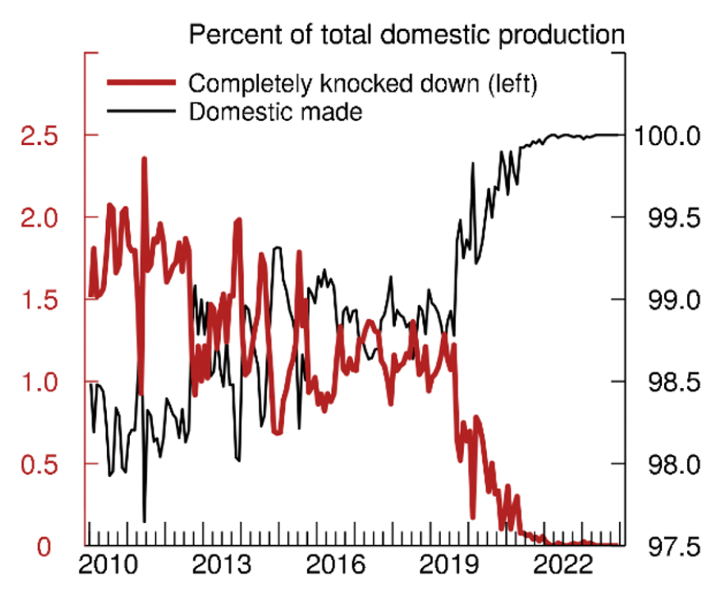
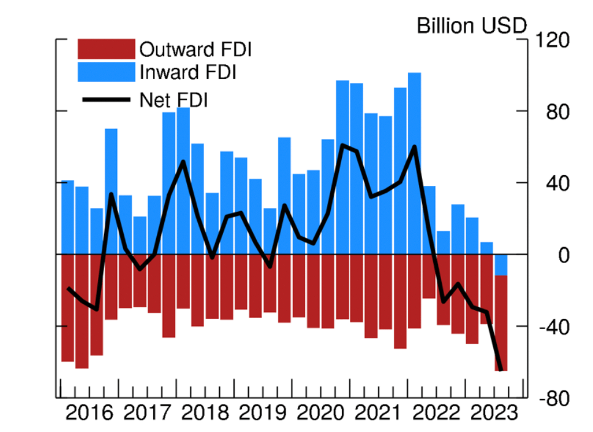

# IMF 2023 第四次磋商报告

IMF在2024年的2月2日发布了中国的第四次磋商报告，相对客观全面地总结了23年前三个季度的经济成果，下面主要是对部分内容进行摘抄和总结。

[People's Republic of China: 2023 Article IV Consultation-Press Release; Staff Report; and Statement by the Executive Director for the People's Republic of China](https://www.imf.org/en/Publications/CR/Issues/2024/02/01/People-s-Republic-of-China-2023-Article-IV-Consultation-Press-Release-Staff-Report-and-544379)

## 摘要概述

截止23年Q3，实际 GDP 同比增速是 5.2%。其中消费占比 84.6% 贡献4.4个百分点，出口和固定资产投资表现疲软。

通胀随着粮食和能源价格下跌而走低，核心通胀依然保持为正，处在较低水平。





家庭储蓄率降至疫情前，但是储蓄意愿依然居高不下且消费信心扔低于疫情前。

PMI 就业项指数处于收缩区间，各行业普遍疲软。工资收入增长比较低迷，且青年失业率高企。





房地产方面，今年出了很多政策如降低首付比率、降低个人住房贷款利率(5Y LPR)、推进保障性住房、加大城中村改造等等，但销售总额继续在大幅萎缩。

23年统计局每月的70城房地产数据中二手房价格也在下降，但是 IMF 表示目前的房价仅下降3%左右，相较于家庭收入和租金仍处在高位。

## 风险评估矩阵 （国内风险）

| 风险来源 | 风险可能性 | 预期影响 | 应对政策 |
| --- | --- | --- | --- |
| 房地产行业的下滑比预期更为急剧。 | 中 | 高房地产投资受到直接影响导致增长放缓，地方政府融资压力导致财政收紧，消费者和企业信心低迷导致投资和消费下降。 | 促进陷入困境的房地产开发实现高效、有序的重组，确保完成未完工预售房项目以提振信心，并通过加强审慎政策来做好准备应对金融体系的系统性溢出效应。采取更宽松的宏观政策，特别是通过降息来放松货币政策。 财政政策应侧重于将支出从投资转向家庭，这将支持短期增长并促进长期再平衡，而不会对债务动态产生不利影响。 |
| 资产负债表衰退。 | 低 | 高总体债务水平高，引起广泛的去杠杆，这可能导致国内需求疲软和进一步的通货紧缩压力，并产生潜在的负反馈循环。 | 宏观经济政策应更加宽松。货币宽松政策应侧重于降息。如果广泛的去杠杆导致增长大幅放缓，可能需要提供额外的财政支持，但应由中央政府在预算内提供。实施基于市场导向型政策的一揽子高质量全面改革方案来重振增长。 |
| 复苏强于预期。 | 中 (上行风险) | 高政策支持和重组导致房地产行业企稳，消费者和企业信心改善，复苏强于预期。 | 考虑以前倾方式实施财政整顿。 |

## 总结

这份报告还对房地产杠杆风险和地方政府的”隐性债务“做了总结，同时提振经济和新的增长引擎提出了一些建议，个人认为其中有些比较有意思。比如

- 对地方政府融资平台债务使用破产框架来促进债务减记和资产出售的策略
- 实施财政改革，例如将财政支出转向家庭，增加社会支出，减少预算外投资
- 实行国有企业改革并逐步取消一些产业政策，目前国内的许多政策是属于供给端的，需求端的政策有所不足
- 劳动力市场和教育政策，比如让教育系统更好相应技能需求、出台招聘和创业扩大就业服务、扩大失业保险覆盖面等等
- 减轻收入不平等和过度家庭储蓄，比如提高劳动收入在GDP中的比重、加强对资本所得征税等等

# 美联储研究笔记——评估中国“自力更生”

美联储官方在2月2号出的研究笔记，标题是评估中国”自力更生“的成果。

这里的中国”自力更生“指的是自2018年贸易战开始时，中美提高关税，国内提出了”自力更生“的口号，目的是在国内发展的过程中，更倾向于使用国内生产的原材料、零部件、技术和服务等等。比如以软件行业为例，23年比较火的信创和国产化概念。

这份报告主要是美联储对国内目标的评估，下面我们具体看。

[Assessing China's Efforts to Increase Self-Reliance](https://www.federalreserve.gov/econres/notes/feds-notes/assessing-chinas-efforts-to-increase-self-reliance-20240202.html)

## 增长模式

这部分首先讨论了中国近几十年GDP的增长模式特征——投资份额占比高和家庭消费占比低。国内一直致力于扩大产能从而促进出口，但内需鲜有提升。

IMF的报告指出2022年中国的贸易顺差达到 900亿美元，占22年 GDP大约5个百分点。

由此得出国内目前还是处于出口导向型，以海外需求为主的增长模式。

## 进口依赖度下降

这里给出了2幅图。左图可以看出18年之后进口的增长确实弱于出口增长；右图主要是进出口在GDP增长中的占比，这里以5年为一个窗口期，也可以明显看到进口占比在17、18年之后落后于出口占比并拉开差距。

这里还提到一个因素，就是中国进口品类主要是 ① 机电产品，主要涉及高端装备和关键零部件等高附加值机电产品 ② 高新技术产品，这两类占比较高，但是在这两类产品包括半导体行业在22年是处于周期底部的位置，全球市场对这类产品的整体需求也处于低位。

所以这里作者指出中国进口的下降是不是因为全球市场需求的原因导致的，而不是自身减少进口或国产替代？

之后作者给到这两个产品进出口的数据，如下。从这里可以看出机电产品出口相对稳定但是进口大幅下跌；高科技产品进出口都下跌但是进口下跌幅度更高。能看到这里面确实有一部分是减少了进口转为国产替代，另一部分也是因为全球对高科技产品需求的减少导致的。

## 汽车行业

中国成为了世界上最大的新能源汽车 (electric vehicles, EVs) 制造国，新能源行业也收到政府的大力扶持。但2020年后，不仅是新能源车，燃油车 (internal combustion engine vehicles, ICE) 的出口也大幅上升。

作者在这里给出的逻辑是，由于国内的钢铁和电子产品等零部件价格相对低廉，加上政府对系能源车的扶持，导致国内生产新能源车的成本低廉。国内汽车的市场需求逐渐被新能源车分走，致使燃油车产能过剩，不得不走向出口，这也得益于海外的燃油车需求并没有迅速下降。

进一步分析，这里给出了 零部件进口的组装车和完全国产车的对比，可以看出从19年后国内逐渐变成了国产车而非组装车的模式。

总结一下，过去几年中国从汽车进口国变成了汽车出口国，汽车生产从依赖进口零部件转变成了国内制造。同时汽车零部件的出口也逐渐增加。所以但看汽车行业，国内的进口份额减少和出口增加是符合“自力更生”的目标的。

## FDI减少

过去两年尤其是22-23年，中国的外商直接投资 (Foreign Direct Investment, FDI) 急剧下降。

一方面是因为22年之后欧美各国开始加息，即中美利差使得海外资金外流；另一方面作者认为是因为房地产风险和反间谍法对部分公司的打击。除了这些因素，因为中美贸易战的升级，投资机构不得不更多地考虑地缘政治带来的风险。国外投资者开始将资金逐渐转向对西方更友好的国家。

与此同时，FDI的减少又让中国增加了降低对外依赖的紧迫性。

## 总结

美联储的研究笔记中肯定了中国从2018年到目前，关于”自力更生”的发展目标，尤其在高科技行业和高端机电产品领域，从进口逐渐转向出口。同时随着地缘政治风险的上升，中国的FDI急剧下降，这会导致中国降低对外依赖的紧迫性，接着又反过来导致促使FDI下降。

同时中国和西方国家依然有比较深的联系。根据 [OECD 经合组织的数据](https://stats.oecd.org/)，从2010年到2020年，中国对经合组织成员国内部需求中的外部附加值贡献显著增长，换句话说经合组织成员国内的需求，对中国的产品依赖度越来越高，尤其是计算机和电子设备相关产品。

中国在减少外部依赖的同时扩大了出口，从18年以来出口和GDP增长的关联度越来越高，22和23年因为外需有所下降。

最后作者指出，虽说中国减少了进口的依赖，但是由于出口导致对国外需求的依赖有所上升。全球的生产和消费与中国脱钩还遥遥无期。