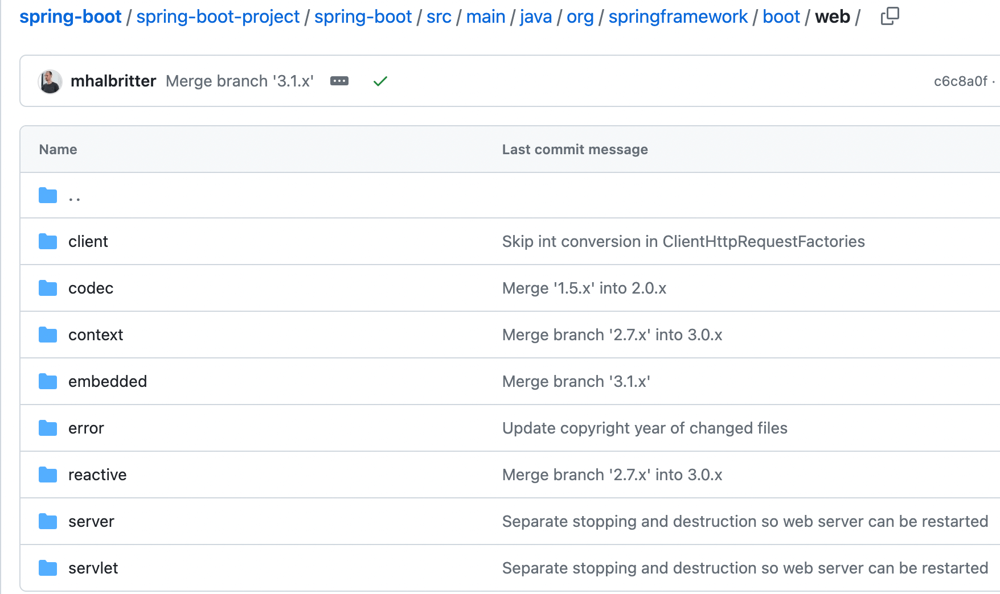
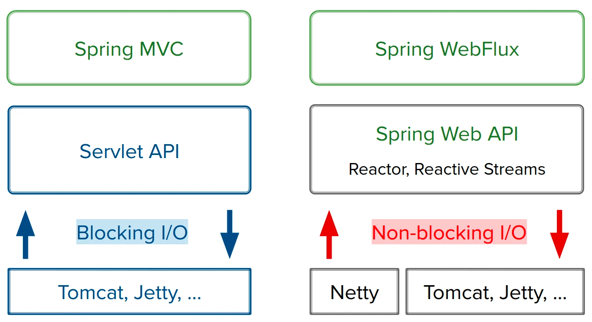
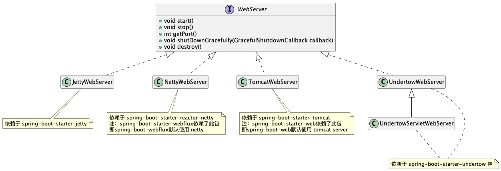
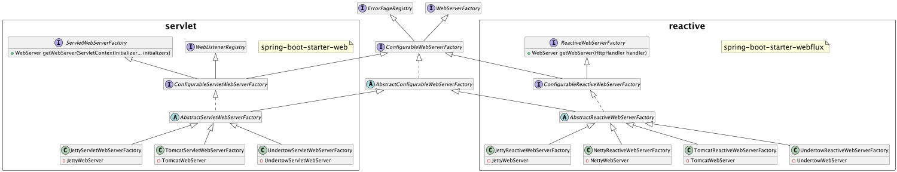
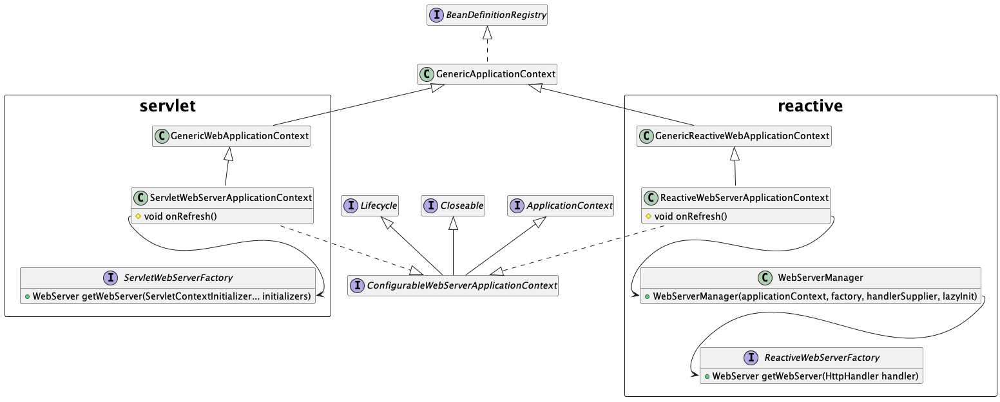

## 引言

基于Spring Boot的web应用中，在spring-boot包内包含了内置的 web server，具体包括 **`tomcat`**、**`jetty`**、**`undertow`** 和 **`netty`**。

本文旨在厘清spring boot中内置server的原理和使用。

## Spring Boot Server 源码剖析

首先我们跟踪一下 `org.springframework.boot:spring-boot` 包中 `org.springframework.boot.web` package下的代码，代码可以看 [Github spring-boot](https://github.com/spring-projects/spring-boot/tree/main/spring-boot-project/spring-boot/src/main/java/org/springframework/boot/web)

package下的目录结构如下：

- embedded：主要是存放内置的web server，包含WebServer和WebServerFactory等实现，同时用到对应 server 的package
- reactive：基于 reactive 的spring boot 应用，依赖`spring-boot-starter-webflux`包
- servlet：基于servlet的 spring boot 应用，依赖`spring-boot-starter-web` 包
- server：servlet 和 reactive 中通用的 server 相关的类和接口



### Servlet 和 Reactive

Spring Framework 5.0 提供了两种web框架，分别是 `servlet` 和 `reactive` ，他们具体的不同如下

- `servlet` 是Spring Web中引入，基于servlet API实现，即Spring MVC；
    
    `reactive` 是通过Spring Webflux引入，实现了Reactive Streams 规范的响应式
    
- `servlet` 实现的是阻塞IO (blocking I/O)
    
    `reactive` 实现的是 [Event-Loop](https://www.ruanyifeng.com/blog/2013/10/event_loop.html)，非阻塞IO(non-blocking I/O)，即异步处理
    
- 针对`servlet` 框架，SpringBoot提供了三种内置Server，分别是 **Jetty**、**Tomcat** 和 **Undertow**
    
    针对`reactive` 框架，SpringBoot提供了四种内置Server，分别是 **Jetty**、**Tomcat**、**Undertow** 和 **Netty**
    
    
    

### WebServer

这部分我们介绍一下 WebServer 接口与实现，WebServer提供的5个方法如下：

- start：启动服务
- stop：停止服务
- getPort：提供端口号
- shutDownGracefully: 优雅地关闭服务，在尝试结束服务的时候调用，处理一些被阻止的请求
- destroy：销毁服务使其无法再次启动，默认调用stop方法

然后我们来看看 WebServer 的实现，实现主要是spring-boot中内置的几个Server，具体有：

- JettyWebServer：基于Jetty的WebServer实现，依赖于 `org.eclipse.jetty`
- NettyWebServer：基于Netty的WebServer实现，依赖于 `io.projectreactor` 和 `io.netty`
- TomcatWebServer：基于Tomcat的WebServer实现，依赖于 `org.apache.tomcat`
- UndertowWebServer：基于Undertow的WebServer实现，依赖于 `io.undertow`

目前我们知道了SpringBoot中内置的WebServer提供了这些实现，那么在服务启动时，**默认**使用的是哪个 Server 呢？

- 启用 **servlet** 框架的情况下，默认使用的是 **TomcatWebServer，因为**`spring-boot-starter-web` 中默认依赖了`spring-boot-starter-tomcat`。
- 启用 **reactive** 框架的情况下，默认使用的是 **NettyWebServer，因为**`spring-boot-starter-webflux` 中默认依赖了 `spring-boot-starter-reactor-netty`。



### WebServerFactory

SpringBoot中提供了WebServerFactory的工厂接口类，用来封装WebServer的创建

WebServerFactory也分为了两种即 **ServletWebServerFactory** 和 **ReactiveWebServerFactory**，两者都提供了`getWebServer` 方法来创建WebServer，但具体有所不同

- **ServletWebServerFactory** 提供的`getWebServer` 方法传入的参数是`org.springframework.boot.web.servlet.ServletContextInitializer`，用于配置Servlet 3.0+的接口。
    
    **ServletContextInitializer**中提供了`onStartup(ServletContext servletContext)` 方法
    
    其中`jakarta.servlet.ServletContext`用于连接对应的servlet容器
    

- **ReactiveWebServerFactory** 提供的`getWebServer` 方法传入的参数是`org.springframework.http.server.reactive.HttpHandler`**。**
    
    **HttpHandler**中提供了`handle(ServerHttpRequest request, ServerHttpResponse response)`方法
    
    其中 `org.springframework.http.server.reactive.ServerHttpRequest`和`org.springframework.http.server.reactive.ServerHttpResponse` 对应的则是基于reactive server的 request 和 response
    

| Server | Servlet stack | Reactive stack |
| --- | --- | --- |
| Tomcat | TomcatServletWebServerFactory | TomcatReactiveWebServerFactory |
| Jetty | JettyServletWebServerFactory | JettyReactiveWebServerFactory |
| Undertow | UndertowServletWebServerFactory | UndertowReactiveWebServerFactory |
| Reactor | N/A | NettyReactiveWebServerFactory |

WebServerFactory具体的接口和实现类如下图，这里不再做详细说明



### Server 的 Bean 管理

上面我们梳理了 WebServer 和 用于管理的工厂类 WebServerFactory，下面我们来剖析SpringBoot中是如何通过Factory管理Server Bean的。

创建了对应的`ServletWebServerApplicationContext`和`ReactiveWebServerApplicationContext` ，并在这两个类实现了 `onRefresh()` 方法，此方法用于在特定context子类中初始化特殊的bean，这里所指的特定context子类包含**ServletWebServerApplicationContext**、**ReactiveWebServerApplicationContext** 和 **StaticWebApplicationContext**，具体如下：

- 在`ServletWebServerApplicationContext` 中，`onRefresh()` 方法中获取 ServletWebServerFactory Bean 创建 WebServer
- 在 `ReactiveWebServerApplicationContext` 中，`onRefresh()` 方法中获取ReactiveWebServerFactory Bean，并创建WebServerManager，在 WebServerManager 的构造方法中创建了 WebServer
- 在`StaticWebApplicationContext`中，`onRefresh()` 方法用于创建 ThemeSource 的静态主题



## 内置 Server 简述：Jetty/Netty/Tomcat/Undertow

这里不会展开介绍这4种Server的实现和区别，只是稍微简述一下实现和不同点。

### Tomcat

Tomcat目前收录与 Apache 项目中，官方链接是[https://tomcat.apache.org/](https://tomcat.apache.org/)

Tomcat是主流的Java Web Server，所以是十分稳定和成熟的，同时社区活跃文档和资源丰富。

Tomcat可以支持`Http`, `Http/2` , `AJP`, `WebSocket` 协议，支持`Servlet 6.0` 

### Jetty

Jetty是 Eclipse 提供的一款Server，官方链接是[https://eclipse.dev/jetty/documentation.php](https://eclipse.dev/jetty/documentation.php)

相比Tomcat它更加轻量级，有自己的异步支持。

Jetty可以支持`Http`, `Http/2` ,`Http/3`, `AJP`, `WebSocket` 协议，支持`Servlet 6.0` 

### Netty

Netty是一个基于时间驱动的异步网络框架，被广泛应用于高性能的网络应用程序，尤其是处理大量并发连接的服务端应用，官方链接是[https://netty.io/index.html](https://netty.io/index.html)。

Netty几乎支持了大部分的协议，有**`SSL/TLS`**, ** `HTTP`**, ** `HTTP/2`**, **`HTTP/3`**, **`WebSockets`**, **`DNS`**, ** `SPDY` **, **`SMTP`** 等

### Undertow

Undertow是 JBoos 提供的一款Server，官方地址是[https://undertow.io/](https://undertow.io/)

Undertow的特点在于轻量级、高性能和地资源消耗，同时支持嵌入式应用程序和微服务。

Undertow可以支持`Http`, `Http/2` , `WebSocket` 协议，支持`Servlet 4.0` 

### Server对比

这里贴一下基于Tomcat/Jetty/Undertow的Server运行情况，主要监控了 内存使用、类加载、线程数、每秒请求书 和 每个请求的平均处理时长。

我们可以得知，内存占用和类加载方面，Jetty更加轻量；处理请求数和响应时间方面，Undertow速度更快。

| Metric | Tomcat | Jetty | Undertow |
| --- | --- | --- | --- |
| jvm.memory.used (MB) | 168 | 155 | 164 |
| jvm.classes.loaded | 9869 | 9784 | 9787 |
| jvm.threads.live | 25 | 17 | 19 |
| Requests per second | 1542 | 1627 | 1650 |
| Average time per request (ms) | 6.483 | 6.148 | 6.059 |

## 如何在 Spring-Boot 中配置其他 Server

最后一部分我们介绍一下如何在 SpringBoot 中使用非默认的 Server

### 使用 Jetty Server

在 Servlet 框架下使用 Jetty：

```xml
<dependency>
    <groupId>org.springframework.boot</groupId>
    <artifactId>spring-boot-starter-web</artifactId>
    <exclusions>
        <exclusion>
            <groupId>org.springframework.boot</groupId>
            <artifactId>spring-boot-starter-tomcat</artifactId>
        </exclusion>
    </exclusions>
</dependency>
<dependency>
    <groupId>org.springframework.boot</groupId>
    <artifactId>spring-boot-starter-jetty</artifactId>
</dependency>
```

在 Reactive 框架下使用 Jetty:

```xml
<dependency>
    <groupId>org.springframework.boot</groupId>
    <artifactId>spring-boot-starter-webflux</artifactId>
    <exclusions>
        <exclusion>
            <groupId>org.springframework.boot</groupId>
            <artifactId>spring-boot-starter-reactor-netty</artifactId>
        </exclusion>
    </exclusions>
</dependency>
<dependency>
    <groupId>org.springframework.boot</groupId>
    <artifactId>spring-boot-starter-jetty</artifactId>
</dependency>
```

### 使用 Undertow Server

在 Servlet 框架下使用 Undertow：

```xml
<dependency>
    <groupId>org.springframework.boot</groupId>
    <artifactId>spring-boot-starter-web</artifactId>
    <exclusions>
        <exclusion>
            <groupId>org.springframework.boot</groupId>
            <artifactId>spring-boot-starter-tomcat</artifactId>
        </exclusion>
    </exclusions>
</dependency>
<dependency>
    <groupId>org.springframework.boot</groupId>
    <artifactId>spring-boot-starter-undertow</artifactId>
</dependency>
```

在 Reactive 框架下使用 Undertow：

```xml
<dependency>
    <groupId>org.springframework.boot</groupId>
    <artifactId>spring-boot-starter-webflux</artifactId>
    <exclusions>
        <exclusion>
            <groupId>org.springframework.boot</groupId>
            <artifactId>spring-boot-starter-reactor-netty</artifactId>
        </exclusion>
    </exclusions>
</dependency>
<dependency>
    <groupId>org.springframework.boot</groupId>
    <artifactId>spring-boot-starter-undertow</artifactId>
</dependency>
```

### 在 Reactive 框架下使用 Tomcat

```xml
<dependency>
    <groupId>org.springframework.boot</groupId>
    <artifactId>spring-boot-starter-webflux</artifactId>
    <exclusions>
        <exclusion>
            <groupId>org.springframework.boot</groupId>
            <artifactId>spring-boot-starter-reactor-netty</artifactId>
        </exclusion>
    </exclusions>
</dependency>
<dependency>
    <groupId>org.springframework.boot</groupId>
    <artifactId>spring-boot-starter-tomcat</artifactId>
</dependency>
```

### 在 Reactive 框架下支持Netty, 且兼容 Servlet

如果原有是基于SpringMVC的项目，想使用Netty Server，需要依赖SpringWebflux

值得注意的是 SpringWebflux 也是支持@Controller、@RestController 等传统SpringMVC注解的，具体实现的类是`AnnotationConfigReactiveWebServerApplicationContext` ，它是`ReactiveWebServerApplicationContext` 的子类。

```xml
<dependency>
	<groupId>org.springframework.boot</groupId>
	<artifactId>spring-boot-starter-web</artifactId>
  <exclusions>
		<exclusion>
			<groupId>org.springframework.boot</groupId>
      <artifactId>spring-boot-starter-tomcat</artifactId>
    </exclusion>
	</exclusions>
</dependency>
<dependency>
	<groupId>org.springframework.boot</groupId>
	<artifactId>spring-boot-starter-webflux</artifactId>
</dependency>
```

## 参考

[“How-to” Guides](https://docs.spring.io/spring-boot/docs/current/reference/html/howto.html#howto.webserver)

[ApplicationContextException: Unable to start ServletWebServerApplicationContext due to missing ServletWebServerFactory bean](https://stackoverflow.com/questions/50231736/applicationcontextexception-unable-to-start-servletwebserverapplicationcontext)

[Spring 5的Servlet和反应式技术栈解析_Java_Rossen Stoyanchev_InfoQ精选文章](https://www.infoq.cn/article/servlet-and-reactive-stacks-spring-framework-5)

[Comparing Embedded Servlet Containers in Spring Boot | Baeldung](https://www.baeldung.com/spring-boot-servlet-containers)

[Tomcat vs. Jetty vs. Undertow: Comparison of Spring Boot Embedded Servlet Containers - Examples Java Code Geeks - 2023](https://examples.javacodegeeks.com/java-development/enterprise-java/spring/tomcat-vs-jetty-vs-undertow-comparison-of-spring-boot-embedded-servlet-containers/)

[SpringBoot 2 performance — servlet stack vs WebFlux reactive stack](https://medium.com/@the.raj.saxena/springboot-2-performance-servlet-stack-vs-webflux-reactive-stack-528ad5e9dadc)

[Spring MVC Async vs Spring WebFlux | Baeldung](https://www.baeldung.com/spring-mvc-async-vs-webflux)
