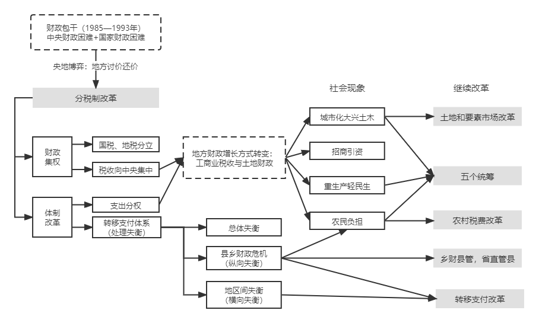
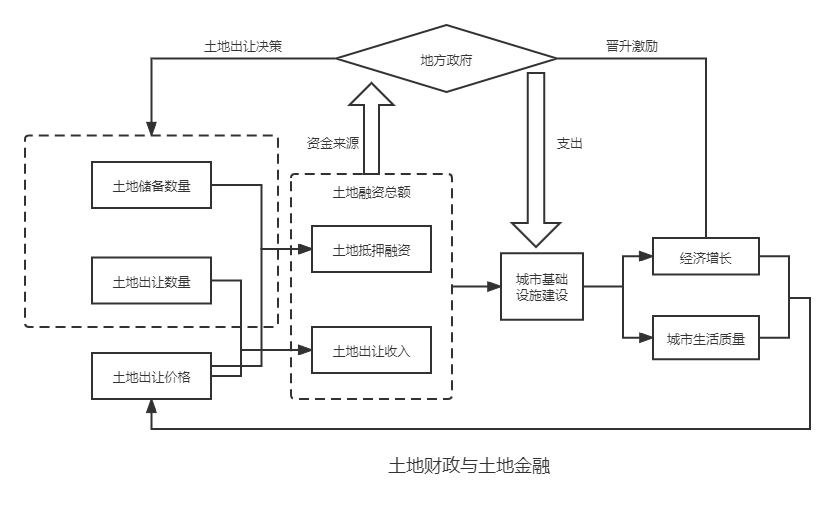

&emsp;&emsp;主要是对最近看的《置身事内——中国政府与经济发展》微观篇做下梳理，把自己比较感兴趣的点稍微记录一下。当然书中说的会更加细节和全面，且用了大量的事例方便理解，所以最好还是建议直接看书。本来想全看完写的，目前就看了一半，后一半是宏观篇...图的话是照着书中的原图自己画的，基本没有改动。

## 1. 央地关系

&emsp;&emsp;本书中第一章主要介绍了地方政府的权利与事务，但在这里我主要想总结为央地关系，主要分行政管理层面、信息不对等和激励相容。附上书中的行政规划图：

### 1.1 行政管理
&emsp;&emsp;行政管理层面主要分为两点：

* 条块分割，多重领导 

&emsp;&emsp;“条条”指从上到下的部门垂直关系；“块块”指横向的以行政区划为界的政府。

&emsp;&emsp;大多数地方部门需要同时接受“条条”和“块块”的双重领导。通常“条条”关系是业务关系，“块块”关系是领导关系。

* 上级领导与协调

&emsp;&emsp;若是部门事务，本部门领导就可以决定；

&emsp;&emsp;若是经常性的跨部门事务，则设置上级“分管领导”甚至“领导小组”来推进。

&emsp;&emsp;以上只是总结在行政管理层面之间的关系，但是对于具体的复杂事务，需要灵活处理。

### 1.2 信息不对等

&emsp;&emsp;信息不对等主要有上下级信息不对等和内部领导与专职人员的信息不对等，例如古代的官和吏，英国的内阁部门长官和常务次官。因为下级可能扭曲或者隐瞒信息，所以上级的监督和审计就很有必要，但监督机制本身也会受信息制约。

&emsp;&emsp;对于规章制度清晰、有客观评价标准的事务，可以各方立约，权责利协商清楚即可。但对于大多数时候，模糊不清的地方很多，也没有明确的规章制度，实际的权利和责任就会高度个人化，导致体制内的规章制度无法完全取代个人信任。

### 1.3 激励相容

&emsp;&emsp;最后是激励相容，即上下级和工作目标与官员自身利益之间的激励相容。

&emsp;&emsp;对于一类比较具体的，规划流程明确，成果容易衡量和评价的，更倾向于垂直化管理和领导，例如海关。

&emsp;&emsp;对于另一类比较抽象和宽泛的，需要给地方放权即属地管理。明确地方的权利和责任，同时与地方分享发展成果，如发展经济方面。

## 2. 财政与税务

&emsp;&emsp;第二章介绍了分税制改革，之后兴起的土地财政，以及后续针对一系列不平衡等问题的继续改革，总结如下图所示：

### 2.1 分税制改革

&emsp;&emsp;财政包干期间，需要根据地方实际来确定承包形式和分账比例，各个地方向中央缴纳的比例各不相同，导致中央收入占比不断下降，于是出现了94年的分税制改革。

&emsp;&emsp;94年实行的分税制改革把税收分为3类：中央税（如关税），地方税（如营业税）和共享税（如增值税）。改革中最重要的税种是增值税（占全国税收收入1/4），由地方税改为共享税，从93年税收为基数，新增的部分中央拿75%地方25%。分税制改革后，中央占全国预算收入的比重从改革前的22%增加到55%。增加了中央政府的宏观调控，但是改变地方政府发展经济的模式。改革中涉及到央地博弈的部分，书中朱总理和广东省协商博弈的部分比较有意思。

### 2.2 分税制后的改革

&emsp;&emsp;分税制改革后，地方政府手中的资源受到了挤压。98年实行住房分配货币化，并明确政府对土地建设的垄断权力后，地方政府开始通过土地和税收进行招商引资竞争，由此引发了地区间的不平衡，市区相比县乡、珠三角长三角相比中西部更容易通过土地的资本运作转换成有价值的资产。于是出现了以下改革：

* 将农村基本公共服务开支纳入国家公共财政保障范围，中央和地方共同负担

* 税收返还、中央转移支付和激励机制

* 基层财政资源向上统筹，如乡财县管，省直管县

## 3. 投融资与债务

&emsp;&emsp;这一章主要讲的是地方政府依托于土地金融进行的投融资和债务问题。   由于分税制改革导致地方财政吃紧，城市化进程又需要大量城建经费，需要在城市建设开发中引入银行资金，此时便需要城投公司，即政府融资平台，国内最大的城投公司是国家开发银行。

&emsp;&emsp;简单描述下面的图就是，通过土地为主的融资，用于基础设施建设（工业园区、文旅等等），获得经济收益，从而还清负债的同时，带动经济增长和城市生活质量。

### 3.1 投融资

&emsp;&emsp;这部分主要介绍政府如何进行城市建设，分为3种模式如下：

* 政府融资平台负责土地的整理和基础设施建设（土地一级开发），企业负责建设、招商、运营（土地二级开发），可以是房地产企业或是央企国企等，如万达广场、新天地、苏州工业园区等等

* 政府融资平台进行土地一级和二级开发，主要是由于周期长、盈利前景不明确，且问题复杂涉及历史文化保护等，民营企业难以处理，比较特例，如成都宽窄巷子，由成都文旅集团全权开发和运营

* 土地一级和二级开发完全依托于民营企业。此类情况主要针对中西部市县，招商引资困难的地区。这类民企如华夏幸福

### 3.2 债务问题

&emsp;&emsp;城投公司最主要的融资方式是银行贷款和发行债券，即城投债。但日后能否负担起这些债务，取决于跟土地有关的收益，否则只能靠借新还旧来滚动和延续债务。于是针对地方债进行了如下改革和治理：

* 债务置换

&emsp;&emsp;用地方政府发行的公债，替换一部分融资平台公司的银行贷款和城投债。因为政府公债利率低、期限长且信用更高

* 推动融资平台转型，厘清与政府的关系，剥离为政府融资的功能，破除政府对其的“隐性”担保

* 约束银行和金融机构，避免大量资金流入融资平台

* 问责官员，对过度负债终身追责

## 4. 工业化中的政府角色

&emsp;&emsp;这章主要通过事例（京东方和光伏）来介绍的，下面主要对给出的事例做一个时间线的总结。光伏的懒得写了。

### 4.1 京东方与政府投资

&emsp;&emsp;京东方前身是国企北京电子管厂。

&emsp;&emsp;2005年在北京市政府与国开行协调下，9家银行组成银团，由建设银行北京分行牵头，给京东方贷款收购韩国企业的生产线，并在北京亦庄建设5代线。具备生产小型液晶显示面板的能力。

&emsp;&emsp;2008年，京东方在成都建设4.5代线，成都2家城投公司（成都工业投资集团和成都高新投资集团）定向政府股票18亿，剩余16亿采用银团贷款，由国开行牵头。

&emsp;&emsp;2009年，合肥政府承诺出资60亿帮助京东方建立6代线，同时两家城投公司（合肥建投和合肥新城）带动社会资本又融资120亿，其中两家城投公司30亿社会投资机构出资90亿。此外京东方还利用国开行牵头银团贷款75亿。解决了大屏幕被卡脖子的问题。

&emsp;&emsp;京东方的基本融资模式是扩充资本金+银行贷款。地方政府投资平台既可以参与京东方股票定向增发来扩充资本金，也可以用土地使用权收益入股。同时地方城投公司可以委托当地银行向京东方提供低息甚至免息委托贷款。

### 4.2 政府产业引导基金

&emsp;&emsp;首先我们先了解一下私募的概念，简单讲就是一群人把钱交给另一群人去管理和投资，分享投资收益。私募分为LP（有限合伙人，即出钱方），GP（普通合伙人，即管钱和投资人）。LP把钱交给GP投资和运作，同时付给GP两种费用（基本管理费和绩效提成）。GP的投资对象可以是上市公司公开交易股票（二级市场），也可以是未上市公司的股权（一级市场），还可以是上市公司的定向增发（一级半市场）。其中政府引导基金就是属于LP。

&emsp;&emsp;政府引导基金和政府投资企业相比有以下三个特点：

* 不直接参与投资，把钱交给市场化的私募基金GP

* 把引导基金交给市场化基金管理人运作，是借用市场力量去使用财政资金

* 大多数引导基金投向战略新兴产业，不允许投向基础设施和房地产


<a href="https://mp.weixin.qq.com/s/gcV8l4VQOZgPGmY01rLhpw">
看得见的手——《置身事内》笔记（微观）
</a>

