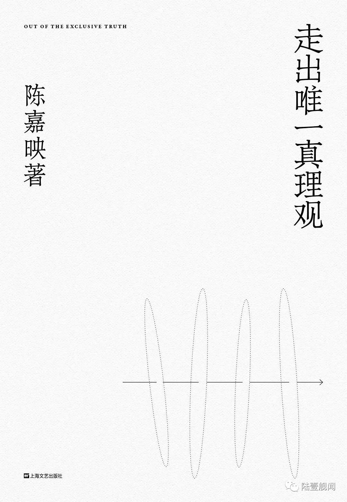

&emsp;&emsp;本书是首都师范大学哲学系教授 陈嘉映先生的著作。主要收录了一些陈嘉映老师的学术自述、采访、对话、演讲等等。通过以自己哲学家的视角，对历史、艺术、政治、科技、死亡与爱情、教育与洗脑、读书，甚至是人工智能等等，表达自己的观点和看法。不过我以为，不论观点和看法的结果如果，陈老师对这些问题思考的过程和深度，是值得我们细细去品味的。

&emsp;&emsp;既然书名是《走出唯一真理观》，我也想以这个标题展开讲讲。以下内容主要源自于本书开头的哲学自述和个人的一些思考和理解 (同时声明一点，我个人由于不喜欢对话类型，所以也都是跳着看的，暂时还没看完...) 。

&emsp;&emsp;本书开篇想讲了陈嘉映老师的个人的经历，个人学习和思考的过程变化，以及发生过的种种事情，比如文革、恢复高考、出国，改革开放等等，逐渐阐述了自己思想上的改变——走出普遍主义(即认为存在对所有人普遍适用的普遍伦理的一元论)。下面请允许我引用一段书中的原文：

&emsp;&emsp;要说转变，思想的总体倾向倒是有转变。是什么呢？简单说，是走出普遍主义。我一开始读哲学，是读黑格尔，后来一直读到柏拉图，不管读得深浅，但是大致是在这样一个思想框架和精神框架下思考的。简单说，有一套终极的真理或者唯一的理念，其他都是这样的一个一的分殊。可以说是普遍主义的或绝对主义的。后来我渐渐离开了这种普遍主义。我不知道这个转变是啥时候发生的，也说不上是在哪一位的影响下发生了这种转变。1975年之后，我读杜威、威廉·詹姆士，读罗素，后来读海德格尔，读维特根斯坦，渐渐地，离开了唯一真理的想法。有不同的道，从前有不同的道，现在有不同的道，将来还有不同的道。重要的问题不是要找唯一的道，而是这些不同的道之间怎么呼应，怎么交流，怎么斗争。你要是坚持说，哲学要的就是唯一的真理体系，那我不得不说，哲学已经死了。不是我说的，二十世纪好多哲学家这么说，比如海德格尔，他晚年有篇文章就叫做《哲学的终结与思的任务》。

&emsp;&emsp;总得来说这里所说的思想上的转变多少还有些抽象，所以陈嘉映老师还列举了大量的事例，让它变得更加通俗。例如他用政治思想举例。年轻时他对专制政体深恶痛绝，对民主宪政有着无限的憧憬，认为民主宪政是人类的目标——人类社会最后要归于民主宪政。但逐渐地，他不再认为无论哪个国家，处境如何，都该采纳这种制度。紧接着，便开始怀疑民主宪政是不是人类制度的最后归宿，也许会有另外的制度更适合新的社会状况，成为政治思想上的主流，甚至于说就没有主流。当然这里的论述并非是想尝试探索政治思想的根源，或者争论什么政治上的学术问题，而只是为了展示走出普遍主义的思想在政治层面上的一种体现。

&emsp;&emsp;同时，书中并非是那种难以理解，让人捉摸不透的语言，反而十分通俗，甚至会有些哲学家的幽默感，或是饱含情感，例如他在讲到政治思想时对福山的批评：

&emsp;&emsp;苏联解体的时候，自由主义似乎完胜，福山甚至认为历史已经终结。这简直成了笑话，看看这二三十年以来世界的政治经济变化吧，民主宪政制度还说不上在衰败，但它的生命力远不像从前那么强大了。

&emsp;&emsp;当我们理解了走出唯一真理观，或者说是走出普遍主义的思想后，以政治思想为例，我们也许会发现：既然没有政体会是主流，我们研究当今世界的政体兴许还有用，但是研究落后的雅典政治，研究古代中国的政治真的还能起到什么用处吗？

&emsp;&emsp;对于这个疑问，陈嘉映老师转向了历史的角度为我们做出了解释 (原文并不是这种跳跃式的讲法，而是一种循序渐进的，但我在此处只是做了简单的摘抄和连接)：

&emsp;&emsp;我们读历史，因为历史拓宽了我们看待现实的视野。我们读千年的历史，并不是为了看清历史的总体走向。在人类的整体发展中给自己找个位置，这只能是幻觉。历史教给我们更具体而微的东西，让我们更真切地了解我们自己的处境。

&emsp;&emsp;当这句话说出来时，看似是单单在说历史，其实可以套在很多层面。比如说爱情，正如人们喜欢听爱情相关的歌曲、看相关的小说，多多少少会认为某个桥段某个人和自己或身边人的情况很相似。更甚者甚至想借机仿照，但往往情况会有不同，我们的经历也不会完全合适地套入到某个故事中。那我们为什么还会去看还会去听还会去了解？因为这些会潜移默化地教给我们更具体而微的东西，让我们更真切地了解自己的处境。

&emsp;&emsp;同样，其他的也可以用类似的方法去解释。但是问题来了，当我们妄图用走出普遍主义后所产生的对待事物的这种方法，去套用所有东西的时候，这是否又走进了普遍主义的陷阱？

&emsp;&emsp;以上内容大多为个人观点，以上摘抄和阐述的内容也仅仅为书的第一小节的一小部分，这本书中还存留着更多有趣的观点及思考。当然这本书也并非直接来告诉我们任何普世的价值或者结论，我所钦佩的也仅是陈嘉映老师由浅及深，逐步分析的思考过程。这种思考的行为本身就对我产生了不少的吸引力。

&emsp;&emsp;最后请允许我用同样是第一小节的一段话来作为本次推荐的结束：

&emsp;&emsp;哲学死了也没有什么关系，思想还远远不会死。愿意思考的年轻人，一代一代都会涌现。


<a href="https://mp.weixin.qq.com/s/lCR7FFgJ1wYSeYkPeOIuyg">
好书推荐｜《走出唯一真理观》
</a>


