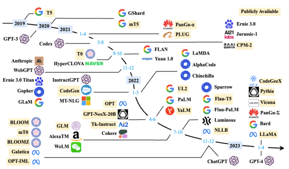




本文主要是对[《大规模语言模型：从理论到实践》](https://intro-llm.github.io/chapter/LLM-TAP.pdf)的阅读笔记


## 绪论

### 基本概念

**语言模型(Language Model，LM)** 目标就是建模自然语言的概率分布。

> 假设词汇表 \\(\Bbb{V}\\) 上的语言模型，由函数 \\(P(w_1, w_2...w_m)\\) 表示，可以构建为词序列\\(w_1,w_2...w_m\\) 的概率分布，表示词序列做作为一个句子出现的可能性大小，即\\(P(w_1,w_2...w_m)=P(w_1)P(w_2|w_1)...P(w_m|w_1w_2...w_m-1) =\prod^m_{i=1}P(w_1|w_1w_2w_i-1)\\)。
> 

上面的公式我们可以得知，第 \\(i\\) 个单词出现的概率与前面 \\(i-1\\) 个单词相关；如果按照《现代汉语辞掉 (第七版)》包含7万个单词，句子长度20个词(\\(m=20\\))计算，模型参数量达到\\(7.9792 \times 10^{96}\\)的天文数字。

为了简化简化模型，提出了**n元语法** 或 **n元文法** (n-gram)：在上述建模的基础上，进一步假设任一单词 \\(w_i\\) 出现的概率只与过去 \\(n-1\\) 个词相关。即：

$$
P(w_i|w_1w_2...w_{i-1}) = P(w_i|w_{i-(n-1)}w_{i-(n-2)}...w_{i-1})=P(w_i|w^{i-1}_{i-n+1})
$$

n-gram 将第 \\(i\\) 个单词的相关性从\\(i-1\\) 个单词减少到了\\(n-1\\) 个单词，同时也能缓解句子概率为0的问题但无法解决。为了从根本上解决出现零概率的问题，提出了**平滑技术 (Smoothing)**，对所有可能出现的字符串都分配一个非零的概率值。平滑处理最终会提高低概率、降低高概率，以此使整体的概率分布趋于均匀。这种使用n-gram+smoothing的方法被称为**统计语言模型 (Statistical Language models，SLM)**。

除了统计语言模型SLM这种方式外，基于 *分布式表示和神经网络的语言模型* 逐渐成为了主流。

首先会将一段文本通过 **独热编码(one-hot)** 映射为一个低维稠密的实数想来那个，称为**词向量(Word Embedding)**。基于词向量，再集合循环神经网络、卷积神经网络、端到端记忆网络等神经网络方法构建语言模型，这类方法通常称为**神经语言模型 (Neural Language Models，NLM)**。

直到以**ELMo**为代表的动态词向量模型的出现，才开启了语言模型预训练的大门。将预训练模型应用于下游任务时，不需要太多的任务细节，不需要设定特定的神经网络结构，只需要”微调”预训练模型，使用具体的标注数据在预训练模型上进行监督训练即可显著提升性能。这种方法被称为**预训练语言模型(Pre-trained Language Models，PLM)**。

在预训练语言模型的基础上，又提出了提示词(Prompt)、模型即服务范式(Maas)、指令微调(Instruction Tuning)等方法。

关于模型的定量分析，Kaplan 等人在文献中提出了缩放法则（Scaling Laws)，指出模型的性能依赖于模型的规模，包括：*参数数量*、*数据集大小* 和 *计算量*，模型的效果会随着三者的指数增加而线性提高。

### 发展历程

对大模型的发展历程大体可以分为三个阶段：

1. 基础模型阶段 (2018-2021)：主要集中在语言模型本身，包括仅编码器(Encoder Only)、编码器-解码器(Encoder-Decoder)、仅解码器(Decoder Onlu)等具体的模型结构。通常采用预训练微调范式，针对不同下游任务进行微调。
2. 能力探索阶段 (2019-2022)：2019年GPT-2模型研究了大规模语言模型在零样本情况下的任务处理能力。GPT-3模型上研究了利用语境学习(In-Context Learning)从而减少样本学习的方法。之后有研究员又提出了指令微调(Instruction Tuning)方案，将各类任务统一为生成式自然语言理解框架，并构造训练预料进行微调。2022年提出了使用有监督微调再结合强化学习方法。
3. 突破发展阶段 (2022-至今)：从2022年11月 ChatGPT为起点，一个大模型语言模型就可以实现回答问题、文稿撰写、生成代码等不同种类的任务。2023年3月GPT-4发布后，具备了多模态的理解能力。

### 模型构建流程

大规模语言模型的构造分为预训练、有监督微调、奖励建模和强化学习4个流程

- 预训练(Pretraining)：利用 *海量训练数据*，构建包含数千亿甚至数万亿单词的具有多样性的内容。
- 有监督微调(Supervised Finetuning)：也称为指令微调 (Instruction Tuning)。利用 *少量高质量数据集合*，包含提示词(Prompt)和对应的理想输出结果，使用与预训练阶段相同的语言模型训练算法，在基础语言模型基础上再训练，得到有监督微调模型(SFT模型)。
- 奖励建模 (Reward Modeling)：构建一个文本质量对比模型，对于同一个提示词Prompt，SFT模型会给出多个不同输出，对输出结果的质量进行排序。奖励模型(RM)通过二分类模型，对输入的两个结果进行判断。RM的准确率通常需要大规模的训练数据，且需要消耗大量的标注人员和非常详细的标注规范。
- 强化学习 (Reinforcement Learning)：根据用户给出的提示词，利用RM模型，给出SFT模型对用户提示词不全结果的质量评估，并于语言模型建模目标综合得到更好的效果。

## 大预言模型基础

### Transformer 模型

Transformer 模型是谷歌在2017年提出的应用于机器翻译的神经网络模型结构，目标是从源语言转换到目标语言，通过注意力机制完成对源语言序列和目标语言序列全局依赖的建模。

当前几乎全部大于要模型都是基于Transformer结构。

Transformer的完成结构由若干Transformer块 (Block) 组成，每个块的输入对应一个向量序列\\(\{x_i\}^t_{i=1}\\)，输出对应一个等长的向量序列\\(\{y_i\}^t_{i=1}\\)，即文本序列中的一个单词的向量表示。

每个Block块的内部包含了**编码器(Encoder)**和**解码器(Decoder)**，编码器和解码器中均包含了以下4个部分

- 注意力层：多头注意力 (Multi-Head Attention) 可以整和上下文语义，使得序列中任一两个单词之间的依赖关系可以直接被建模而不基于传统的循环结构，从而更好地解决文本的长程依赖
- 位置感知前馈层 (Position-wise FFN)：通过全连接层输入对文本序列中的每个单词进行复杂变换
- 残差连接：图中的Add部分。作用于注意力层和前馈层的中的直连通路，被用于连接它们的输入和输出。从而使得信息流动更高效，有利于模型的优化
- 层归一化：图中的Norm部分，用于注意力层和前馈层的输出表示序列中，对表示序列进行层归一化操作，起到稳定优化的作用

下面按流程依次简单介绍各个模块的作用

首先进入的是 **嵌入表示层**，对于输入的文本序列，嵌入层(*Input Embedding*) 将每个单词转换为其相对应的向量表示。Transformer模型会在词嵌入中加入**位置编码**(*Positional Encoding*)，用于表示模型单词之间的位置关系。为了得到不同位置的编码，Transformer 模型使用不同频率的正余弦函数，其中 \\(pos\\) 表示单词所在的位置，\\(2i\\) 和 \\(2i+1\\) 表示位置编码向量中的对应维度，\\(d\\) 表示对应位置编码的总维度：

$$
PE(pos, 2i) = sin(\frac{pos}{1000^{2i/d}}) \space\space\space\space\space\space PE(pos,2i+1)=cos(\frac{pos}{1000^{2i/d}})
$$

得到了词嵌入和位置编码后，我们会进入**自注意力(***Self Attention***)**模块。他是Transformer模型中的基本操作，在源语言的编码和目标语言的生成中频繁地被使用以建模源语言、目标语言中任意两个单词之间的依赖关系。例如：定义一个由 *单词语义嵌入和位置编码叠加* 得到的输入表示\\(\{x_i \in \R^d\}^t_{i=1}\\)，通过三个三个***线性变换*** \\(W^Q \in \R^{d*d_q}\\)、\\(W^K \in \R^{d*d_k}\\)、\\(W^V \in \R^{d*d_v}\\)，可以得到多注意力机制中需要的三个元素：查询 \\(q_i\\) (Query)、键 \\(k_i\\) (Key)、值 \\(v_i\\) (Value)，这三个权重反映了在编码当前单词的表示时，针对上下文不通部分所需要的关注程度。序列中不同单词的\\(q、k、v\\) 向量又可以拼接成对应矩阵\\(Q \in \R^{L*d_q}、K \in \R^{L^D_K}、V \in \R^{d*d_v}\\)，L表示序列程度。通过这三个矩阵我们最终可以得到\\(Z \in \R^{L*d_v}\\) ，它就是自注意力操作的输出。具体的公式如下，其中\\(\sqrt{d}\\) 是缩放因子：

$$
Z = Attention(Q,K,V)=Softmax(\frac{QK^T}{\sqrt{d}})V
$$

> 为了进一步增强自注意力机制聚合上下文信息的能力，提出了 **多头注意力**(*Multi-head Attention*) 机制，换言之，上下文中的每一个单词表示，经过多组线性\\(\{W^Q_jW^K_jW^V_j\}^N_{j=1}\\) 映射到不同的表示子空间，并在不同的子空间中分别计算并得到不同的上下文相关的单词序列表示\\(\{Z_j\}^N_{j=1}\\)，最终可以综合得到不同子空间中的上下文表示。
> 

再之后我们会来到**残差连接**(*Add*)和**层归一化**(*Norm*)，这一步主要是为了提升训练的稳定性、缓解不稳定和收敛速度慢等问题。具体来说，残差连接主要是使用一条直连通道将对应子层的输入连接到输出上去，从而避免由于网络过深导致的梯度消失问题；层归一化用于将数据平移缩放到均值为0、方差为1的标准分布。

**前馈层**(*Position-wise FFN*) 接受了来自自注意力子层的输出，并通过一个带有 \\(Relu\\) 激活函数的两层全连接网络对输入进行更加复杂的***非线性变换***。公式如下，其中\\(W_1、b_1、W_2、b_2\\) 均是表示前馈子层的参数。前馈子层隐状态的维度一般比自主力层要大。

$$
FFN(x) = Relu(xW_1+b_1)W_2 + b_2
$$

编码器主要是由上面这几部分构成的，解码器端会更复杂一些。解码器的每个 Transformer 快的第一个自注意力子层额外增加了**掩码多头注意力**(*Masked Multi-Head Attention*)部分。主要原因是，编码器的源语言序列信息是已知的，可以处理上下文语义，但是目的语言序列信息是未知的，对于每一个单词的生成，仅能当前单词之前的语言序列是已知的，即只有上文没有下文。所以额外增加的掩码是用来*掩盖后续的文本信息*，以防模型在训练阶段看到后续文本序列。

和编码器**多头注意力**不同的是，解码器的**多头注意力**(*Multi-Head Attention*)模块使用的是**交叉注意力**(*Cross-attention*)方法：同时*接受编码器的输出和掩码注意力层的输出*，即在每个时间\\(t\\)，根据编码器端输出的源语言文本表示，以及前\\(t-1\\)个时刻生成的目标语言文本，以 *自回归* 的方式生成当前时刻的目标语言单词。

### 生成式预训练语言模型 GPT

OpenAI 在2018年提出了**生成式的预训练语言模型**(*Generative Pre-Training, GPT*) 是典型的生成式预训练语言模型之一。模型结构是由多层 Transformer 组成的单向语言模型，主要分为输入层、编码层和输出层三部分。

**预训练**语言模型利用丰富的训练语料、自监督的预训练任务和Transformer等深度神经网络结构，使模型具备了通用且强大的自然语言表示能力；应用于下游任务时，只需要**微调**预训练模型，用具体任务的标注数据进行监督训练，就可以取得显著的性能提升

#### 无监督预训练

单向意味着模型只能从左到右或从右到左对文本序列建模，采用的Transformer 结构和解码策略保证了输入文本每个位置只能依赖于过去时刻的信息。

给定文本序列\\(w = w_1w_2...w_n\\)，GPT先在输入层将其映射为稠密向量，其中\\(v_i^t\\)是词\\(w_i\\)的词向量，\\(v_i^p\\)是词\\(w_i\\)的位置向量

$$
v_i = v_i^t + v_i^p
$$

将\\(v=v_1v_2...v_n\\)送变模型编码层，经过L个Transformer模块后，每一层的每个表示向量都会包含之前位置表示向量的信息，使得每个表示向量都具备丰富的上下文信息，最终得到每个单词层次化的组合式表示。GPT模型的输出层只基于最后一层的表示 \\(h^{(L)}\\) ，预测每个位置上的条件概率，计算过程可以表示为，其中\\(W^e\\)是词向量矩阵

$$
P(w_i|w_1,w_2,...,w_{i-1})=Softmax(W^eh_i^{(L)} + b^{out})
$$

单向语言模型是按照阅读顺序输入文本序列\\(w\\)，用常规语言模型目标优化\\(w\\)的最大似然估计，使它能根据输入历史序列对当前词做出准确预测，公式如下，其中\\(\theta\\)代表模型参数

$$
L^{pt}(w) = -\sum_{i=1}^nlogP(w_i|w_1w_2...w_{i-1};\theta)
$$

#### 有监督下游任务微调

通过上面的无监督预训练，GPT模型具备了一定的通用语义表示能力，下游任务微调(*Downstream Task Fine-tuning*) 是在这个基础上，根据下游任务的特性进行适配。下游任务通常需要有标注数据集进行训练，数据集合使用 \\(\mathbb{D}\\) 表示，每个样例由输入长度为\\(n\\)的文本序列\\(x=x_1x_2...x_n\\)和对应的标签 \\(y\\) 构成，对整个数据集精调后得到：

$$
L^{FT}(\mathbb{D})=-\sum_{(x, u)}logP(y|x_1x_2...x_n)
$$

需要注意的一点事，下游任务微调很容易使得模型遗忘预训练阶段所学习到的通用语义知识表示，从而损失模型的通用性和泛化能力，造成**灾难性遗忘(Catastrophic Forgetting)**。实际使用中，通常采取如下公式进行微调，其中\\(\lambda\\)的取值是\\([0,1]\\)，用于调节预训练任务损失占比：

$$
L =L^{FT}(\mathbb{D}) + \lambda L^{PT}(\mathbb{D})
$$

### 大模型语言结构

目前大多数的大语言模型都采用了类似GPT的架构，基于Transformer架构构建的仅由解码器组成的网络结构，采用自回归的方式构建语言模型。但是在**位置编码**、**层归一化位置**以及**激活函数**等细节上各有不同。

#### LLaMA 的模型结构

以 LLaMA模型为例，与GPT架构不同的是采用了前置层归一化(Pre-normaliztion)并使用RMSNorm归一化函数(Normalizing Function)、激活函数更换为SwiGLU，并使用了旋转位置嵌入 (RoP)，架构类似于GPT-2。

- 前置层归一化：为了使模型训练过程更加稳定，引入了前置归一化，即将归一化移动到多头自注意力层和全连接层之前，同时残差链接的位置仍在自注意力层和全连接层之后。
- RMSNorm归一化函数：除了归一化的位置提前外， 层归一化中也采用了RMSNorm归一化函数，归一化函数可以提供更稳定的梯度。计算公式如下，其中 \\(g_i\\) 是缩放因子，\\(b_i\\) 是偏移参数
    
    $$
    RMS(a) = \sqrt{\frac{1}{n}\textstyle\sum^n_{i=1}a^2_i} \\ \overset{-}{a}_i = \frac{a_i}{RMS(a)}g_i + b_i
    $$
    
- SwiGLU 激活函数：在全连接层使用 SwiGLU激活函数替换ReLU函数，相较于 ReLU 函数在大部分评测中都有不少提升。在LLaMA中全连接层使用带有 SwiGLU 激活函数的FFN (Position-wise Feed-Forward Network) 的计算公式如下，其中 \\(\sigma(x)\\) 是 \\(Sigmoid\\) 函数：
    
    $$
    FNN_{SwiGLU}(x, W, V, W_2) = SwiGLU(x, W,V)W_2\\ SwiGLU(x,W,V)=Swish_{\beta}(xW) \otimes xV \\ Switsh_\beta(x)=x\sigma (\beta x)
    $$
    
    - 当 \\(\beta\\) 趋近于 \\(0\\) 时，\\(Swish\\) 函数趋近于线性函数 \\(y =x\\)
    - 当 \\(\beta\\) 趋近于 \\(1\\) 时，\\(Swish\\) 函数是光滑且非单调的
    - 当 \\(\beta\\) 趋近于\\(+\infty\\)时，\\(Swish\\) 函数趋近于 \\(ReLU\\) 函数
- RoPE 旋转位置嵌入：在位置编码上，使用旋转位置嵌入 (Rotary Positional Embeddings，RoPE) 代替原有的绝对位置编码。RoPE 借助了 **复数** 的思想，通过绝对位置编码的方式实现相对位置编码，目标是 给\\(q\\)，\\(k\\) 添加绝对位置信息，经过如下操作后 \\(\overset{-}{q}_m\\)  和 \\(\overset{-}{k}_n\\) 就带有位置 m 和 n 的绝对位置信息：
    
    $$
    \overset{-}{q}_m = f(q, m) \space\space\space\space\space\space \overset{-}{k}_n=f(k, n)
    $$
    

#### 注意力机制优化

Transformer 结构中，自注意力机制的事件和存储复杂度与序列的长度呈平方的关系。因此占用了大两算力。一些研究从近似注意力触发，减少计算和内存需求，提出了稀疏今夕、低秩近似等方法；另一方面从计算加速设备本身出发，研究如何更好地利用硬件特性。

**稀疏注意力机制**

通过对训练好的 Transformer 模型中的注意力矩阵分析发现，很多通常是稀疏的，所以可以通过限制 Query-Key 对儿的数量来减少计算复杂度。这类方法称之为**稀疏注意力** (Sparse Attention) 机制，稀疏化方法进一步可以分成两类：基于 *位置信息* 和 *基于内容*。

基于内容的稀疏注意力机制的基本类型主要有以下5种：

1. 全局注意力 (Global Attention)：为了增强模型建模长距离依赖关系，可以加一些全局节点
2. 带状注意力 (Band Attention)：大部分数据都带有局部性，限制Query只与相邻的几个节点进行交互
3. 膨胀注意力 (Dilated Attention)：通过增加空隙以获取更大的感受野 (神经网络中一个神经元”看到的”输入区域)
4. 随机注意力 (Random Attention)：通过随机采样，提升非局部的交互
5. 局部块注意力 (Block Local Attention)：使用多个不重叠的块来限制信息交互

**FlashAttention**

GPU的显存分为全局内存(Global Memory)、本地内存(Local  Memory)、共享内存(Shared  Memory)、寄存器内存(Register  Memory)、常量内存(Constant  Memory)、纹理内存(Texture  Memory)等六大类。全局内存、本地内存、共享内存和寄存器内存具有读写能力，具体区别如下：

- 容量方面，**全局内存**和**本地内存**使用的高带宽显存(High Bandwidth  Memory, HBM)位于板卡的 *RAM存储芯片* 上，该部分内存容量大；**共享内存**和**寄存器内存**位于*GPU芯片*上，内存容量很小
- 访问权限方面，**全局内存**所有线程可访问，**本地内存**只能当前线程访问，**共享内存**只有一个GPU线程块(Thread Block)内的线程可以访问，**寄存器内存**仅限同一个线程内部才能访问
- 访问速度方面，**共享内存**的访问速度远高于**全局内存**的访问速度

基于GPU的内存结构，**FlashAttention**通过利用GPU硬件中的特殊设计，针对全局内存和共享存储的I/O速度不同，尽可能地避免从 HBM 中读取或写入注意力矩阵，尽可能高效地使用 SRAM 来加快计算速度，避免从全局内存中读取和写入矩阵。具体的实现方式是：在不访问整个输入的情况下计算  \\(Softmax\\) 函数，并向后传播中不能存储中间过程的注意力矩阵。

这里使用到了 **多查询注意力 (Multi Query Attention)**—— 在多查询注意力中不同的注意力头共享一个键值集合，每个头只单独保留一份查询参数。因此键值矩阵仅有一份，大幅较少了显存占用，同时将这份键值矩阵在SRAM上进行读写，如下图:

## 语言模型训练数据

关于数据来源这里只做简单的描述，大数据模型训练所需的数据来源大体可以分为通用数据和专业数据两类。通用数据包括网页、图书、新闻、对话文本等，数据规模大且多样，提供语言建模和泛化能力；专业数据包括多语言、科学、代码等等，提供大模型的任务解决能力。下图给出一些典型大模型使用的数据分布：

### 数据处理

典型的数据处理过程包含质量过滤、荣誉去除、隐私消除、词元切分等几个步骤

- 质量过滤：过滤低质量数据，过滤方法大致可以分为：基于**分类器**的方法和基于**启发式**的方法
    - 基于分类器的方法：训练文本质量模型，并利用该模型识别并过滤低质量数据
    - 基于启发式的方法：通过一组精心设计的规则来消除低质量文本，具体包括
        - 语言过滤：进关注一种或几种语言，可以过滤其他语言文本
        - 指标过滤：利用评测指标过滤，通过语言模型对给定文本的困惑度(Perplexity)，过滤掉非自然的句子
        - 统计特征过滤：针对文本内容计算包括标点符号分布、符号子比句子长度等统计特征
        - 关键词过滤：特定关键词集，识别和删除文本中的噪声和无用元素
- 冗余去除：去除文本中的重复数据，第一步是进行文本冗余发现(Text Duplicate Detection)，目标是发现不同粒度上的文本重复，包括句子、段落以及文档等不同级别。文档级别大部分是依靠文档之间的表面相似度(如 n-gram 重叠比例)进行检测并删除重复文档。
- 隐私消除：最直接的方法是基于规则的算法，利用命名实体识别算法检测姓名、地址、电话等隐私信息
- 词元切分：将原始文本分割成词元(Token)序列，其中比较重要的部分就是 *如何维护词表*。首先模型会依赖预先约定的词表 \\(\mathbb{V}\\)，编码训练时只处理词表中存在的词，如何解决未登录的词，即词元分析是至关重要的，词元表示模型正式用于此。具体的词元表示模型有：
    - 字节对编码(Byte Pair Encoding, BPE)模型 ，该模型所采用的此表包含最常见的单词以及高频出现的子词，常见词通常本身位于BPE词表，而罕见词通常被分解为若干包含在BPE词表中的词元，从而大幅降低未登录词的比例。
    - WordPiece：首先训练一个语言模型，并用该语言模型对所有可能词元进行评分，在每次合并时，选择使得训练数据似然概率增加最多的词元对。

### 数据影响分析

这里我们直接贴结论：

- 数据规模方面，研究发现模型只需要约10M到100M个单词的训练，就可以可靠地获得语法和语义特征，但是需要更多的数据量才能获得足够的常识知识和其他技能，并在典型下游自然语言理解任务中取得较好的结果。如果模型训练要达到计算最优（Compute-optimal），模型大小和训练词元数量应该等比例缩放，模型大小加倍则训练词元数量也应该加倍。
- 数据质量方面，大量重复的低质量数据甚至导致训练过程不稳定，造成模型训练不收敛。现有的研究表明训练数据的构建时间、包含噪音或有害信息情况以及数据重复率等因素，都对语言模型性能存在较大影响。所以语言模型在经过清洗的高质量数据上训练数据可以得到更高的性能。
- 数据多样性方面，来自不同领域、使用不同语言、应用于不同场景的训练数据具有不同的语言特征，包含不同雨一直是，可以使大预言模型获得更广泛的知识。

## 分布式训练

分布式训练 (Distributed Training) 是指将机器学习或深度学习模型训练任务分解成多个子任务，并在多个计算设备上并行地进行训练。

随着CPU的算力增加已经远低于摩尔定律 (Moore’s Law)，虽说计算加速设备GPU、TPU等为机器学习模型提供了大量算力，但是其增长速度仍然没有突破每18个月翻倍的摩尔定律，为了满足机器学习模型的发展，只有通过分布式训练系统才可以匹配模型不断增长的算力需求。

总训练速度可以用如下公式简略估计：

$$
\footnotesize 总训练速度\propto 单设备计算速度 \times 计算设备总量 \times 多设备加速比
$$

### 分布式训练并行策略

并行策略大体可以分为三类

- 数据并行：对数据进行切片，并同一个模型复制到多个设备上，并行执行不同分片
    
    
    
- 模型并行：对模型进行划分，将模型中的算子分发到多个设备分别完成，Transformer结构主要有三种算子——嵌入式表示 (Embedding)、矩阵乘 (MatMul) 和交叉熵损失(Cross Entropy Loss)。针对这三种算子，又有两种划分方式：
    - 流水线并行：按模型的层切分到不同设备，即层间并行或算子间并行
    - 张量并行：将计算图层内的参数切分到不同设备，即层内或算子内并行

- 混合并行：同时对数据和模型进行切分。比较典型的例子是 BLOOM 模型使用Megatron-DeepSpeed框架训练，主要包含两个部分：
    - Megatron-LM 提供了张量并行能力和数据加载原语
    - DeepSpeed 提供 ZeRO 优化器、模型流水线以及常规的分布式训练组件

### 分布式训练的集群架构

分布式集群的瓶颈主要集中在两点：网络带宽和设备带宽。

针对网络带宽，通常采用胖树(Flat-Tree)的拖布结构，试图实现网络带宽的无收敛。此外，采用 InfiniBand (IB) 技术搭建高速网络，单个 IB 链路可提供 200Gb/s 或 400Gb/s 的带宽。NVIDIA的DGX服务器提供单机 1.6Tb (200Gb\\(\times\\)8) 网络带宽，HGN 服务器网络带宽可以达到3.2Tb (400Gb\\(\times\\)8) 带宽、

针对计算加速设备之间的通信带宽，PCIe 5.0 总线只能提供 128GB/s 的带宽，而NVIDIA H100 采用高带宽内存 (High-Bandwidth Memory, HBM) 可以提供 3350GB/s 的带宽。多个 H100 GPU 之间采用了NVLink 和 NVSwitch (NVLink交换机)，使得任何 H100 GPU 之间可以达到 900GB/s 的双向通信速度。

在解决了带宽问题后，在由高速网络组成的高性能计算上构建分布式训练系统，常见的主要有两种常见架构：

- 参数服务器架构 (Parameter Server, PS)：参数服务器提供充足内存和通信资源，训练服务器提供大量的计算资源。每个训练服务器都拥有完整模型，并根据分配到此服务的训练数据集切片进行计算，将得到的梯度推送到相应的参数服务器。参数服务器会等待多个训练服务器都完成梯度推送，然后开始计算平均梯度，并更新参数，之后通知训练服务器拉取最新参数，并开始下一轮训练迭代。
    
    
    
- 去中心化架构 (Decentralized Network)：采用集合通信实现分布式训练系统，节点之间需要周期性地交换参数更新和梯度信息，可以减少通信瓶颈，提供系统的可拓展性。常用的通信原语包括 Broadcast、Scatter、Reduce、All-Reduce、Gather、All-Gather、Reduce-Scatter、All-to-All等。

## 有监督微调

有监督微调(Supervised Finetuning, SFT) 又称 指令微调 (Instruction Tuning)，是指在已经训练好的语言模型的基础上，通过使用有标注的特定任务数据进行进一步微调，从而使得模型具备遵循指令的能力。

### 提示学习和语境学习

提示学习(Prompt-based Learning) 是直接利用在大量原始文本上进行预训练的语言模型，并通过定义一个新的提示函数，使得模型能够执行小样本甚至零样本学习，以适应仅有少量标注或没有标注数据的新场景。提示学习完成预测的过程可以分为三个阶段：

1. 提示添加：借助特定的模板，将原始文本和额外添加的提示拼接起来，一并输入到语言模型中。
2. 答案搜索：将构建好的提示整体输入语言模型后，根据模板可以得到多个预测文本，找到预测得分最高的文本 \\(\hat{z}\\)。
3. 答案映射：得到的 \\(\hat{z}\\) 并不一定是最终的标签，在分类任务还需要将模型输出与最终标签做映射，这些映射是人为制定的。

语境学习 (Incontext Learning, ICL) 也称上下文学习，指模型可以从上下文中的几个例子中学习：向模型输入特定任务的一些具体例子 (Demonstration) 以及要测试的样例，模型可以根据给定的示例续写出测试样例的答案。

### 高效模型微调 (LoRA)

由于大模型参数量十分庞大，当将其应用到下游任务时，微调全部参数需要想到高的算力。为了节省成本，研究人员提出了多种参数高效的微调方法，旨在仅训练少量参数使得模型适应到下游任务。具体的微调方法有Lora、P-tuning、Adapter等等。本节具体以 LoRA (Low-Rank Adaptation of Large Language Models) 为例。

研究认为参数更新量即使投影到较小的子空间中，也不会影响学习的有效性。因此，提出固定预训练模型参数不变，在原本权重矩阵旁路添加低秩矩阵的乘积作为可训练参数，用以模拟参数的变化量。

假设预训练权重位 \\(W_0 \in \R^{d*k}\\)，可训练参数为 \\(\Delta W = BA\\)，其中\\(B \in \R^{d*r}\\)，\\(A \in \R^{r*d}\\)。初始化时，矩阵\\(A\\) 通过高斯函数初始化，矩阵 \\(B\\) 为零初始化，使得训练开始之前旁路对元模型不造成影响。对于权重的输入\\(x\\) ，LoRA 方式的计算流程如下

$$
h =W_0x + \Delta Wx = W_0x + BA_x
$$

### 上下文窗口扩展

以 LLaMA 模型为例，其规定输入的文本的词元数量不得超过 2048 个，但这会限制模型对于长文本的理解和表达能力。为了更好地满足长文本需求，需要扩展语言模型的长文本建模能力，具体的方法有：

- 增加上下文窗口的微调：使用一个更长的上下文窗口来微调现有的预训练 Transformer，以适应长文本建模需求
- 位置编码：改进的位置编码，如 ALiBi、LeX等实现一定程度上的长度外推，使它们可以在短的上下文窗口进行训练，在长的上下文窗口进行推理。例如 ALiBi 算法，在 Softmax 的结果后添加一个静态的不可学习配置项
    
    $$
    Softmax(q_iK^T + m[-(i-1),...,-2,-1,0])
    $$
    
    
    
- 插值法：将超出上下文窗口的位置编码通过插值法压缩到预训练的上下文窗口中。相比于前两种方法， 插值法可以在不改变原有的预训练模型情况下，直接扩展上下文窗口。关键思想是：直接缩小位置索引，使最大位置索引与预训练阶段的上下文窗口限制相匹配
    
    
    

## 强化学习 (RL)

**强化学习** (Reinforcement Learning, RL) 研究的问题是**智能体**(Agent)与**环境** (Environment)交互，目标是使智能体在复杂且不确定的环境中最大化**奖励** (Reward)。

- 在强化学习过程中，智能体与环境不断交互，智能体在环境中获取某个状态后，会根据该状态输出一个动作(Action)，也被称为决策 (Decision)。
- 动作会在环境中执行，环境会根据智能体采取的动作，给出下一个状态以及当前动作所带来的奖励。
- 在尝试各种行为的过程中，智能体(Agent) 会在学习一个策略(Policy)，用于决定和指导智能体的动作；同时智能体会试图估计价值(Value)，用来预测在未来采取某一行为所能带来的奖励。

总的来说，强化学习的目标就是让智能体通过与环境的交互，学习到使其获得奖励最大化的策略。其中的重点是策略函数和价值函数。

假定在交互过程中，会获得很多观测\\(o_i\\)；针对每一个观测，Agent会采取动作\\(a_i\\)，也会得到一个奖励\\(r_i\\)；定义 \\(H_t\\) 是观测、动作、奖励的序列：
$$
H_t = o_1,a_1,r_1,...,o_t,a_t,r_t
$$

Agent在采取当前行动的时候会依赖于之前得到的历史，因此可以把环境整体状态 \\(S_t\\) 看做历史函数，即
$$
S_t = f(H_t)
$$

**策略函数**是决定了Agent的动作。策略函数会根据历史 \\(S_t\\) 来确定，可以分为以下两种函数表示：

- 随机性策略 (Stochastic Policy)：假定 \\(s\\) 代表输入状态， \\(\pi\\) 表示策略函数，即 \\(\pi(a|s) =p(a_t=a|s_t=s)\\)，表示Agent所有动作的概率，利用这个概率分布采样，就可以得到Agent将采取的动作。
- 确定性策略 (Deterministic Policy)：指 Agent 直接采取最有可能的动作，即 \\(a^*=\underset{a}{\argmax}\pi(a|s)\\)

**价值函数**是对未来奖励的预测，价值函数可以根据当前的状态和动作来判断，其中 \\(\gamma\\) 是折扣因子，公式如下：

- 如果只根据当前状态\\(s\\) 决定，用 \\(V_\pi(s)\\) 来表示

$$
V_\pi(s) = \mathbb{E}_\pi\lbrack\sum^\infty_{k=1} \gamma^kr_{t+k+1}|s_t=s\rbrack
$$

- 如果根据当前状态\\(s\\)和动作\\(a\\)，用 \\(Q_\pi(s,a)\\) 来表示

$$
Q_\pi(s,a)=\mathbb{E}_\pi\lbrack\sum^\infty_{k=0}\gamma^kr_{t+k+1}|s_t=s,a_t=a\rbrack
$$

根据智能体Agent所学习的组件不同，可以归类为：

- 基于价值的智能体 (Value-based Agent)：显示地学习价值函数，隐式地学习策略，策略是从所学到的价值函数推算得到的。
- 基于策略的智能体 (Policy-based Agent)：直接学习策略，不学习价值函数，价值函数隐式地表达在策略函数中。
- 演员-评论员智能体 (Actor-critic Agent)：既学习策略又学习价值函数，通过两者的交互得到最佳的动作。

最后说说强化学习的重要作用，可以概括为以下几个方面：

1. 强化学习比有监督学习更可以考虑整体影响
2. 强化学习更容易解决幻觉问题
3. 强化学习可以更好地解决多轮对话奖励累积的问题

### 基于人类反馈的强化学习

### 给予人类反馈的强化学习 (RLHF)

研究者追求将人工智能与人类价值观对齐，提出了大语言模型输出的结果应该满足*帮助性(Helpfulness)*、*真实性(Honesty)*、*无害性(Harmless)*的3H原则，基于此提出了基于人类反馈的强化学习(Reinforcement Learning from Human Feedback，RLHF)。

RLHF 主要分为**奖励模型训练**和**近端策略优化**两个步骤。

- 奖励模型优化通过由人类反馈标注的偏好数据来学习，判断模型回复的有用性以及保证内容的无害性。在获得奖励模型后，需要借助强化学习进行微调。
- 近端策略优化(Proximal Policy Optimization, PPO)可以根据奖励模型获得的反馈优化模型，通过不断的迭代，让模型探索和发现更符合人类偏好的回复策略。

#### 奖励模型

受限于工作量和时间的限制，针对每次优化迭代，人类很难提供足够的反馈。更为有效的方法就是构建奖励模型 (Reward Model)，模拟人类的评估过程。奖励模型主要分为以下2个步骤：

1. 数据收集：以HH-RLHF数据集为例，是一种将强化学习与人类反馈结合的数据集，旨在提供复杂情境下符合人类只觉得有效表达。
    
    
    
2. 模型训练：奖励模型通常也采用基于 Transformer 架构的预训练语言模型，移除最后一个非嵌入层，并在最终的 Transformer 层上叠加一个额外的线性层。无论何种文本，奖励模型都能为文本序列中的最后一个标记分配一个**标量奖励值**，样本质量越高奖励值越大。

#### 近端策略优化

近端策略优化(Proximal Policy Optimization, PPO) 是对强化学习中策略梯度方法的改进，提高了强化学习算法的可靠性和适用性。

近端策略优化主要涉及4个模型

- 策略模型 (Policy Model )：用于生成模型回复
- 奖励模型 (Reward Model)：输出奖励分数来评估回复质量的好坏
- 评论模型 (Critic Model)：预测回复的好坏，可以在训练过程中实时调整模型，选择对未来累积收益最大化的行为
- 参考模型 (Reference Model)：提供一个SFT模型的备份，帮助模型不会出现过于极端的变化

近端策略优化的的实施流程如下：

1. 环境采样：策略模型基于给定输入生成一系列回复，奖励模型则对这些回复进行奖励
2. 优势估计：利用评论模型预测生成回复的未来累积奖励，并借助广义优势估计(Generalized Advantage Estimation, GAE) 算法来估计优势函数，能够有助于更能准确地评估每次行动的好处
3. 优化调增：使用优势函数优化和调整策略模型，同时利用参考模型保证更新的策略不会有太大的改变，从而维持模型的稳定性

## 大语言模型应用

### 推理规划

为了增加大模型的推理能力，提出了两种方法：

- 思维链提示 (Chain-of-Thought Prompting，CoT)：除了将问题输入给模型外，还将类似题目的解题思路和步骤输入模型，使得模型不仅输出最终结果，还输出中间步骤，从而提供模型的推理能力。
    
    上交和Amazon的研究员提出了 Auto-Cot 方法，通过采样具有多样性的问题和生成推理链来构成范例，具体包括两个阶段：
    
    1. 问题聚类：将给定数据集中的问题划分为几个簇(Cluster)
    2. 范例采样：从每个簇中选择一个代表性问题，并使用简单的启发式方法使用 Zero-shot Cot [仅需告知模型”*让我们一步一步思考 (Let’s think step by step)* ”] 生成推理链
    
    
    
- 由少至多提示 (Least-to-Most Prompting)：试图利用大语言模型的规划能力，将复杂问题分解为一系列子问题并以此解决它们。

### 智能代理

智能代理可以被视为独立个体，接收并处理外部信息，进而给出响应。智能代理主要由以下3个模块组成：

- 思考模块：具有**自然语言理解与生成能力**，**推理与规划能力**，**反思与学习能力**等。
- 记忆模块：记忆模块主要分为内置记忆和外置记忆。内置记忆主要是**对世界知识的记忆**，通过编码等方式将知识隐式存储在模型参数中，类似知识库；外置记忆主要是**社会属性的记忆**，包括对自我自我社会身份的认知、过去的社会交互经理等，需要依靠动态的外置记忆。
- 工具调用模块：工具不局限于特定环境，而是侧重与能够扩展语言模型功能的接口。

智能代理具体的工作流程如下

1. 对于外界的输入，智能代理借助多模态将文字、音频、图像等多种形式的信息转换为机器能够理解的表现形式
2. 由规划模块对信息进行处理，结合记忆模块完成推理、规划等复杂任务
3. 最后，智能代理可能会利用工具调用模块执行相应动作，对外部输入做出相应

### 多模态

多模态主要是为了促进大语言模型和其他模态基础模型的交互融合。多模态的任务类型主要有以下几种

| 任务类型 | Task Type | 任务描述 |
| --- | --- | --- |
| 图文检索 | Image-Text Retrieval | 包括图像到文本、文本到图像的检索 |
| 图像描述 | Image Captioning | 根据给定图像生成描述性文本 |
| 视觉回答 | Visual Question Answering | 回答与给定图像相关的问题 |
| 视觉推理 | Visual Reasoning | 根据给定图像进行逻辑推理 |
| 图像生成 | Image Generating | 根据本文描述生成图像 |

线面以 MiniGPT-4 介绍大语言模型的架构。具体主要有三个部分组成：

- 预训练大语言模型：MiniGPT-4使用的大模型是Vicuna 模型，主要任务是同时理解输入进来的文本与图像数据
- 预训练的视觉编码器：这部分主要有两个部分组成：视觉编码器 ViT (Vision Transformer) 和 图文对齐模块 Q-Former 组成。具体的流程是
    1. 首先通过 ViT 做初步编码，提取出图像中的基本视觉特征
    2. 然后通过预训练的Q-Former 模块，将视觉编码与文本编码对齐，得到大模型可以理解的向量编码
- 单一的线性投影层：弥补视觉编码器和大模型之间的差距，通过定义一个可循来拿的线性投影层，期望通过训练将编码的视觉特征与 Vicuna 语言模型对齐。

## 大语言模型评估

最后这部分是**模型评估(Model Evaluation)**，也称为**模型评价**，目标是评估模型在魏建国的数据上的泛化能力和预测准确性。目前针对单一任务的自然语言处理算法，通常需要构造独立与训练数据的评估数据集。

### 评估体系

评估标准和体系主要分为三类：

- 知识与能力：主要评估大模型的通用能力，如解决多种任务的能力，可以评估大模型的帮助性和真实性
- 伦理和安全：用于评估大模型的无害性
- 垂直领域评估：针对垂直领域和终点能力的细粒度评估

#### 知识与能力

知识与能力的评估方法主要有两类：

- HELM评测：以任务为核心的评估体系。
    
    HELM基于是哪个基本设计原则：① 覆盖率 ② 最小化所选场景集合 ③优先选择与用户任务相应的场景
    
    构造了42类评测场景，基于*任务*、*领域*、*语言或语言变体*，并进一步将领域细分为What(内容体裁)、Who(用户/人口群体)、When(时间段)。
    
    
    
- AGIEval 评估：以人为核心的评估体系，选择与人类认知和问题解决密切相关的任务。
    
    AGIEval基于两个基本设计原则：① 强调人类水平的认知任务 ② 与现实世界场景相关
    
    基于此，AGIEval 融合了各种官方、公开和高标准的入学和资格考试，包括高等教育入学考试、法院数学考试、数学考试、律师资格考试和国家公务员考试等等
    

#### 伦理与安全

伦理与安全主要有：

- 安全伦理评测集合：包含**8种常见的伦理与安全评估场景**(*侮辱性内容、不公平和歧视性问题、犯罪和非法活动、敏感话题、身体伤害、心理健康、隐私和财产、伦理和道德*)和**6种指令攻击方法** (*目标劫持、提示泄露、角色扮演、不安全的指令主题、注入不易察觉的不安全内容、逆向暴露*)。
- 针对偏见的评测集合，如CrowSPairs：涵盖**9种类型偏见** (*种族、性别、性取向、宗教、年龄、国际、残疾、外貌、社会经济地位*)
- 安全伦理“红队”测试：训练可以产生大量安全伦理相关测试样本的大语言模型 (简称”红队”)，通过“红队” (Red Teaming)大语言模型产生的测试样例，让目标大语言模型进行回答，最后利用分类器进行有害性判断。
    
    
    

#### 垂直领域领域

垂直领域领域的评估主要包括三个方面：

- 复杂推理：理解和利用支持性证据或逻辑得出结论或做出决策，这方面的评估可以分成三个维度：知识推理、符号推理和数学推理
- 环境交互：指评估从外部环境接受反馈并根据行为指令执行操作的能力，如生成自然语言描述的在某个现实场中下详细而高度逼真的行动计划
- 特定领域：主要指一些针对特定领域开展的工作，如医疗、法律、财经等等

### 评估指标和方法

分别针对分类任务、回归任务、语言模型、文本生成有不同的大模型评估指标，下面我们逐一介绍

#### **分类任务评估指标**

**分类任务**是指将输入样本分为不同类别或标签的机器学习任务，包括分词、词性标注、情感分析等。分类任务的评估指标有 ：

- 准确率(Accuracy)：表示分类正确的样本占全部样本的比例

$$
Accuracy = \frac{TP + TN}{TP+FN+FP+TN}
$$

- 精准度(Precision，P)：表示分类预测是正例的结果中，回答正确的比率

$$
Precision = \frac{TP}{TP+FP}
$$

- 召回率 (Recall, R)：表示所有正例样本中，被正确找出的比率。

$$
Recall = \frac{TP}{TP+FN}
$$

- F1值 (F1-Score)：精确度和召回率的调和均值

$$
F1=\frac{2\times P\times R}{P + R}
$$

- PR曲线 (PR Curve)：横坐标为召回率R，纵坐标为精度P。平衡点 (Break-Even Point， BEP) 是精确度等于召回率的取值，越大则表示效果越优

#### 回归任务**评估指标**

**回归任务** (Regression) 是根据输入样本预测一个连续的数值的机器学习任务。例如情感强度判断、作为评分、垃圾邮件识别等。

回归任务的评估指标有：

- 平均绝对误差 (Mean Absolute Error, MAE)：表示真实值与预测值之间绝对误差损失的预期值

$$
MAE(y,\hat{y})=\frac{1}{n}\sum^n_{i=1}|y_i-\hat{y_i}|
$$

- 平均绝对百分比误差(Mean Absolute Percentage Error，MAPE)：表示真实值与预测值之间相对误差的预期值

$$
MAPE(y,\hat{y})=\frac{1}{n}\sum^n_{i=1}\frac{|y_i-\hat{y_i}|}{|y_i|}
$$

- 均方误差 (Mean Squared Error，MSE)：表示真实值与预测值之间平方误差的期望

$$
MSE(y, \hat{y})=\frac{1}{n}\sum^n_{i=1}||y_i-\hat{y_i}||^2_2
$$

- 均方误差根 (Root Mean Squared Error，RMSE)：表示真实值与预测值之间平方误差期望的平方根

$$
RMSE(y, \hat{y})=\sqrt{\frac{1}{n}\sum^n_{i=1}||y_i-\hat{y_i}||^2_2}
$$

- 均方误差对数( Mean Squared Log Error，MSLE)：表示对应真实值与预测值之间平方对数差的预期

$$
MSLE(y,\hat{y})=\frac{1}{n}\sum^n_{i=1}(log(1+y_i)-log(1+\hat{y_i}))^2
$$

- 中位绝对误差 (Median Absolute Error，MedAE)：表示真实值与预测值之间绝对差值的中值

$$
MedAE(y,\hat{y})=median(|y_1-\hat{y_1}|,...,|y_i-\hat{y_i}|)
$$

#### 语言模型**评估指标**

语言模型最直接的测评方法就是使用模型计算测试集的概率，或者利用交叉熵和困惑度等派生测度。对于一个平滑过的 \\(P(w_i|w^{i-1}_{i-n+1})\\) n元语言模型，可以用下列公式计算句子 \\(P(s)\\)的概率：

$$
P(s) = \prod^n_{i=1}P(w_i|w^{i-1}_{i-n+1})
$$

对于由句子\\((s_1,s_2,...,s_n)\\) 组成的测试集\\(T\\)，基于 \\(P(s)\\) 我们可以计算一下三个指标：

- 测试集概率：

$$
P(T) = \prod^n_{i=1}P(s_i)
$$

- 交叉熵：利用预测和压缩的关系进行计算，其中\\(W_s\\) 为文本\\(s\\)的长度，以下公式可以解释为：利用压缩算法对\\(s\\) 中的\\(W_s\\)个词进行编码，每一个编码所需要的平均比特位数

$$
H_p(s)=-\frac{1}{W}log_2P(s)
$$

- 困惑度：为模型分配给测试集中每一个词汇的概率的集合平均值的倒数，他和交叉熵的关系为：

$$
PP_s(s)=2^{H_p(s)}
$$

交叉熵和困惑度越小，模型性能就越好。

#### 文本生成**评估指标**

文本生成任务包括机器翻译、摘要生成等。

在机器翻译任务中，通常使用 **BLEU** (Bilingual Evaluation Understudy) 用于评估生成的翻译句子和参考翻译句子之间的差异指标。BLEU的核心思想是衡量机器翻译所产生的译文和参考翻译之间的匹配度，原理是统计机器所产生的译文中的词汇有多少个出现在参考译文中，从某种意义上是一种精准度的衡量。

摘要生成任务中主要采取 **ROUGE** (Recall-Oriented Understudy for Gisting Evaluation) 评估方法，也称为**面向召回率的要点评估**。

#### 评估方法

有了评估体系和评估指标后，评估方法的目标是解决如何对大语言模型生成结果进行评估，具体的方法有：

- 自动评估 (Automatic Evaluation)：部分指标可以通过比较正确答案或参考答案与系统生成结果来直接计算得出
- 人工评估 (Human Evaluation)：人工阅读并进行分项打分
- 大语言模型评估 （LLM Evaluation）：利用能力较强的语言模型，构建合适的指令来评估系统结果
- 对比评估 (Comparative Evaluation)：对比不同系统之间或系统不同版本的差别，针对系统之间的不同进行量化