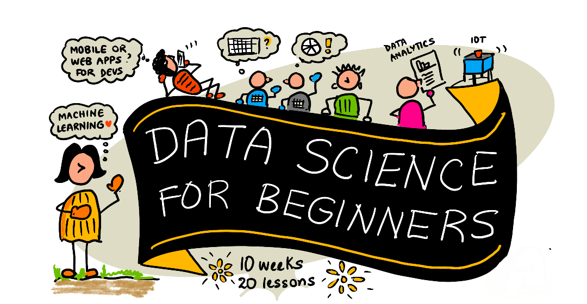
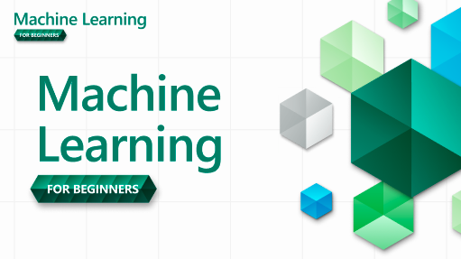
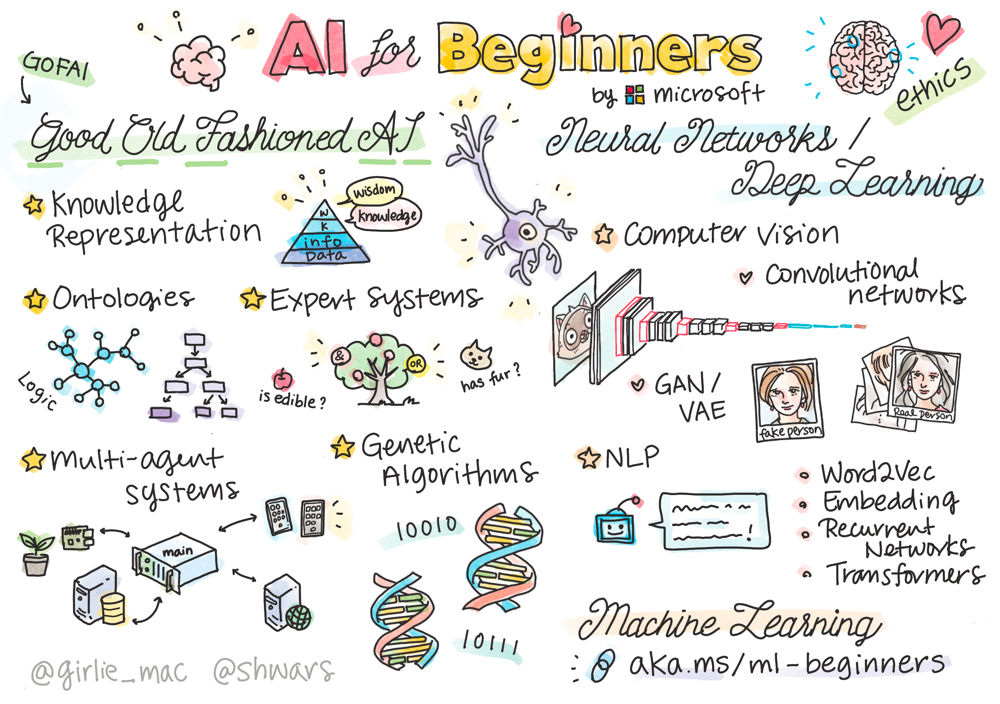

## 经济

<table>
    <thead>
        <tr>
            <th style="width: 20%">图片</th>
            <th style="width: 25%">名称</th>
            <th style="width: 15%">作者</th>
            <th style="width: 15%">链接</th>
            <th style="width: 15%">其他</th>
        </tr>
    </thead>
    <tbody>
        <tr>
            <td></td>
            <td>Economics of Money and Banking     货币银行学</td>
            <td>Perry G Mehrling</td>
            <td>
                <a href="https://www.coursera.org/learn/money-banking" target="_blank">coursera</a>
                   
                <a href="https://wisburg.com/videos?page=1&k=&tagid=79" target="_blank">智堡</a>
            </td>
            <td >2022 - Present</td>
        </tr>
        <tr>
            <td></td>
            <td>The New Lombard Street   新伦巴第街</td>
            <td>Perry G Mehrling</td>
            <td><a href="economy/Perry Mehrling - The New Lombard Street.pdf" >书籍链接</a></td>
            <td >2022 - Present</td>
        </tr>
        <tr>
            <td></td>
            <td>Money and Empire</td>
            <td>Perry G Mehrling</td>
            <td><a href="economy/Perry Mehrling - Money and Empire.pdf" target="_blank">书籍链接</a></td>
            <td >2022 - Present</td>
        </tr>
        <tr>
             <td></td>
             <td>聪明投资者的成功之道——好生意、好公司、好价格</td>
             <td>Value_at_Rist 陈晓虎</td>
             <td><a href="economy/聪明投资者的成功之道——好生意、好公司、好价格.pdf" target="_blank">书籍链接</a></td>
             <td >2022 - Present</td>
        </tr>
    </tbody>

</table>

## 编程

<table>
    <thead>
        <tr>
            <th style="width: 20%">图片</th>
            <th style="width: 25%">名称</th>
            <th style="width: 15%">作者</th>
            <th style="width: 15%">链接</th>
            <th style="width: 15%">其他</th>
        </tr>
    </thead>
    <tbody>
        <tr>
            <td></td>
            <td>给初学者看的数据科学教程 Data Science For Beginners</td>
            <td>微软 microsoft</td>
            <td><a href="https://microsoft.github.io/Data-Science-For-Beginners/#/" target="_blank">microsoft/Data-Science-For-Beginners</a></td>
            <td >2023 - Present</td>
        </tr>
        <tr>
            <td></td>
            <td>给初学者看的机器学习教程 ML For Beginners</td>
            <td>微软 microsoft</td>
            <td><a href="https://microsoft.github.io/ML-For-Beginners/#/" target="_blank">microsoft/ML-For-Beginners</a></td>
            <td >2023 - Present</td>
        </tr>
        <tr>
            <td></td>
            <td>给初学者看的人工智能教程 AI For Beginners</td>
            <td>微软 microsoft</td>
            <td><a href="https://microsoft.github.io/AI-For-Beginners/" target="_blank">microsoft/AI-For-Beginners</a></td>
            <td >2023 - Present</td>
        </tr>
        <tr>
            <td></td>
            <td>给初学者看的物联网教程 IoT For Beginners</td>
            <td>微软 microsoft</td>
            <td><a href="https://microsoft.github.io/IoT-For-Beginners/" target="_blank">microsoft/IoT-For-Beginners</a></td>
            <td >2023 - Present</td>
        </tr>
        <tr>
            <td></td>
            <td>凤凰架构——构建可靠的大型分布式系统</td>
            <td>周志明</td>
            <td><a href="https://icyfenix.cn/" target="_blank">凤凰架构电子书</a></td>
            <td >2023 - Present</td>
        </tr>
        <tr>
            <td></td>
            <td>MySQL 是怎样运行的：从根儿上理解 MySQL</td>
            <td>小孩子4919</td>
            <td><a href="https://relph1119.github.io/mysql-learning-notes/#/" target="_blank">从根儿上理解MySQL电子书</a></td>
            <td >2023 - Present</td>
        </tr>

    </tbody>
</table>

## 政治

<table>
    <thead>
        <tr>
            <th style="width: 25%">名称</th>
            <th style="width: 15%">作者</th>
            <th style="width: 15%">链接</th>
            <th style="width: 15%">其他</th>
        </tr>
    </thead>
    <tbody>
        <tr>
            <td>如何学习重要政党会议</td>
            <td>东吴证券</td>
            <td><a href="polity/中国政策系列一：如何学习重要党政会议.pdf" target="_blank">书籍链接</a></td>
            <td >2022 - Present</td>
        </tr>
    </tbody>
</table>